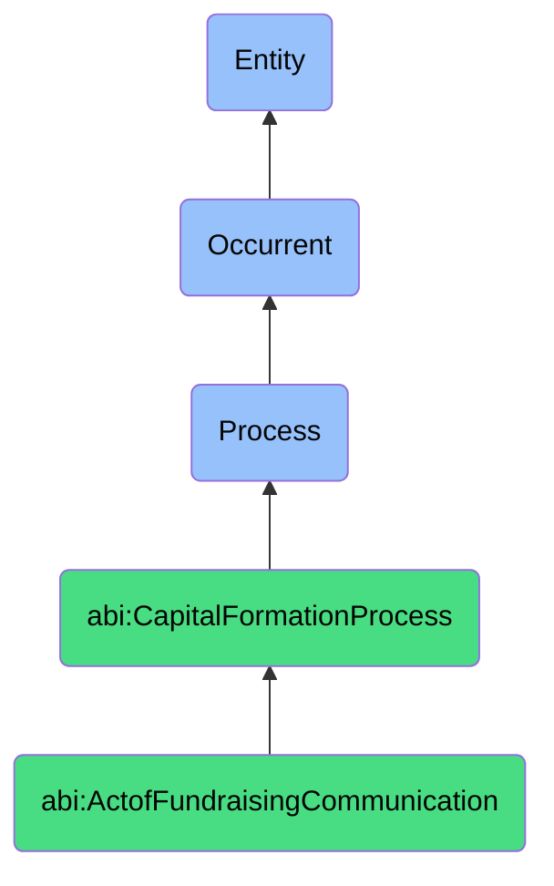

# ActofFundraisingCommunication

## Definition
An act of fundraising communication is an occurrent process that unfolds through time, involving the strategic creation, refinement, and distribution of persuasive narratives, data presentations, and informational materials that articulate a company's value proposition, market opportunity, competitive advantages, financial performance, and growth potential to prospective investors in support of capital formation objectives.

## Hierarchy in BFO


## Ontological Schema (TBox)
```turtle
abi:ActofFundraisingCommunication a owl:Class ;
  rdfs:subClassOf abi:CapitalFormationProcess ;
  rdfs:label "Act of Fundraising Communication" ;
  skos:definition "A process that generates and distributes narratives (e.g., teaser decks, KPI memos) to support investment." .

abi:CapitalFormationProcess a owl:Class ;
  rdfs:subClassOf bfo:0000015 ;
  rdfs:label "Capital Formation Process" ;
  skos:definition "A time-bound process related to attracting, securing, and managing financial investments from external sources." .

abi:has_communication_creator a owl:ObjectProperty ;
  rdfs:domain abi:ActofFundraisingCommunication ;
  rdfs:range abi:CommunicationCreator ;
  rdfs:label "has communication creator" .

abi:targets_investor_audience a owl:ObjectProperty ;
  rdfs:domain abi:ActofFundraisingCommunication ;
  rdfs:range abi:InvestorAudience ;
  rdfs:label "targets investor audience" .

abi:produces_fundraising_collateral a owl:ObjectProperty ;
  rdfs:domain abi:ActofFundraisingCommunication ;
  rdfs:range abi:FundraisingCollateral ;
  rdfs:label "produces fundraising collateral" .

abi:articulates_value_proposition a owl:ObjectProperty ;
  rdfs:domain abi:ActofFundraisingCommunication ;
  rdfs:range abi:ValueProposition ;
  rdfs:label "articulates value proposition" .

abi:presents_financial_information a owl:ObjectProperty ;
  rdfs:domain abi:ActofFundraisingCommunication ;
  rdfs:range abi:FinancialInformation ;
  rdfs:label "presents financial information" .

abi:uses_communication_channel a owl:ObjectProperty ;
  rdfs:domain abi:ActofFundraisingCommunication ;
  rdfs:range abi:CommunicationChannel ;
  rdfs:label "uses communication channel" .

abi:addresses_investor_question a owl:ObjectProperty ;
  rdfs:domain abi:ActofFundraisingCommunication ;
  rdfs:range abi:InvestorQuestion ;
  rdfs:label "addresses investor question" .

abi:has_communication_date a owl:DatatypeProperty ;
  rdfs:domain abi:ActofFundraisingCommunication ;
  rdfs:range xsd:date ;
  rdfs:label "has communication date" .

abi:has_engagement_metric a owl:DatatypeProperty ;
  rdfs:domain abi:ActofFundraisingCommunication ;
  rdfs:range xsd:string ;
  rdfs:label "has engagement metric" .

abi:has_narrative_focus a owl:DatatypeProperty ;
  rdfs:domain abi:ActofFundraisingCommunication ;
  rdfs:range xsd:string ;
  rdfs:label "has narrative focus" .
```

## Ontological Instance (ABox)
```turtle
ex:SeriesAPitchDeckDevelopment a abi:ActofFundraisingCommunication ;
  rdfs:label "Series A Pitch Deck Development and Distribution" ;
  abi:has_communication_creator ex:ChiefExecutiveOfficer, ex:ChiefFinancialOfficer, ex:PitchConsultant ;
  abi:targets_investor_audience ex:VentureCapitalFirms, ex:StrategicCorporateInvestors ;
  abi:produces_fundraising_collateral ex:MainPitchDeck, ex:MarketOpportunityOnePager, ex:TeamBiosDocument, ex:ProductRoadmapSlides ;
  abi:articulates_value_proposition ex:MarketDisruptionNarrative, ex:CompetitiveAdvantageFramework ;
  abi:presents_financial_information ex:PastPerformanceMetrics, ex:FiveYearFinancialProjections, ex:UnitEconomicsBreakdown ;
  abi:uses_communication_channel ex:SecureDataRoom, ex:DirectEmailDistribution, ex:InvestorPortal ;
  abi:addresses_investor_question ex:MarketSizeInquiry, ex:ScalabilityQuestion, ex:MarginsQuery, ex:CACScopeQuestion ;
  abi:has_communication_date "2023-06-15"^^xsd:date ;
  abi:has_engagement_metric "82% view rate, 45 minutes average review time" ;
  abi:has_narrative_focus "AI-driven automation for enterprise efficiency" .

ex:MonthlyInvestorKPIMemo a abi:ActofFundraisingCommunication ;
  rdfs:label "Monthly Investor KPI and Progress Memo" ;
  abi:has_communication_creator ex:InvestorRelationsDirector, ex:DataAnalyticsTeam ;
  abi:targets_investor_audience ex:ExistingSeedInvestors, ex:ProspectiveSeriesAInvestors ;
  abi:produces_fundraising_collateral ex:MonthlyKPIDashboard, ex:CustomerGrowthGraph, ex:RevenueRunrateChart ;
  abi:articulates_value_proposition ex:TractionDemonstrationNarrative, ex:MarketValidationStory ;
  abi:presents_financial_information ex:MRRGrowthTrend, ex:CashRunwayAnalysis, ex:CustomerAcquisitionCosts ;
  abi:uses_communication_channel ex:InvestorNewsletter, ex:InvestorUpdateEmails ;
  abi:addresses_investor_question ex:GrowthRateQuestion, ex:BurnRateQuery, ex:CustomRetentionQuestion ;
  abi:has_communication_date "2023-09-30"^^xsd:date ;
  abi:has_engagement_metric "93% open rate, 76% click-through rate" ;
  abi:has_narrative_focus "Accelerating customer adoption and path to profitability" .
```

## Related Classes
- **abi:ActofCapitalRaising** - A broader process that leverages communication materials.
- **abi:ActofInvestorOutreach** - A process that utilizes materials created in fundraising communication.
- **abi:ActofInvestorMeeting** - A process where fundraising communication materials are presented.
- **abi:ActofDueDiligence** - A process that often requires additional detailed communications.
- **abi:DataVisualizationProcess** - A process used to create visual elements for fundraising materials.
- **abi:MessageRefinementProcess** - A process for iteratively improving investment narratives.
- **abi:InvestorRelationsProcess** - A broader process that includes ongoing investor communications. 