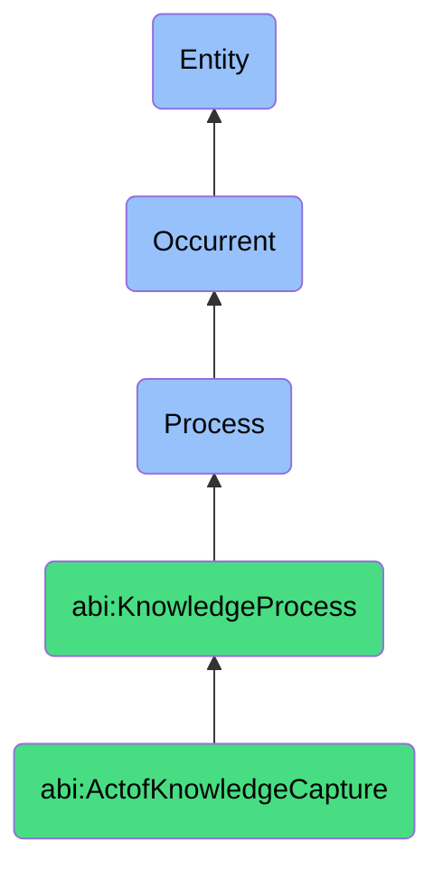

# ActofKnowledgeCapture

## Definition
An act of knowledge capture is an occurrent process that unfolds through time, involving the deliberate identification, elicitation, extraction, and formalization of tacit or implicit knowledge, experiences, insights, decision rationales, contextual information, and technical expertise from individuals or groups, using structured methods and tools to transform this knowledge into explicit, documented, searchable, and shareable artifacts that preserve institutional memory, facilitate knowledge transfer, and support organizational learning.

## Hierarchy in BFO


## Ontological Schema (TBox)
```turtle
abi:ActofKnowledgeCapture a owl:Class ;
  rdfs:subClassOf abi:KnowledgeProcess ;
  rdfs:label "Act of Knowledge Capture" ;
  skos:definition "A process that extracts, records, and formalizes tacit knowledge from discussions, projects, or workflows." .

abi:KnowledgeProcess a owl:Class ;
  rdfs:subClassOf bfo:0000015 ;
  rdfs:label "Knowledge Process" ;
  skos:definition "A time-bound process related to the creation, capture, organization, transfer, maintenance, or application of knowledge within an organizational context." .

abi:has_knowledge_source a owl:ObjectProperty ;
  rdfs:domain abi:ActofKnowledgeCapture ;
  rdfs:range abi:KnowledgeSource ;
  rdfs:label "has knowledge source" .

abi:captures_knowledge_content a owl:ObjectProperty ;
  rdfs:domain abi:ActofKnowledgeCapture ;
  rdfs:range abi:KnowledgeContent ;
  rdfs:label "captures knowledge content" .

abi:uses_capture_method a owl:ObjectProperty ;
  rdfs:domain abi:ActofKnowledgeCapture ;
  rdfs:range abi:CaptureMethod ;
  rdfs:label "uses capture method" .

abi:categorizes_knowledge a owl:ObjectProperty ;
  rdfs:domain abi:ActofKnowledgeCapture ;
  rdfs:range abi:KnowledgeCategory ;
  rdfs:label "categorizes knowledge" .

abi:structures_knowledge_format a owl:ObjectProperty ;
  rdfs:domain abi:ActofKnowledgeCapture ;
  rdfs:range abi:KnowledgeFormat ;
  rdfs:label "structures knowledge format" .

abi:associates_with_context a owl:ObjectProperty ;
  rdfs:domain abi:ActofKnowledgeCapture ;
  rdfs:range abi:ContextualAssociation ;
  rdfs:label "associates with context" .

abi:produces_knowledge_artifact a owl:ObjectProperty ;
  rdfs:domain abi:ActofKnowledgeCapture ;
  rdfs:range abi:KnowledgeArtifact ;
  rdfs:label "produces knowledge artifact" .

abi:has_capture_timestamp a owl:DatatypeProperty ;
  rdfs:domain abi:ActofKnowledgeCapture ;
  rdfs:range xsd:dateTime ;
  rdfs:label "has capture timestamp" .

abi:has_knowledge_importance a owl:DatatypeProperty ;
  rdfs:domain abi:ActofKnowledgeCapture ;
  rdfs:range xsd:string ;
  rdfs:label "has knowledge importance" .

abi:has_capture_completeness a owl:DatatypeProperty ;
  rdfs:domain abi:ActofKnowledgeCapture ;
  rdfs:range xsd:decimal ;
  rdfs:label "has capture completeness" .
```

## Ontological Instance (ABox)
```turtle
ex:ArchitecturalDecisionCapture a abi:ActofKnowledgeCapture ;
  rdfs:label "Architecture Planning Meeting Decision Capture" ;
  abi:has_knowledge_source ex:SeniorArchitect, ex:ProductOwner, ex:TechnicalLeads, ex:ArchitectureMeeting ;
  abi:captures_knowledge_content ex:DatabaseSelectionRationale, ex:ScalabilityConsiderations, ex:SecurityArchitectureTrade-offs ;
  abi:uses_capture_method ex:StructuredMeetingNotes, ex:DecisionRecordTemplate, ex:DesignDiagramAnnotation ;
  abi:categorizes_knowledge ex:ArchitecturalDecision, ex:TechnicalConstraint, ex:DesignPattern ;
  abi:structures_knowledge_format ex:ArchitecturalDecisionRecord, ex:DataFlowDiagram, ex:ComponentInteractionModel ;
  abi:associates_with_context ex:ProductRoadmap, ex:SystemEvolutionTimeline, ex:BusinessRequirements ;
  abi:produces_knowledge_artifact ex:ArchitecturalDecisionRepository, ex:SystemContextDocument, ex:DesignRationaleWiki ;
  abi:has_capture_timestamp "2023-11-10T14:30:00Z"^^xsd:dateTime ;
  abi:has_knowledge_importance "Critical" ;
  abi:has_capture_completeness "0.95"^^xsd:decimal .

ex:ResearchFindingsCapture a abi:ActofKnowledgeCapture ;
  rdfs:label "User Research Insights Formalization" ;
  abi:has_knowledge_source ex:UserResearcher, ex:UserInterviews, ex:UsabilityTesting, ex:BehavioralAnalytics ;
  abi:captures_knowledge_content ex:UserPreferences, ex:UsabilityFriction, ex:AdoptionBarriers, ex:WorkflowPatterns ;
  abi:uses_capture_method ex:ThematicAnalysis, ex:AffnityDiagramming, ex:UserJourneyMapping, ex:BehavioralPatternRecognition ;
  abi:categorizes_knowledge ex:UserBehavior, ex:EmotionalResponse, ex:FeatureUtilization, ex:AccessibilityIssue ;
  abi:structures_knowledge_format ex:ResearchReport, ex:PersonaProfiles, ex:UserJourneyDocumentation, ex:HeatmapVisualizations ;
  abi:associates_with_context ex:ProductFeatureSet, ex:MarketSegment, ex:CompetitiveLandscape, ex:BusinessMetrics ;
  abi:produces_knowledge_artifact ex:ResearchInsightsRepository, ex:DesignPrinciplesDocument, ex:UserPersonaLibrary ;
  abi:has_capture_timestamp "2023-10-05T11:45:00Z"^^xsd:dateTime ;
  abi:has_knowledge_importance "High" ;
  abi:has_capture_completeness "0.88"^^xsd:decimal .
```

## Related Classes
- **abi:ActofDocumentVersioning** - A process that often follows knowledge capture to maintain artifact evolution.
- **abi:ActofSOPExecution** - A process that may be informed by knowledge captured from past experiences.
- **abi:KnowledgeSynthesisProcess** - A process for combining and organizing captured knowledge.
- **abi:ExpertiseElicitationProcess** - A specialized process for extracting knowledge from subject matter experts.
- **abi:KnowledgeValidationProcess** - A process for verifying the accuracy of captured knowledge.
- **abi:TacitKnowledgeExternalizationProcess** - A process focusing specifically on converting implicit to explicit knowledge.
- **abi:InstitutionalMemoryPreservationProcess** - A process ensuring captured knowledge remains accessible over time. 