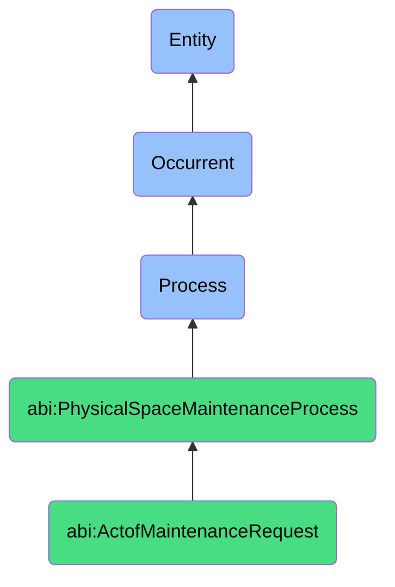

# ActofMaintenanceRequest

## Definition
An act of maintenance request is an occurrent process that unfolds through time, involving the formal identification, documentation, submission, and processing of a request for physical infrastructure repair, inspection, or maintenance services, indicating the nature, location, and urgency of the issue requiring attention, through established communication channels and workflows that enable appropriate triage, assignment, resource allocation, and tracking to address physical environment deficiencies, failures, or preventative maintenance needs.

## Hierarchy in BFO


## Ontological Schema (TBox)
```turtle
abi:ActofMaintenanceRequest a owl:Class ;
  rdfs:subClassOf abi:PhysicalSpaceMaintenanceProcess ;
  rdfs:label "Act of Maintenance Request" ;
  skos:definition "A process that initiates repair or inspection tasks in physical infrastructure." .

abi:PhysicalSpaceMaintenanceProcess a owl:Class ;
  rdfs:subClassOf bfo:0000015 ;
  rdfs:label "Physical Space Maintenance Process" ;
  skos:definition "A time-bound process related to the management, maintenance, scheduling, or allocation of physical spaces, facilities, or infrastructure." .

abi:has_request_initiator a owl:ObjectProperty ;
  rdfs:domain abi:ActofMaintenanceRequest ;
  rdfs:range abi:RequestInitiator ;
  rdfs:label "has request initiator" .

abi:identifies_maintenance_issue a owl:ObjectProperty ;
  rdfs:domain abi:ActofMaintenanceRequest ;
  rdfs:range abi:MaintenanceIssue ;
  rdfs:label "identifies maintenance issue" .

abi:specifies_affected_location a owl:ObjectProperty ;
  rdfs:domain abi:ActofMaintenanceRequest ;
  rdfs:range abi:AffectedLocation ;
  rdfs:label "specifies affected location" .

abi:routes_to_service_provider a owl:ObjectProperty ;
  rdfs:domain abi:ActofMaintenanceRequest ;
  rdfs:range abi:ServiceProvider ;
  rdfs:label "routes to service provider" .

abi:follows_maintenance_protocol a owl:ObjectProperty ;
  rdfs:domain abi:ActofMaintenanceRequest ;
  rdfs:range abi:MaintenanceProtocol ;
  rdfs:label "follows maintenance protocol" .

abi:requests_service_type a owl:ObjectProperty ;
  rdfs:domain abi:ActofMaintenanceRequest ;
  rdfs:range abi:ServiceType ;
  rdfs:label "requests service type" .

abi:produces_request_record a owl:ObjectProperty ;
  rdfs:domain abi:ActofMaintenanceRequest ;
  rdfs:range abi:RequestRecord ;
  rdfs:label "produces request record" .

abi:has_submission_timestamp a owl:DatatypeProperty ;
  rdfs:domain abi:ActofMaintenanceRequest ;
  rdfs:range xsd:dateTime ;
  rdfs:label "has submission timestamp" .

abi:has_requested_completion_date a owl:DatatypeProperty ;
  rdfs:domain abi:ActofMaintenanceRequest ;
  rdfs:range xsd:date ;
  rdfs:label "has requested completion date" .

abi:has_urgency_level a owl:DatatypeProperty ;
  rdfs:domain abi:ActofMaintenanceRequest ;
  rdfs:range xsd:string ;
  rdfs:label "has urgency level" .
```

## Ontological Instance (ABox)
```turtle
ex:AirConditioningMalfunctionRequest a abi:ActofMaintenanceRequest ;
  rdfs:label "Broken Air Conditioning System Maintenance Request" ;
  abi:has_request_initiator ex:OfficeManager, ex:AffectedDepartmentHead ;
  abi:identifies_maintenance_issue ex:AirConditioningMalfunction, ex:ExcessiveHeat, ex:CondensationLeak ;
  abi:specifies_affected_location ex:ThirdFloorEastWing, ex:OpenOfficeArea, ex:ServerRoom ;
  abi:routes_to_service_provider ex:FacilitiesManagementTeam, ex:HVACContractor ;
  abi:follows_maintenance_protocol ex:EnvironmentalSystemsOutage, ex:ServerRoomTemperatureEmergency ;
  abi:requests_service_type ex:EmergencyRepair, ex:SystemDiagnostics, ex:TemperatureControl ;
  abi:produces_request_record ex:MaintenanceTicket, ex:WorkOrderGeneration, ex:ServiceHistoryUpdate ;
  abi:has_submission_timestamp "2023-11-17T10:30:00Z"^^xsd:dateTime ;
  abi:has_requested_completion_date "2023-11-17"^^xsd:date ;
  abi:has_urgency_level "High - Business Impact" .

ex:PlumbingFixtureRepairRequest a abi:ActofMaintenanceRequest ;
  rdfs:label "Bathroom Plumbing Fixture Maintenance Request" ;
  abi:has_request_initiator ex:EmployeeSelfService, ex:BuildingOccupant ;
  abi:identifies_maintenance_issue ex:LeakingFaucet, ex:WaterPressureIssue, ex:DrainageProblem ;
  abi:specifies_affected_location ex:SecondFloorRestroom, ex:HandicapAccessibleStall ;
  abi:routes_to_service_provider ex:InternalMaintenanceStaff, ex:PlumbingServiceCompany ;
  abi:follows_maintenance_protocol ex:StandardPlumbingRepairProcess, ex:WaterConservationPolicy ;
  abi:requests_service_type ex:RoutineRepair, ex:FixtureReplacement, ex:PreventativeMaintenance ;
  abi:produces_request_record ex:RepairTicket, ex:PartRequisition, ex:ServiceNotification ;
  abi:has_submission_timestamp "2023-11-15T14:20:00Z"^^xsd:dateTime ;
  abi:has_requested_completion_date "2023-11-22"^^xsd:date ;
  abi:has_urgency_level "Medium - Operational Impact" .
```

## Related Classes
- **abi:ActofCleaningScheduling** - A process that may be triggered by conditions identified during maintenance.
- **abi:ActofSpaceReservation** - A process that might be affected by maintenance activities in spaces.
- **abi:MaintenanceExecutionProcess** - A process that executes the work initiated by the maintenance request.
- **abi:MaintenanceInspectionProcess** - A process for evaluating the condition of facilities proactively.
- **abi:AssetManagementProcess** - A broader process that encompasses maintenance of organizational assets.
- **abi:WorkOrderManagementProcess** - A process for managing work orders generated from maintenance requests.
- **abi:FacilityRiskAssessmentProcess** - A process for evaluating risks associated with maintenance issues. 