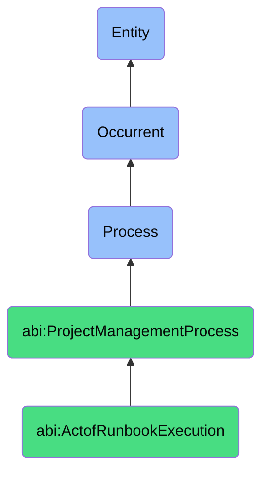

# ActofRunbookExecution

## Definition
An act of runbook execution is an occurrent process that unfolds through time, involving the methodical implementation, operation, and completion of a predefined, documented sequence of procedural steps, commands, decision points, and actions designed to address specific operational scenarios, incidents, routine tasks, or service requests in a standardized, consistent, and repeatable manner, reducing variability, minimizing errors, ensuring compliance with established practices, and enabling efficient knowledge transfer and automation of routine operational activities.

## Hierarchy in BFO


## Ontological Schema (TBox)
```turtle
abi:ActofRunbookExecution a owl:Class ;
  rdfs:subClassOf abi:ProjectManagementProcess ;
  rdfs:label "Act of Runbook Execution" ;
  skos:definition "A predefined, repeatable process that executes standard responses to common tasks or issues." .

abi:ProjectManagementProcess a owl:Class ;
  rdfs:subClassOf bfo:0000015 ;
  rdfs:label "Project Management Process" ;
  skos:definition "A time-bound process related to the planning, execution, monitoring, and control of project activities to achieve specific objectives." .

abi:has_runbook_executor a owl:ObjectProperty ;
  rdfs:domain abi:ActofRunbookExecution ;
  rdfs:range abi:RunbookExecutor ;
  rdfs:label "has runbook executor" .

abi:follows_runbook_procedure a owl:ObjectProperty ;
  rdfs:domain abi:ActofRunbookExecution ;
  rdfs:range abi:RunbookProcedure ;
  rdfs:label "follows runbook procedure" .

abi:addresses_operational_scenario a owl:ObjectProperty ;
  rdfs:domain abi:ActofRunbookExecution ;
  rdfs:range abi:OperationalScenario ;
  rdfs:label "addresses operational scenario" .

abi:executes_procedure_step a owl:ObjectProperty ;
  rdfs:domain abi:ActofRunbookExecution ;
  rdfs:range abi:ProcedureStep ;
  rdfs:label "executes procedure step" .

abi:makes_operational_decision a owl:ObjectProperty ;
  rdfs:domain abi:ActofRunbookExecution ;
  rdfs:range abi:OperationalDecision ;
  rdfs:label "makes operational decision" .

abi:utilizes_operational_tool a owl:ObjectProperty ;
  rdfs:domain abi:ActofRunbookExecution ;
  rdfs:range abi:OperationalTool ;
  rdfs:label "utilizes operational tool" .

abi:produces_execution_result a owl:ObjectProperty ;
  rdfs:domain abi:ActofRunbookExecution ;
  rdfs:range abi:ExecutionResult ;
  rdfs:label "produces execution result" .

abi:has_execution_start_time a owl:DatatypeProperty ;
  rdfs:domain abi:ActofRunbookExecution ;
  rdfs:range xsd:dateTime ;
  rdfs:label "has execution start time" .

abi:has_execution_completion_time a owl:DatatypeProperty ;
  rdfs:domain abi:ActofRunbookExecution ;
  rdfs:range xsd:dateTime ;
  rdfs:label "has execution completion time" .

abi:has_execution_outcome a owl:DatatypeProperty ;
  rdfs:domain abi:ActofRunbookExecution ;
  rdfs:range xsd:string ;
  rdfs:label "has execution outcome" .
```

## Ontological Instance (ABox)
```turtle
ex:PluginDeploymentRecoveryExecution a abi:ActofRunbookExecution ;
  rdfs:label "Failed Plugin Deployment Recovery Runbook Execution" ;
  abi:has_runbook_executor ex:DeploymentSystem, ex:SystemAdministrator ;
  abi:follows_runbook_procedure ex:PluginDeploymentFailureRunbook, ex:RecoveryProcedure ;
  abi:addresses_operational_scenario ex:FailedPluginDeployment, ex:IncompleteInstallation, ex:IntegrationBreakage ;
  abi:executes_procedure_step ex:EnvironmentValidation, ex:DeploymentRollback, ex:DependencyCheck, ex:SystemRestart ;
  abi:makes_operational_decision ex:RollbackDecision, ex:RetrySelectionLogic, ex:NotificationEscalationChoice ;
  abi:utilizes_operational_tool ex:DeploymentPipeline, ex:ConfigurationManager, ex:MonitoringSystem ;
  abi:produces_execution_result ex:RecoveryStatusReport, ex:DeploymentAuditLog, ex:IncidentTicketUpdate ;
  abi:has_execution_start_time "2023-11-18T03:15:00Z"^^xsd:dateTime ;
  abi:has_execution_completion_time "2023-11-18T03:45:00Z"^^xsd:dateTime ;
  abi:has_execution_outcome "Successful Recovery" .

ex:DataBackupVerificationExecution a abi:ActofRunbookExecution ;
  rdfs:label "Monthly Data Backup Verification Runbook Execution" ;
  abi:has_runbook_executor ex:DataOperationsTeam, ex:BackupVerificationSystem ;
  abi:follows_runbook_procedure ex:BackupVerificationProcedure, ex:DataIntegrityCheckProcess ;
  abi:addresses_operational_scenario ex:RoutineBackupVerification, ex:RestorationReadinessCheck ;
  abi:executes_procedure_step ex:BackupInventoryCheck, ex:RestoreTestExecution, ex:DataIntegrityValidation, ex:PerformanceMetricCollection ;
  abi:makes_operational_decision ex:BackupRotationSelection, ex:RestorationEnvironmentChoice, ex:ValidationCriteriaApplication ;
  abi:utilizes_operational_tool ex:BackupSystem, ex:ValidationFramework, ex:DataComparisonUtility, ex:ReportingDashboard ;
  abi:produces_execution_result ex:BackupVerificationReport, ex:RestorationTestResults, ex:ComplianceCertification ;
  abi:has_execution_start_time "2023-11-01T01:00:00Z"^^xsd:dateTime ;
  abi:has_execution_completion_time "2023-11-01T04:30:00Z"^^xsd:dateTime ;
  abi:has_execution_outcome "Verified Successfully" .
```

## Related Classes
- **abi:ActofServiceDelivery** - A process that may incorporate runbook execution for standard service components.
- **abi:ActofUptimeMonitoring** - A process that may trigger runbook execution when issues are detected.
- **abi:ActofIncidentEscalation** - A process that may occur when runbook execution fails to resolve an issue.
- **abi:ActofServiceLevelReview** - A process that may evaluate the effectiveness of runbook executions.
- **abi:RunbookDevelopmentProcess** - A process for creating and updating runbook procedures.
- **abi:AutomationImplementationProcess** - A process for converting manual runbooks to automated procedures.
- **abi:KnowledgeTransferProcess** - A process that uses runbooks to standardize operational knowledge. 