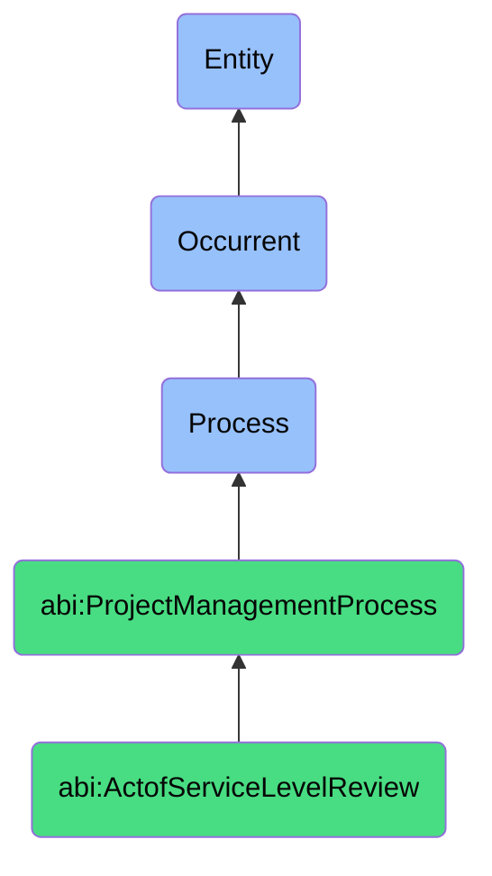

# ActofServiceLevelReview

## Definition
An act of service level review is an occurrent process that unfolds through time, involving the systematic collection, analysis, and evaluation of operational performance metrics, quality indicators, and service delivery data against predetermined service level agreements, objectives, or expectations over a defined measurement period, to identify compliance levels, performance trends, improvement opportunities, and corrective actions while providing stakeholders with transparent reporting on service quality, reliability, efficiency, and contractual fulfillment.

## Hierarchy in BFO


## Ontological Schema (TBox)
```turtle
abi:ActofServiceLevelReview a owl:Class ;
  rdfs:subClassOf abi:ProjectManagementProcess ;
  rdfs:label "Act of Service Level Review" ;
  skos:definition "A periodic process that assesses whether operational metrics met agreed performance standards." .

abi:ProjectManagementProcess a owl:Class ;
  rdfs:subClassOf bfo:0000015 ;
  rdfs:label "Project Management Process" ;
  skos:definition "A time-bound process related to the planning, execution, monitoring, and control of project activities to achieve specific objectives." .

abi:has_review_conductor a owl:ObjectProperty ;
  rdfs:domain abi:ActofServiceLevelReview ;
  rdfs:range abi:ReviewConductor ;
  rdfs:label "has review conductor" .

abi:reviews_service_performance a owl:ObjectProperty ;
  rdfs:domain abi:ActofServiceLevelReview ;
  rdfs:range abi:ServicePerformance ;
  rdfs:label "reviews service performance" .

abi:evaluates_performance_metric a owl:ObjectProperty ;
  rdfs:domain abi:ActofServiceLevelReview ;
  rdfs:range abi:PerformanceMetric ;
  rdfs:label "evaluates performance metric" .

abi:compares_against_service_level a owl:ObjectProperty ;
  rdfs:domain abi:ActofServiceLevelReview ;
  rdfs:range abi:ServiceLevel ;
  rdfs:label "compares against service level" .

abi:analyzes_performance_trend a owl:ObjectProperty ;
  rdfs:domain abi:ActofServiceLevelReview ;
  rdfs:range abi:PerformanceTrend ;
  rdfs:label "analyzes performance trend" .

abi:identifies_improvement_opportunity a owl:ObjectProperty ;
  rdfs:domain abi:ActofServiceLevelReview ;
  rdfs:range abi:ImprovementOpportunity ;
  rdfs:label "identifies improvement opportunity" .

abi:produces_review_report a owl:ObjectProperty ;
  rdfs:domain abi:ActofServiceLevelReview ;
  rdfs:range abi:ReviewReport ;
  rdfs:label "produces review report" .

abi:has_review_period_start a owl:DatatypeProperty ;
  rdfs:domain abi:ActofServiceLevelReview ;
  rdfs:range xsd:date ;
  rdfs:label "has review period start" .

abi:has_review_period_end a owl:DatatypeProperty ;
  rdfs:domain abi:ActofServiceLevelReview ;
  rdfs:range xsd:date ;
  rdfs:label "has review period end" .

abi:has_compliance_percentage a owl:DatatypeProperty ;
  rdfs:domain abi:ActofServiceLevelReview ;
  rdfs:range xsd:decimal ;
  rdfs:label "has compliance percentage" .
```

## Ontological Instance (ABox)
```turtle
ex:MonthlySupportResponseReview a abi:ActofServiceLevelReview ;
  rdfs:label "Monthly Customer Support Response Time SLA Review" ;
  abi:has_review_conductor ex:SupportManager, ex:QualityAssuranceTeam, ex:ClientSuccessLead ;
  abi:reviews_service_performance ex:TicketResponseTimes, ex:CaseResolutionRates, ex:CustomerSatisfactionScores ;
  abi:evaluates_performance_metric ex:FirstResponseTime, ex:TimeToResolution, ex:EscalationRate, ex:CustomerSatisfactionIndex ;
  abi:compares_against_service_level ex:ResponseTimeSLA, ex:ResolutionTimeSLA, ex:SatisfactionTargets ;
  abi:analyzes_performance_trend ex:PriorityTicketResponseTrend, ex:AgentPerformanceTrend, ex:CategoryResolutionTrend ;
  abi:identifies_improvement_opportunity ex:AgentTrainingNeed, ex:DocumentationEnhancement, ex:ProcessOptimization ;
  abi:produces_review_report ex:MonthlySLAComplianceReport, ex:PerformanceDashboard, ex:TrendAnalysis ;
  abi:has_review_period_start "2023-10-01"^^xsd:date ;
  abi:has_review_period_end "2023-10-31"^^xsd:date ;
  abi:has_compliance_percentage "97.3"^^xsd:decimal .

ex:QuarterlyCloudInfrastructureReview a abi:ActofServiceLevelReview ;
  rdfs:label "Quarterly Cloud Infrastructure Availability SLA Review" ;
  abi:has_review_conductor ex:CloudOperationsLead, ex:InfrastructureManager, ex:ServiceDeliveryDirector ;
  abi:reviews_service_performance ex:SystemUptime, ex:ServiceAvailability, ex:IncidentResponse, ex:MaintenanceImpact ;
  abi:evaluates_performance_metric ex:UptimePercentage, ex:MeanTimeToRecover, ex:IncidentFrequency, ex:MaintenanceWindow ;
  abi:compares_against_service_level ex:AvailabilitySLA, ex:RecoveryTimeSLA, ex:IncidentResolutionSLA ;
  abi:analyzes_performance_trend ex:MonthlyAvailabilityTrend, ex:ServiceDegradationTrend, ex:MaintenanceEfficiencyTrend ;
  abi:identifies_improvement_opportunity ex:RedundancyEnhancement, ex:AutomatedRecoveryExpansion, ex:MaintenanceWindowOptimization ;
  abi:produces_review_report ex:QuarterlyPerformanceReport, ex:SLACompliance, ex:InfrastructureRecommendations ;
  abi:has_review_period_start "2023-07-01"^^xsd:date ;
  abi:has_review_period_end "2023-09-30"^^xsd:date ;
  abi:has_compliance_percentage "99.95"^^xsd:decimal .
```

## Related Classes
- **abi:ActofServiceDelivery** - A process that produces the performance being reviewed.
- **abi:ActofUptimeMonitoring** - A process that collects data used in service level reviews.
- **abi:ActofIncidentEscalation** - A process that impacts metrics evaluated in service level reviews.
- **abi:ActofRunbookExecution** - A process that contributes to service reliability measured in reviews.
- **abi:PerformanceImprovementProcess** - A process for implementing changes based on review findings.
- **abi:SLANegotiationProcess** - A process for establishing or revising service level agreements.
- **abi:CapacityPlanningProcess** - A process informed by service level review trends to ensure future performance. 