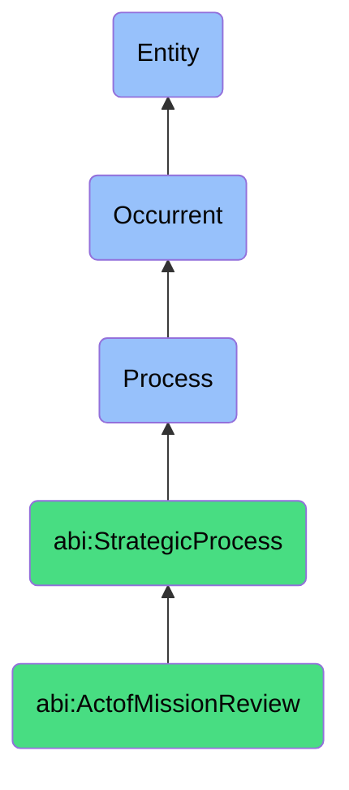

# ActofMissionReview

## Definition
An act of mission review is an occurrent process that unfolds through time, involving the systematic examination and evaluation of organizational activities, decisions, initiatives, and outcomes against the organization's formally articulated mission statement or purpose, to identify alignment gaps, verify strategic coherence, validate resource allocation priorities, and ensure that operational and tactical choices authentically reflect and advance the organization's fundamental reason for existence.

## Hierarchy in BFO


## Ontological Schema (TBox)
```turtle
abi:ActofMissionReview a owl:Class ;
  rdfs:subClassOf abi:StrategicProcess ;
  rdfs:label "Act of Mission Review" ;
  skos:definition "A process that evaluates whether actions, strategies, or behaviors align with the declared mission." .

abi:StrategicProcess a owl:Class ;
  rdfs:subClassOf bfo:0000015 ;
  rdfs:label "Strategic Process" ;
  skos:definition "A time-bound process related to the assessment, alignment, articulation, or evolution of organizational purpose, principles, direction, and capabilities." .

abi:has_mission_reviewer a owl:ObjectProperty ;
  rdfs:domain abi:ActofMissionReview ;
  rdfs:range abi:MissionReviewer ;
  rdfs:label "has mission reviewer" .

abi:assesses_mission_statement a owl:ObjectProperty ;
  rdfs:domain abi:ActofMissionReview ;
  rdfs:range abi:MissionStatement ;
  rdfs:label "assesses mission statement" .

abi:evaluates_organizational_activity a owl:ObjectProperty ;
  rdfs:domain abi:ActofMissionReview ;
  rdfs:range abi:OrganizationalActivity ;
  rdfs:label "evaluates organizational activity" .

abi:uses_mission_alignment_criteria a owl:ObjectProperty ;
  rdfs:domain abi:ActofMissionReview ;
  rdfs:range abi:MissionAlignmentCriteria ;
  rdfs:label "uses mission alignment criteria" .

abi:identifies_mission_alignment_gap a owl:ObjectProperty ;
  rdfs:domain abi:ActofMissionReview ;
  rdfs:range abi:MissionAlignmentGap ;
  rdfs:label "identifies mission alignment gap" .

abi:proposes_mission_alignment_action a owl:ObjectProperty ;
  rdfs:domain abi:ActofMissionReview ;
  rdfs:range abi:MissionAlignmentAction ;
  rdfs:label "proposes mission alignment action" .

abi:produces_mission_review_report a owl:ObjectProperty ;
  rdfs:domain abi:ActofMissionReview ;
  rdfs:range abi:MissionReviewReport ;
  rdfs:label "produces mission review report" .

abi:has_review_date a owl:DatatypeProperty ;
  rdfs:domain abi:ActofMissionReview ;
  rdfs:range xsd:date ;
  rdfs:label "has review date" .

abi:has_alignment_score a owl:DatatypeProperty ;
  rdfs:domain abi:ActofMissionReview ;
  rdfs:range xsd:decimal ;
  rdfs:label "has alignment score" .

abi:has_review_scope a owl:DatatypeProperty ;
  rdfs:domain abi:ActofMissionReview ;
  rdfs:range xsd:string ;
  rdfs:label "has review scope" .
```

## Ontological Instance (ABox)
```turtle
ex:QuarterlyProductStrategyMissionReview a abi:ActofMissionReview ;
  rdfs:label "Q3 Product Strategy Mission Alignment Assessment" ;
  abi:has_mission_reviewer ex:ChiefProductOfficer, ex:ProductVisionCommittee, ex:CustomerAdvocateRepresentative ;
  abi:assesses_mission_statement ex:CompanyMissionStatement, ex:ProductVisionStatement ;
  abi:evaluates_organizational_activity ex:ProductRoadmap, ex:FeaturePriorityMatrix, ex:UXDesignGuidelines, ex:MarketPositioning ;
  abi:uses_mission_alignment_criteria ex:CustomerImpactMetrics, ex:CoreValueExpression, ex:MarketDifferentiation, ex:LongTermValueGeneration ;
  abi:identifies_mission_alignment_gap ex:FeatureBloatDetection, ex:LackOfCustomerPainPointFocus, ex:ShortTermRevenueOveremphasis ;
  abi:proposes_mission_alignment_action ex:FeatureConsolidationInitiative, ex:CustomerCentricPriorityFramework, ex:LongTermMetricsImplementation ;
  abi:produces_mission_review_report ex:ProductMissionAlignmentDocument, ex:ExecutiveBriefingSummary ;
  abi:has_review_date "2023-09-15"^^xsd:date ;
  abi:has_alignment_score "0.72"^^xsd:decimal ;
  abi:has_review_scope "Product Strategy and Roadmap" .

ex:AnnualOrganizationalMissionReview a abi:ActofMissionReview ;
  rdfs:label "Annual Corporate Mission Effectiveness Assessment" ;
  abi:has_mission_reviewer ex:ChiefExecutiveOfficer, ex:BoardOfDirectors, ex:StrategyConsultant, ex:StakeholderPanel ;
  abi:assesses_mission_statement ex:CorporateMissionStatement, ex:OrganizationalPurposeDocument ;
  abi:evaluates_organizational_activity ex:AnnualBudgetAllocation, ex:StrategicInitiatives, ex:DepartmentalObjectives, ex:CompensationStructure ;
  abi:uses_mission_alignment_criteria ex:ResourceAllocationConsistency, ex:StrategicOutcomeMeasurement, ex:OrganizationalCoherence, ex:ExternalPerception ;
  abi:identifies_mission_alignment_gap ex:ResourceImbalanceIssues, ex:MissionDriftEvidence, ex:IncentiveMisalignment, ex:BrandPerceptionDisconnect ;
  abi:proposes_mission_alignment_action ex:ResourceRebalancingPlan, ex:MissionReinforcement, ex:CompensationRestructuring, ex:BrandMissionRealignment ;
  abi:produces_mission_review_report ex:ComprehensiveMissionAssessment, ex:StrategicGapAnalysis, ex:AlignmentRoadmap ;
  abi:has_review_date "2023-11-30"^^xsd:date ;
  abi:has_alignment_score "0.65"^^xsd:decimal ;
  abi:has_review_scope "Complete Organizational Alignment" .
```

## Related Classes
- **abi:ActofValueManifestationReview** - A complementary process examining alignment with organizational values.
- **abi:ActofStrategySync** - A follow-up process to realign plans with strategic intent based on mission review.
- **abi:MissionFormulationProcess** - A process for creating or revising the organizational mission.
- **abi:StrategicPlanningProcess** - A process informed by mission review findings to develop strategic direction.
- **abi:OrganizationalPrioritySettingProcess** - A process for establishing work priorities based on mission.
- **abi:ResourceAllocationProcess** - A process for distributing resources in alignment with mission.
- **abi:MissionCommunicationProcess** - A process for articulating the mission to stakeholders. 