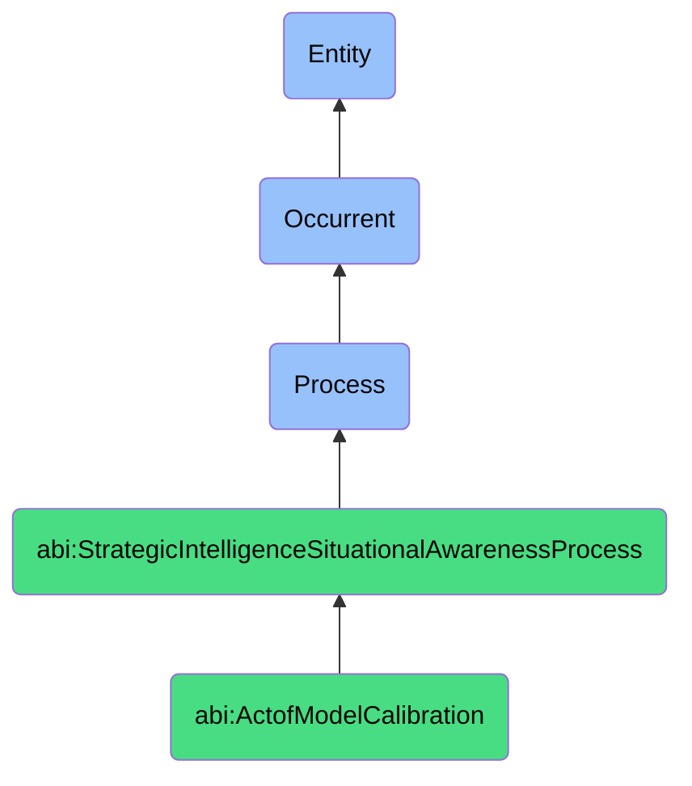

# ActofModelCalibration

## Definition
An act of model calibration is an occurrent process that unfolds through time, involving the systematic adjustment, refinement, or tuning of a computational, statistical, or conceptual model's parameters, assumptions, or structure to align its outputs more closely with empirical observations, historical data, or established benchmarks, thereby increasing the model's accuracy, reliability, and predictive validity through iterative testing, validation, and optimization techniques that reduce discrepancies between model predictions and ground truth data points.

## Hierarchy in BFO


## Ontological Schema (TBox)
```turtle
abi:ActofModelCalibration a owl:Class ;
  rdfs:subClassOf abi:StrategicIntelligenceSituationalAwarenessProcess ;
  rdfs:label "Act of Model Calibration" ;
  skos:definition "A process that systematically adjusts a model's parameters to align its outputs with empirical observations, increasing accuracy and reliability." .

abi:has_calibration_performer a owl:ObjectProperty ;
  rdfs:domain abi:ActofModelCalibration ;
  rdfs:range abi:CalibrationPerformer ;
  rdfs:label "has calibration performer" .

abi:calibrates_target_model a owl:ObjectProperty ;
  rdfs:domain abi:ActofModelCalibration ;
  rdfs:range abi:TargetModel ;
  rdfs:label "calibrates target model" .

abi:uses_reference_dataset a owl:ObjectProperty ;
  rdfs:domain abi:ActofModelCalibration ;
  rdfs:range abi:ReferenceDataset ;
  rdfs:label "uses reference dataset" .

abi:applies_calibration_method a owl:ObjectProperty ;
  rdfs:domain abi:ActofModelCalibration ;
  rdfs:range abi:CalibrationMethod ;
  rdfs:label "applies calibration method" .

abi:adjusts_model_parameter a owl:ObjectProperty ;
  rdfs:domain abi:ActofModelCalibration ;
  rdfs:range abi:ModelParameter ;
  rdfs:label "adjusts model parameter" .

abi:employs_validation_technique a owl:ObjectProperty ;
  rdfs:domain abi:ActofModelCalibration ;
  rdfs:range abi:ValidationTechnique ;
  rdfs:label "employs validation technique" .

abi:produces_calibration_metric a owl:ObjectProperty ;
  rdfs:domain abi:ActofModelCalibration ;
  rdfs:range abi:CalibrationMetric ;
  rdfs:label "produces calibration metric" .

abi:results_in_model_version a owl:ObjectProperty ;
  rdfs:domain abi:ActofModelCalibration ;
  rdfs:range abi:ModelVersion ;
  rdfs:label "results in model version" .

abi:has_calibration_timestamp a owl:DatatypeProperty ;
  rdfs:domain abi:ActofModelCalibration ;
  rdfs:range xsd:dateTime ;
  rdfs:label "has calibration timestamp" .

abi:has_calibration_iterations a owl:DatatypeProperty ;
  rdfs:domain abi:ActofModelCalibration ;
  rdfs:range xsd:integer ;
  rdfs:label "has calibration iterations" .

abi:has_accuracy_improvement a owl:DatatypeProperty ;
  rdfs:domain abi:ActofModelCalibration ;
  rdfs:range xsd:decimal ;
  rdfs:label "has accuracy improvement" .
```

## Ontological Instance (ABox)
```turtle
ex:DemandForecastingModelCalibration a abi:ActofModelCalibration ;
  rdfs:label "Retail Demand Forecasting Model Calibration" ;
  abi:has_calibration_performer ex:DataScientist, ex:MerchandisingAnalyst, ex:ForecastingSpecialist ;
  abi:calibrates_target_model ex:TimeSeriesForecastingModel, ex:SeasonalityModel, ex:PromotionResponseModel ;
  abi:uses_reference_dataset ex:HistoricalSalesData, ex:PromotionalEventHistory, ex:SeasonalTrendData ;
  abi:applies_calibration_method ex:BayesianOptimization, ex:CrossValidation, ex:EnsembleWeightTuning ;
  abi:adjusts_model_parameter ex:SeasonalityWeights, ex:PromotionMultiplier, ex:TrendDampening, ex:OutlierThreshold ;
  abi:employs_validation_technique ex:OutOfSampleTesting, ex:BackTesting, ex:CrossValidation ;
  abi:produces_calibration_metric ex:MeanAbsolutePercentageError, ex:RootMeanSquaredError, ex:ForecastAccuracy ;
  abi:results_in_model_version ex:RetailForecastingV2_4, ex:SeasonalityModelV3_1 ;
  abi:has_calibration_timestamp "2023-09-15T10:30:00Z"^^xsd:dateTime ;
  abi:has_calibration_iterations "27"^^xsd:integer ;
  abi:has_accuracy_improvement "0.16"^^xsd:decimal .

ex:CustomerChurnModelCalibration a abi:ActofModelCalibration ;
  rdfs:label "SaaS Customer Churn Prediction Model Calibration" ;
  abi:has_calibration_performer ex:CustomerSuccessAnalyst, ex:MachineLearningEngineer, ex:ProductManager ;
  abi:calibrates_target_model ex:ChurnPredictionModel, ex:CustomerHealthModel, ex:EngagementScoringModel ;
  abi:uses_reference_dataset ex:HistoricalChurnEvents, ex:UserEngagementMetrics, ex:SupportTicketHistory ;
  abi:applies_calibration_method ex:LogisticRegressionTuning, ex:RandomForestOptimization, ex:ThresholdAdjustment ;
  abi:adjusts_model_parameter ex:RiskThreshold, ex:FeatureWeights, ex:TimeHorizon, ex:EngagementDecayFactor ;
  abi:employs_validation_technique ex:KFoldValidation, ex:PrecisionRecallCurve, ex:ROCAnalysis ;
  abi:produces_calibration_metric ex:F1Score, ex:RecallRate, ex:PrecisionMetric, ex:AUCScore ;
  abi:results_in_model_version ex:ChurnPredictorV5_2, ex:EngagementScoringV3_7 ;
  abi:has_calibration_timestamp "2023-10-05T14:45:00Z"^^xsd:dateTime ;
  abi:has_calibration_iterations "42"^^xsd:integer ;
  abi:has_accuracy_improvement "0.23"^^xsd:decimal .
```

## Related Classes
- **abi:ActofSimulation** - A process that creates modeled scenarios that may require calibration.
- **abi:ActofSituationAssessment** - A process that provides real-world context for model calibration.
- **abi:ActofSituationalAwarenessGeneration** - A process that synthesizes a situation that models may represent.
- **abi:ActofStrategicOptionGeneration** - A process that may use calibrated models to generate options.
- **abi:DataAnalysisProcess** - A process for examining data that may inform model calibration.
- **abi:ModelDevelopmentProcess** - A process for creating models that require calibration.
- **abi:PredictiveAnalyticsProcess** - A process utilizing predictive models that benefit from calibration. 