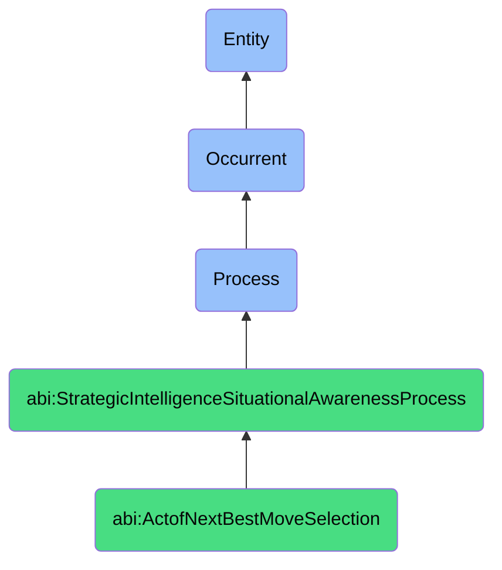

# ActofNextBestMoveSelection

## Definition
An act of next best move selection is an occurrent process that unfolds through time, involving the systematic evaluation, prioritization, and determination of the most advantageous immediate course of action from a set of available options, considering current context, strategic objectives, resource constraints, and probabilistic outcomes to identify the optimal next step that maximizes value, minimizes risk, or best advances toward desired goals, often balancing short-term tactical gains with longer-term strategic positioning.

## Hierarchy in BFO


## Ontological Schema (TBox)
```turtle
abi:ActofNextBestMoveSelection a owl:Class ;
  rdfs:subClassOf abi:StrategicIntelligenceSituationalAwarenessProcess ;
  rdfs:label "Act of Next Best Move Selection" ;
  skos:definition "A process that systematically evaluates and determines the most advantageous immediate course of action based on current context and objectives." .

abi:has_decision_maker a owl:ObjectProperty ;
  rdfs:domain abi:ActofNextBestMoveSelection ;
  rdfs:range abi:DecisionMaker ;
  rdfs:label "has decision maker" .

abi:considers_current_situation a owl:ObjectProperty ;
  rdfs:domain abi:ActofNextBestMoveSelection ;
  rdfs:range abi:CurrentSituation ;
  rdfs:label "considers current situation" .

abi:evaluates_strategic_option a owl:ObjectProperty ;
  rdfs:domain abi:ActofNextBestMoveSelection ;
  rdfs:range abi:StrategicOption ;
  rdfs:label "evaluates strategic option" .

abi:applies_decision_criteria a owl:ObjectProperty ;
  rdfs:domain abi:ActofNextBestMoveSelection ;
  rdfs:range abi:DecisionCriteria ;
  rdfs:label "applies decision criteria" .

abi:uses_evaluation_method a owl:ObjectProperty ;
  rdfs:domain abi:ActofNextBestMoveSelection ;
  rdfs:range abi:EvaluationMethod ;
  rdfs:label "uses evaluation method" .

abi:assesses_option_impact a owl:ObjectProperty ;
  rdfs:domain abi:ActofNextBestMoveSelection ;
  rdfs:range abi:OptionImpact ;
  rdfs:label "assesses option impact" .

abi:considers_resource_constraint a owl:ObjectProperty ;
  rdfs:domain abi:ActofNextBestMoveSelection ;
  rdfs:range abi:ResourceConstraint ;
  rdfs:label "considers resource constraint" .

abi:selects_next_best_move a owl:ObjectProperty ;
  rdfs:domain abi:ActofNextBestMoveSelection ;
  rdfs:range abi:NextBestMove ;
  rdfs:label "selects next best move" .

abi:produces_decision_rationale a owl:ObjectProperty ;
  rdfs:domain abi:ActofNextBestMoveSelection ;
  rdfs:range abi:DecisionRationale ;
  rdfs:label "produces decision rationale" .

abi:has_selection_timestamp a owl:DatatypeProperty ;
  rdfs:domain abi:ActofNextBestMoveSelection ;
  rdfs:range xsd:dateTime ;
  rdfs:label "has selection timestamp" .

abi:has_decision_confidence a owl:DatatypeProperty ;
  rdfs:domain abi:ActofNextBestMoveSelection ;
  rdfs:range xsd:decimal ;
  rdfs:label "has decision confidence" .

abi:has_option_count a owl:DatatypeProperty ;
  rdfs:domain abi:ActofNextBestMoveSelection ;
  rdfs:range xsd:integer ;
  rdfs:label "has option count" .
```

## Ontological Instance (ABox)
```turtle
ex:ProductRoadmapPrioritization a abi:ActofNextBestMoveSelection ;
  rdfs:label "Q2 Product Development Roadmap Prioritization" ;
  abi:has_decision_maker ex:ProductManager, ex:EngineeringLead, ex:CustomerSuccessDirector, ex:CTO ;
  abi:considers_current_situation ex:MarketCompetition, ex:CustomerFeedbackTrends, ex:EngineeringCapacity, ex:QuarterlyObjectives ;
  abi:evaluates_strategic_option ex:FeatureADevelopment, ex:FeatureBDevelopment, ex:PlatformRestructuring, ex:TechnicalDebtReduction ;
  abi:applies_decision_criteria ex:CustomerImpact, ex:StrategicAlignment, ex:TechnicalFeasibility, ex:MarketDifferentiation ;
  abi:uses_evaluation_method ex:WeightedScoringModel, ex:ROICalculation, ex:ICEFramework ;
  abi:assesses_option_impact ex:RevenueGrowthImpact, ex:CustomerRetentionImpact, ex:MarketPositioningImpact ;
  abi:considers_resource_constraint ex:DeveloperAvailability, ex:BudgetAllocation, ex:TimeToMarket ;
  abi:selects_next_best_move ex:PrioritizeFeatureA, ex:DeferPlatformRestructuring ;
  abi:produces_decision_rationale ex:CustomerValuePrioritization, ex:CompetitiveResponseNecessity ;
  abi:has_selection_timestamp "2023-09-28T15:30:00Z"^^xsd:dateTime ;
  abi:has_decision_confidence "0.87"^^xsd:decimal ;
  abi:has_option_count "4"^^xsd:integer .

ex:MarketExpansionStrategySelection a abi:ActofNextBestMoveSelection ;
  rdfs:label "European Market Expansion Strategy Selection" ;
  abi:has_decision_maker ex:ChiefStrategyOfficer, ex:RegionalDirector, ex:InternationalGrowthTeam, ex:CFO ;
  abi:considers_current_situation ex:BrexitContext, ex:EURegulations, ex:CompetitorExpansion, ex:MarketOpportunitySize ;
  abi:evaluates_strategic_option ex:DirectEntryGermany, ex:PartnershipNetherlands, ex:AcquisitionFrance, ex:MultimarketGradualEntry ;
  abi:applies_decision_criteria ex:RiskProfile, ex:ResourceRequirements, ex:TimeToRevenue, ex:StrategicFit ;
  abi:uses_evaluation_method ex:ScenarioAnalysis, ex:RealOptionsValuation, ex:RiskAdjustedNPV ;
  abi:assesses_option_impact ex:GrowthTrajectory, ex:MarketShareCapture, ex:CashFlowRequirements ;
  abi:considers_resource_constraint ex:CapitalAvailability, ex:LocalExpertise, ex:ManagementBandwidth ;
  abi:selects_next_best_move ex:PartnerFirstGermanyThenExpand, ex:DelayAcquisitions ;
  abi:produces_decision_rationale ex:RiskMitigatingStaggeredApproach, ex:CapitalEfficiencyMaximization ;
  abi:has_selection_timestamp "2023-10-15T11:00:00Z"^^xsd:dateTime ;
  abi:has_decision_confidence "0.82"^^xsd:decimal ;
  abi:has_option_count "5"^^xsd:integer .
```

## Related Classes
- **abi:ActofSituationAssessment** - A process that provides context for move selection.
- **abi:ActofSituationalAwarenessGeneration** - A process that synthesizes a situational model to inform selection.
- **abi:ActofStrategicOptionGeneration** - A process that creates the options from which the next best move is selected.
- **abi:ActofScenarioPlanning** - A process that may provide future contexts for evaluating potential moves.
- **abi:ActofStrategyAlignmentReview** - A process that ensures selected moves align with broader strategy.
- **abi:DecisionMakingProcess** - A broader process that encompasses various decision types.
- **abi:RiskAssessmentProcess** - A process that evaluates risks associated with potential moves. 