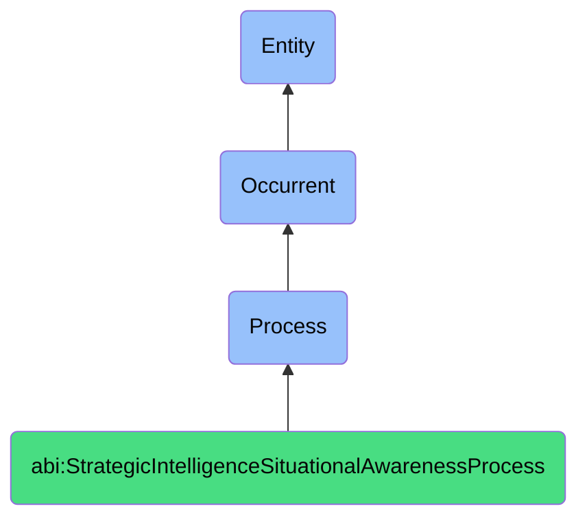

# StrategicIntelligenceSituationalAwarenessProcess

## Definition
A strategic intelligence situational awareness process is an occurrent that unfolds through time, involving the systematic collection, analysis, interpretation, or synthesis of information about internal and external environments, contexts, or systems to develop understanding, assess conditions, identify patterns, evaluate options, or support decision-making, providing actionable insights regarding current situations, potential futures, or optimal courses of action through methodologies that enhance perception, comprehension, and projection capabilities in complex, dynamic, or uncertain circumstances.

## Hierarchy in BFO


## Ontological Schema (TBox)
```turtle
abi:StrategicIntelligenceSituationalAwarenessProcess a owl:Class ;
  rdfs:subClassOf bfo:0000015 ;
  rdfs:label "Strategic Intelligence Situational Awareness Process" ;
  skos:definition "A time-bound process related to the collection, analysis, and synthesis of information to develop understanding of current situations, evaluate options, or support strategic decision-making." .

abi:has_intelligence_agent a owl:ObjectProperty ;
  rdfs:domain abi:StrategicIntelligenceSituationalAwarenessProcess ;
  rdfs:range abi:IntelligenceAgent ;
  rdfs:label "has intelligence agent" .

abi:processes_information_source a owl:ObjectProperty ;
  rdfs:domain abi:StrategicIntelligenceSituationalAwarenessProcess ;
  rdfs:range abi:InformationSource ;
  rdfs:label "processes information source" .

abi:analyzes_situational_context a owl:ObjectProperty ;
  rdfs:domain abi:StrategicIntelligenceSituationalAwarenessProcess ;
  rdfs:range abi:SituationalContext ;
  rdfs:label "analyzes situational context" .

abi:applies_analytical_methodology a owl:ObjectProperty ;
  rdfs:domain abi:StrategicIntelligenceSituationalAwarenessProcess ;
  rdfs:range abi:AnalyticalMethodology ;
  rdfs:label "applies analytical methodology" .

abi:considers_strategic_objective a owl:ObjectProperty ;
  rdfs:domain abi:StrategicIntelligenceSituationalAwarenessProcess ;
  rdfs:range abi:StrategicObjective ;
  rdfs:label "considers strategic objective" .

abi:addresses_uncertainty_factor a owl:ObjectProperty ;
  rdfs:domain abi:StrategicIntelligenceSituationalAwarenessProcess ;
  rdfs:range abi:UncertaintyFactor ;
  rdfs:label "addresses uncertainty factor" .

abi:produces_intelligence_output a owl:ObjectProperty ;
  rdfs:domain abi:StrategicIntelligenceSituationalAwarenessProcess ;
  rdfs:range abi:IntelligenceOutput ;
  rdfs:label "produces intelligence output" .

abi:has_temporal_scope a owl:DatatypeProperty ;
  rdfs:domain abi:StrategicIntelligenceSituationalAwarenessProcess ;
  rdfs:range xsd:string ;
  rdfs:label "has temporal scope" .

abi:has_confidence_level a owl:DatatypeProperty ;
  rdfs:domain abi:StrategicIntelligenceSituationalAwarenessProcess ;
  rdfs:range xsd:decimal ;
  rdfs:label "has confidence level" .

abi:has_strategic_impact a owl:DatatypeProperty ;
  rdfs:domain abi:StrategicIntelligenceSituationalAwarenessProcess ;
  rdfs:range xsd:string ;
  rdfs:label "has strategic impact" .
```

## Ontological Instance (ABox)
```turtle
# StrategicIntelligenceSituationalAwarenessProcess is a parent class with subclasses:
# - abi:ActofSituationAssessment
# - abi:ActofSituationalAwarenessGeneration
# - abi:ActofSimulation
# - abi:ActofModelCalibration
# - abi:ActofStrategicOptionGeneration
# - abi:ActofScenarioPlanning
# - abi:ActofNextBestMoveSelection
# - abi:ActofStrategyAlignmentReview
# and other strategic intelligence and situational awareness-related processes
```

## Related Classes
- **abi:ActofSituationAssessment** - A process that collects, aggregates, and contextualizes signals to define the current state of a system or environment.
- **abi:ActofSituationalAwarenessGeneration** - A process that synthesizes internal and external signals into a coherent, shareable model of what is happening now.
- **abi:ActofSimulation** - A process that models and compares alternative futures or outcomes based on possible actions.
- **abi:ActofModelCalibration** - A process that tunes simulation or forecasting models based on observed performance and changing inputs.
- **abi:ActofStrategicOptionGeneration** - A process that proposes multiple viable paths forward based on current situation and simulation outcomes.
- **abi:ActofScenarioPlanning** - A process of creating and evaluating detailed alternate future situations under uncertainty.
- **abi:ActofNextBestMoveSelection** - A decision-making process where the system or user selects the optimal action among strategic options.
- **abi:ActofStrategyAlignmentReview** - A process to ensure proposed actions align with mission, values, and current commitments. 