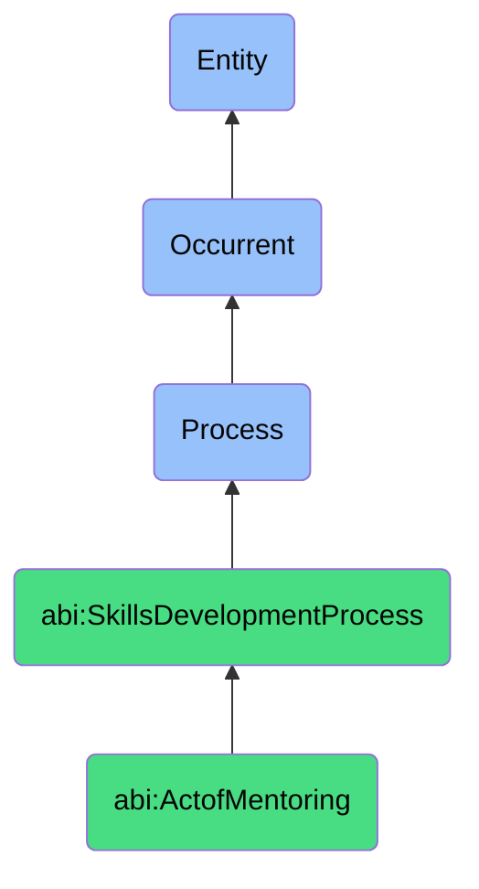

# ActofMentoring

## Definition
An act of mentoring is an occurrent process that unfolds through time, involving the intentional, developmental relationship between a more experienced or knowledgeable individual (mentor) and a less experienced or knowledgeable individual (mentee), characterized by regular guidance, feedback, knowledge sharing, and support aimed at facilitating professional growth, skill enhancement, perspective development, and career advancement through personalized interaction, experiential learning, and progressive autonomy within organizational or disciplinary contexts.

## Hierarchy in BFO


## Ontological Schema (TBox)
```turtle
abi:ActofMentoring a owl:Class ;
  rdfs:subClassOf abi:SkillsDevelopmentProcess ;
  rdfs:label "Act of Mentoring" ;
  skos:definition "A process where a more experienced person supports the development of skills or perspective in another." .

abi:SkillsDevelopmentProcess a owl:Class ;
  rdfs:subClassOf bfo:0000015 ;
  rdfs:label "Skills Development Process" ;
  skos:definition "A time-bound process related to the identification, acquisition, cultivation, enhancement, or transfer of knowledge, capabilities, competencies, or expertise within individuals or organizational contexts." .

abi:has_mentor a owl:ObjectProperty ;
  rdfs:domain abi:ActofMentoring ;
  rdfs:range abi:Mentor ;
  rdfs:label "has mentor" .

abi:has_mentee a owl:ObjectProperty ;
  rdfs:domain abi:ActofMentoring ;
  rdfs:range abi:Mentee ;
  rdfs:label "has mentee" .

abi:addresses_development_area a owl:ObjectProperty ;
  rdfs:domain abi:ActofMentoring ;
  rdfs:range abi:DevelopmentArea ;
  rdfs:label "addresses development area" .

abi:employs_mentoring_approach a owl:ObjectProperty ;
  rdfs:domain abi:ActofMentoring ;
  rdfs:range abi:MentoringApproach ;
  rdfs:label "employs mentoring approach" .

abi:includes_mentoring_activity a owl:ObjectProperty ;
  rdfs:domain abi:ActofMentoring ;
  rdfs:range abi:MentoringActivity ;
  rdfs:label "includes mentoring activity" .

abi:provides_developmental_feedback a owl:ObjectProperty ;
  rdfs:domain abi:ActofMentoring ;
  rdfs:range abi:DevelopmentalFeedback ;
  rdfs:label "provides developmental feedback" .

abi:produces_mentoring_outcome a owl:ObjectProperty ;
  rdfs:domain abi:ActofMentoring ;
  rdfs:range abi:MentoringOutcome ;
  rdfs:label "produces mentoring outcome" .

abi:has_mentoring_start_date a owl:DatatypeProperty ;
  rdfs:domain abi:ActofMentoring ;
  rdfs:range xsd:date ;
  rdfs:label "has mentoring start date" .

abi:has_mentoring_frequency a owl:DatatypeProperty ;
  rdfs:domain abi:ActofMentoring ;
  rdfs:range xsd:string ;
  rdfs:label "has mentoring frequency" .

abi:has_relationship_stage a owl:DatatypeProperty ;
  rdfs:domain abi:ActofMentoring ;
  rdfs:range xsd:string ;
  rdfs:label "has relationship stage" .
```

## Ontological Instance (ABox)
```turtle
ex:OntologyEngineeringMentorship a abi:ActofMentoring ;
  rdfs:label "Senior Ontology Engineer Mentoring Junior Analyst" ;
  abi:has_mentor ex:SeniorOntologyEngineer ;
  abi:has_mentee ex:JuniorDataAnalyst ;
  abi:addresses_development_area ex:OntologyModelingPrinciples, ex:SemanticReasoning, ex:KnowledgeGraphDesign, ex:BusinessDomainModeling ;
  abi:employs_mentoring_approach ex:GuidedPractice, ex:CollaborativeModelingSession, ex:CodeReview, ex:ConceptualDiscussion ;
  abi:includes_mentoring_activity ex:PairModeling, ex:CaseStudyAnalysis, ex:OntologyReviewFeedback, ex:DomainResearch ;
  abi:provides_developmental_feedback ex:ModelingTechniqueAdvice, ex:PatternSelectionGuidance, ex:DocumentationSuggestions ;
  abi:produces_mentoring_outcome ex:ImprovedModelingCapability, ex:IncreasedIndependence, ex:DomainExpertiseGrowth ;
  abi:has_mentoring_start_date "2023-09-01"^^xsd:date ;
  abi:has_mentoring_frequency "Weekly" ;
  abi:has_relationship_stage "Active Development" .

ex:LeadershipDevelopmentMentorship a abi:ActofMentoring ;
  rdfs:label "Executive Leadership Mentoring Program" ;
  abi:has_mentor ex:ChiefOperationsOfficer ;
  abi:has_mentee ex:RisingDirector ;
  abi:addresses_development_area ex:StrategicDecisionMaking, ex:TeamLeadership, ex:OrganizationalInfluence, ex:ChangeManagement ;
  abi:employs_mentoring_approach ex:ShadowingExperience, ex:ScenarioAnalysis, ex:StrategicDialogue, ex:ReflectivePractice ;
  abi:includes_mentoring_activity ex:LeadershipBookDiscussions, ex:MeetingObservation, ex:DelegationPractice, ex:StrategicPlanningParticipation ;
  abi:provides_developmental_feedback ex:LeadershipStyleInsights, ex:DecisionFrameworkAdvice, ex:CommunicationStrategies ;
  abi:produces_mentoring_outcome ex:ExpandedLeadershipCapacity, ex:StrategicThinkingImprovement, ex:IncreasedOrganizationalImpact ;
  abi:has_mentoring_start_date "2023-06-15"^^xsd:date ;
  abi:has_mentoring_frequency "Bi-weekly" ;
  abi:has_relationship_stage "Advanced Growth" .
```

## Related Classes
- **abi:ActofHiring** - A process that may identify mentoring needs for new contributors.
- **abi:ActofOnboarding** - A process often complemented by mentoring for new contributors.
- **abi:ActofInternalTraining** - A more structured process compared to mentoring's individualized approach.
- **abi:ActofSkillAssessment** - A process that may guide mentoring focus areas.
- **abi:ActofSkillRecognition** - A process that formally acknowledges skills developed through mentoring.
- **abi:MentorMatchingProcess** - A process for pairing mentors with appropriate mentees.
- **abi:ProfessionalDevelopmentPlanningProcess** - A process that may incorporate mentoring as a development strategy. 