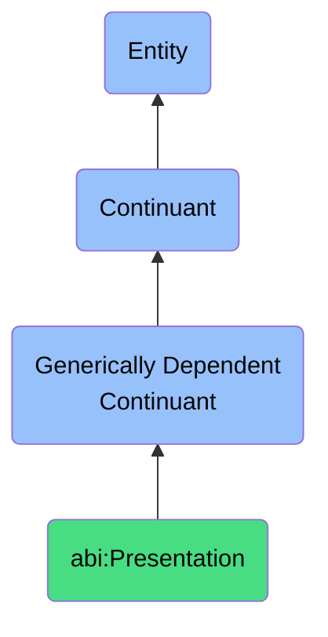

# Presentation

## Definition
A presentation is a generically dependent continuant that structures arrangements of messages or claims meant to inform, persuade, or explain in a time-bound setting.

## Hierarchy in BFO

## Related Classes
- **abi:SlideDeck** - A generically dependent continuant that conveys ideas or insights through a sequential set of visual or textual frames.
- **abi:Report** - A generically dependent continuant that communicates structured analysis or findings about a specific topic.
- **abi:Transcript** - A generically dependent continuant that provides a verbatim or summarized textual representation of spoken dialogue captured during a conversation. 