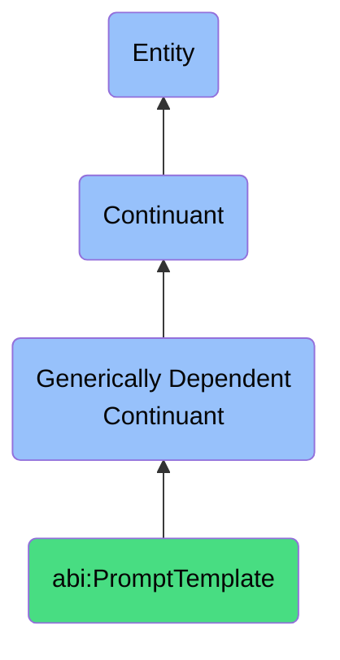

# PromptTemplate

## Definition
A prompt template is a generically dependent continuant that provides a configurable text or structure used to guide AI behavior or responses.

## Hierarchy in BFO

## Related Classes
- **abi:WorkflowSpecification** - A generically dependent continuant that describes a prescriptive plan for a set of interrelated tasks and their sequence.
- **abi:OntologyFile** - A generically dependent continuant that provides a formal encoding of domain-specific concepts, relations, and constraints expressed in a semantic web format.
- **abi:SPARQLQuery** - A generically dependent continuant that expresses a formal query pattern used to retrieve or manipulate information from a semantic graph.
- **abi:ValidationRule** - A generically dependent continuant that defines a logical constraint used to check whether data or behavior conforms to expectations. 