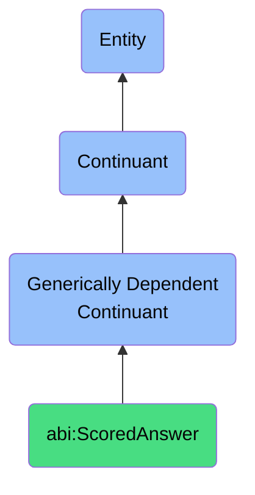

# ScoredAnswer

## Definition
A scored answer is a generically dependent continuant that provides a response to a question or observation that includes a value expressing confidence or quality.

## Hierarchy in BFO

## Related Classes
- **abi:BusinessQuestion** - A generically dependent continuant that expresses a natural-language or formal inquiry posed to elicit decision-relevant knowledge.
- **abi:ObservationContent** - A generically dependent continuant that provides a structured representation of an insight or finding derived from an event or process.
- **abi:Recommendation** - A generically dependent continuant that expresses a proposal for action based on observed facts, learned patterns, or reasoning. 