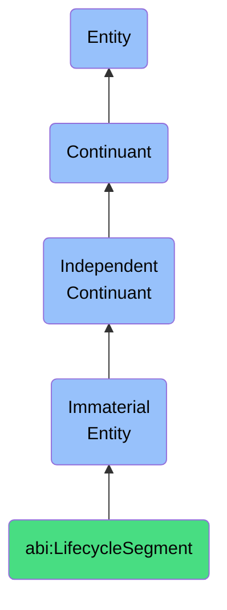

# LifecycleSegment

## Definition
A lifecycle segment is an immaterial entity that identifies a specific stretch of time or state within a content, contract, or asset lifecycle, establishing temporal boundaries that facilitate appropriate handling, governance, and progression of entities through their existence.

## Hierarchy in BFO


## Ontological Schema (TBox)
```turtle
abi:LifecycleSegment a owl:Class ;
  rdfs:subClassOf bfo:0000141 ;
  rdfs:label "Lifecycle Segment" ;
  skos:definition "An immaterial entity that identifies a specific stretch of time or state within a content, contract, or asset lifecycle, establishing temporal boundaries that facilitate appropriate handling, governance, and progression of entities through their existence." .

abi:belongs_to_lifecycle a owl:ObjectProperty ;
  rdfs:domain abi:LifecycleSegment ;
  rdfs:range abi:Lifecycle ;
  rdfs:label "belongs to lifecycle" .

abi:applies_to_entity a owl:ObjectProperty ;
  rdfs:domain abi:LifecycleSegment ;
  rdfs:range owl:Thing ;
  rdfs:label "applies to entity" .

abi:requires_governance a owl:ObjectProperty ;
  rdfs:domain abi:LifecycleSegment ;
  rdfs:range abi:GovernancePolicy ;
  rdfs:label "requires governance" .

abi:triggers_actions a owl:ObjectProperty ;
  rdfs:domain abi:LifecycleSegment ;
  rdfs:range abi:LifecycleAction ;
  rdfs:label "triggers actions" .

abi:progresses_to a owl:ObjectProperty ;
  rdfs:domain abi:LifecycleSegment ;
  rdfs:range abi:LifecycleSegment ;
  rdfs:label "progresses to" .

abi:has_average_duration a owl:DatatypeProperty ;
  rdfs:domain abi:LifecycleSegment ;
  rdfs:range xsd:duration ;
  rdfs:label "has average duration" .

abi:has_state_descriptor a owl:DatatypeProperty ;
  rdfs:domain abi:LifecycleSegment ;
  rdfs:range xsd:string ;
  rdfs:label "has state descriptor" .
```

## Ontological Instance (ABox)
```turtle
ex:ContractReviewSegment a abi:LifecycleSegment ;
  rdfs:label "Contract Under Review Segment" ;
  abi:belongs_to_lifecycle ex:ContractLifecycle ;
  abi:applies_to_entity ex:ServiceAgreementContract ;
  abi:requires_governance ex:LegalReviewPolicy, ex:RiskAssessmentPolicy ;
  abi:triggers_actions ex:LegalReviewAction, ex:StakeholderApprovalAction ;
  abi:progresses_to ex:ContractApprovalSegment ;
  abi:has_average_duration "P14D"^^xsd:duration ;
  abi:has_state_descriptor "Under Review" .

ex:ContentDraftSegment a abi:LifecycleSegment ;
  rdfs:label "Content Draft Segment" ;
  abi:belongs_to_lifecycle ex:ContentLifecycle ;
  abi:applies_to_entity ex:MarketingWhitepaper ;
  abi:requires_governance ex:EditorialPolicy, ex:BrandCompliancePolicy ;
  abi:triggers_actions ex:EditorialReviewAction, ex:ContentFeedbackAction ;
  abi:progresses_to ex:ContentApprovalSegment ;
  abi:has_average_duration "P7D"^^xsd:duration ;
  abi:has_state_descriptor "Draft" .
```

## Related Classes
- **abi:Lifecycle** - An immaterial entity that represents the complete sequence of stages or states through which an entity progresses from creation to disposition.
- **abi:WorkflowStage** - An immaterial entity that delineates a distinct phase within a broader business or operational process.
- **abi:EntityState** - An immaterial entity that represents a specific condition or status of a business entity at a point in time.
- **abi:StatusTransition** - An immaterial entity that represents the change from one state to another within a lifecycle or process flow. 