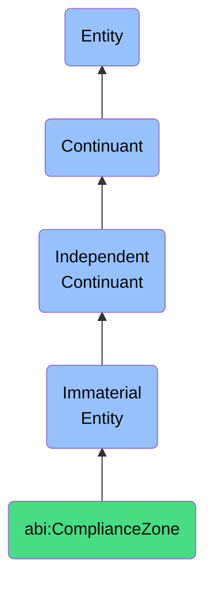

# ComplianceZone

## Definition
A compliance zone is an immaterial entity that designates an area where specific regulatory, legal, or policy requirements apply and must be adhered to.

## Hierarchy in BFO


## Ontological Schema (TBox)
```turtle
abi:ComplianceZone a owl:Class ;
  rdfs:subClassOf bfo:0000141 ;
  rdfs:label "Compliance Zone" ;
  skos:definition "An area where specific regulatory, legal, or policy requirements apply and must be adhered to." .

abi:governs_activity a owl:ObjectProperty ;
  rdfs:domain abi:ComplianceZone ;
  rdfs:range abi:BusinessActivity ;
  rdfs:label "governs activity" .

abi:references_regulation a owl:ObjectProperty ;
  rdfs:domain abi:ComplianceZone ;
  rdfs:range abi:Regulation ;
  rdfs:label "references regulation" .

abi:has_compliance_level a owl:DatatypeProperty ;
  rdfs:domain abi:ComplianceZone ;
  rdfs:range xsd:string ;
  rdfs:label "has compliance level" .

abi:has_enforcing_authority a owl:ObjectProperty ;
  rdfs:domain abi:ComplianceZone ;
  rdfs:range abi:Authority ;
  rdfs:label "has enforcing authority" .
```

## Ontological Instance (ABox)
```turtle
ex:GDPRComplianceZone a abi:ComplianceZone ;
  rdfs:label "GDPR Compliance Zone" ;
  abi:governs_activity ex:PersonalDataProcessing, ex:DataRetention ;
  abi:references_regulation ex:GDPR, ex:ePrivacyDirective ;
  abi:has_compliance_level "Mandatory" ;
  abi:has_enforcing_authority ex:EUDataProtectionAuthorities .

ex:SOX404ComplianceZone a abi:ComplianceZone ;
  rdfs:label "SOX 404 Financial Reporting Compliance Zone" ;
  abi:governs_activity ex:FinancialReporting, ex:InternalControl ;
  abi:references_regulation ex:SarbanesOxleyAct ;
  abi:has_compliance_level "Mandatory for Public Companies" ;
  abi:has_enforcing_authority ex:SEC, ex:PCAOB .
```

## Related Classes
- **abi:ValidationBoundary** - An immaterial entity that is a rule-defined scope where certain logical or business constraints are enforced.
- **abi:RegulatedDomain** - An immaterial entity that represents a business domain subject to specific regulatory oversight.
- **abi:PolicyScope** - An immaterial entity that defines the boundaries within which organizational policies apply. 