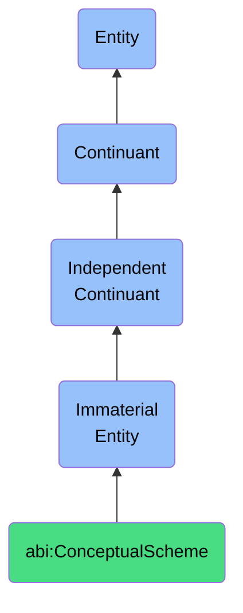

# ConceptualScheme

## Definition
A conceptual scheme is an immaterial entity that provides a systematic arrangement of concepts and their interrelationships, serving as a framework within which experiences, objects, and events are categorized, interpreted, and understood according to particular theoretical orientations or worldviews.

## Hierarchy in BFO


## Ontological Schema (TBox)
```turtle
abi:ConceptualScheme a owl:Class ;
  rdfs:subClassOf bfo:0000141 ;
  rdfs:label "Conceptual Scheme" ;
  skos:definition "An immaterial entity that provides a systematic arrangement of concepts and their interrelationships, serving as a framework within which experiences, objects, and events are categorized, interpreted, and understood according to particular theoretical orientations or worldviews." .

abi:organizes_concepts a owl:ObjectProperty ;
  rdfs:domain abi:ConceptualScheme ;
  rdfs:range abi:Concept ;
  rdfs:label "organizes concepts" .

abi:structures_theoretical_perspective a owl:ObjectProperty ;
  rdfs:domain abi:ConceptualScheme ;
  rdfs:range abi:TheoreticalPerspective ;
  rdfs:label "structures theoretical perspective" .

abi:enables_categorization a owl:ObjectProperty ;
  rdfs:domain abi:ConceptualScheme ;
  rdfs:range abi:CategorizationSystem ;
  rdfs:label "enables categorization" .

abi:shapes_interpretive_framework a owl:ObjectProperty ;
  rdfs:domain abi:ConceptualScheme ;
  rdfs:range abi:InterpretiveFramework ;
  rdfs:label "shapes interpretive framework" .

abi:has_worldview_orientation a owl:DatatypeProperty ;
  rdfs:domain abi:ConceptualScheme ;
  rdfs:range xsd:string ;
  rdfs:label "has worldview orientation" .
```

## Ontological Instance (ABox)
```turtle
ex:ScientificMaterialismScheme a abi:ConceptualScheme ;
  rdfs:label "Scientific Materialism Scheme" ;
  abi:organizes_concepts ex:PhysicalismConcept, ex:CausalDeterminismConcept, ex:EmpiricismConcept ;
  abi:structures_theoretical_perspective ex:MaterialistMetaphysics, ex:ScientificNaturalism ;
  abi:enables_categorization ex:PhysicalCausationSystem, ex:MaterialEntityClassification ;
  abi:shapes_interpretive_framework ex:ReductionistExplanation, ex:MechanisticModeling ;
  abi:has_worldview_orientation "Materialist" .

ex:PhenomenologicalScheme a abi:ConceptualScheme ;
  rdfs:label "Phenomenological Scheme" ;
  abi:organizes_concepts ex:LivedExperienceConcept, ex:IntentionalityConcept, ex:EmbodimentConcept ;
  abi:structures_theoretical_perspective ex:ExistentialPhenomenology, ex:HermeneuticInterpretation ;
  abi:enables_categorization ex:ExperientialMeaningSystem, ex:LifeworldContextClassification ;
  abi:shapes_interpretive_framework ex:ExperientialUnderstanding, ex:PhenomenologicalReduction ;
  abi:has_worldview_orientation "Phenomenological" .
```

## Related Classes
- **abi:KnowledgeStructure** - An immaterial entity that organizes informational content into coherent patterns that facilitate comprehension, retrieval, and application of knowledge within specific domains of understanding, characterized by taxonomic relationships, propositional networks, and conceptual hierarchies.
- **abi:SemanticFramework** - An immaterial entity that structures the conceptual relationships and meaning assignments within a specific domain, providing the constraints through which information is organized and interpreted according to established ontological commitments, taxonomic hierarchies, and domain-specific terminologies.
- **abi:InterpretationContext** - An immaterial entity that provides the framework of presuppositions, background knowledge, and inferential patterns that an agent employs to make sense of information, determining relevance, disambiguating meanings, and enabling appropriate interpretive responses within a specific domain of discourse. 