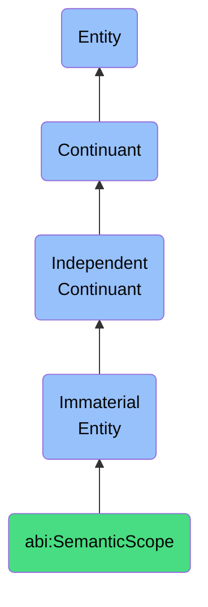

# SemanticScope

## Definition
A semantic scope is an immaterial entity that establishes the contextual boundaries of meaning, interpretation, and semantic relationships within a specified domain or discourse.

## Hierarchy in BFO


## Ontological Schema (TBox)
```turtle
abi:SemanticScope a owl:Class ;
  rdfs:subClassOf bfo:0000141 ;
  rdfs:label "Semantic Scope" ;
  skos:definition "An immaterial entity that establishes the contextual boundaries of meaning, interpretation, and semantic relationships within a specified domain or discourse." .

abi:defines_terminology a owl:ObjectProperty ;
  rdfs:domain abi:SemanticScope ;
  rdfs:range abi:TerminologySet ;
  rdfs:label "defines terminology" .

abi:constrains_interpretation a owl:ObjectProperty ;
  rdfs:domain abi:SemanticScope ;
  rdfs:range abi:InterpretationContext ;
  rdfs:label "constrains interpretation" .

abi:includes_conceptual_relation a owl:ObjectProperty ;
  rdfs:domain abi:SemanticScope ;
  rdfs:range abi:ConceptualRelation ;
  rdfs:label "includes conceptual relation" .

abi:has_ambiguity_level a owl:DatatypeProperty ;
  rdfs:domain abi:SemanticScope ;
  rdfs:range xsd:string ;
  rdfs:label "has ambiguity level" .
```

## Ontological Instance (ABox)
```turtle
ex:FinancialReportingScope a abi:SemanticScope ;
  rdfs:label "Financial Reporting Semantic Scope" ;
  abi:defines_terminology ex:AccountingTerms, ex:FinancialMetrics ;
  abi:constrains_interpretation ex:GAAPInterpretationContext ;
  abi:includes_conceptual_relation ex:RevenueToExpenseRelation, ex:AssetToLiabilityRelation ;
  abi:has_ambiguity_level "Low" .

ex:ProductDocumentationScope a abi:SemanticScope ;
  rdfs:label "Product Documentation Semantic Scope" ;
  abi:defines_terminology ex:TechnicalTerms, ex:UserInterfaceTerms ;
  abi:constrains_interpretation ex:EndUserInterpretationContext ;
  abi:includes_conceptual_relation ex:FeatureToFunctionRelation, ex:ComponentHierarchyRelation ;
  abi:has_ambiguity_level "Medium" .
```

## Related Classes
- **abi:ConceptualDomain** - An immaterial entity that defines a cohesive area of concepts with shared characteristics or relationships.
- **abi:DiscourseContext** - An immaterial entity that provides the framework for understanding and interpreting communication within a specific situation.
- **abi:OntologicalBoundary** - An immaterial entity that demarcates the limits of what can be represented within a formal knowledge representation system. 