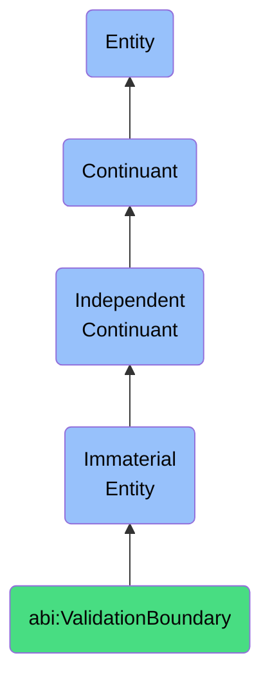

# ValidationBoundary

## Definition
A validation boundary is an immaterial entity that is a rule-defined scope where certain logical or business constraints are enforced.

## Hierarchy in BFO


## Ontological Schema (TBox)
```turtle
abi:ValidationBoundary a owl:Class ;
  rdfs:subClassOf bfo:0000141 ;
  rdfs:label "Validation Boundary" ;
  skos:definition "A rule-defined scope where certain logical or business constraints are enforced." .

abi:enforces_rule a owl:ObjectProperty ;
  rdfs:domain abi:ValidationBoundary ;
  rdfs:range abi:ValidationRule ;
  rdfs:label "enforces rule" .

abi:applies_to_domain a owl:ObjectProperty ;
  rdfs:domain abi:ValidationBoundary ;
  rdfs:range abi:BusinessDomain ;
  rdfs:label "applies to domain" .

abi:has_severity a owl:DatatypeProperty ;
  rdfs:domain abi:ValidationBoundary ;
  rdfs:range xsd:string ;
  rdfs:label "has severity" .

abi:has_enforcement_mechanism a owl:ObjectProperty ;
  rdfs:domain abi:ValidationBoundary ;
  rdfs:range abi:EnforcementMechanism ;
  rdfs:label "has enforcement mechanism" .
```

## Ontological Instance (ABox)
```turtle
ex:FinancialTransactionValidation a abi:ValidationBoundary ;
  rdfs:label "Financial Transaction Validation Boundary" ;
  abi:enforces_rule ex:AntiMoneyLaunderingRules, ex:TransactionLimits ;
  abi:applies_to_domain ex:PaymentProcessing ;
  abi:has_severity "Critical" ;
  abi:has_enforcement_mechanism ex:AutomaticRejection, ex:ManualReview .

ex:DataQualityValidation a abi:ValidationBoundary ;
  rdfs:label "Customer Data Quality Validation Boundary" ;
  abi:enforces_rule ex:DataCompleteness, ex:DataFormatting ;
  abi:applies_to_domain ex:CustomerManagement ;
  abi:has_severity "Medium" ;
  abi:has_enforcement_mechanism ex:ValidationWarning, ex:DataCleansingSuggestion .
```

## Related Classes
- **abi:InsightScope** - An immaterial entity that defines the conceptual boundary of an analysis or insight.
- **abi:DecisionSpace** - An immaterial entity that represents the bounded area of viable choices, constraints, and influencing factors.
- **abi:ComplianceZone** - An immaterial entity that designates an area where specific regulatory or policy requirements apply. 