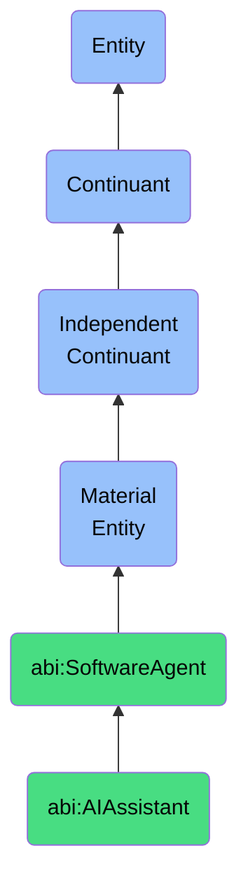

# AIAssistant

## Definition
An AI assistant is a material entity that is a software-controlled agent that performs tasks on behalf of a user but is represented ontologically as a service-deployed entity with memory, identity, and role.

## Hierarchy in BFO


## Ontological Schema (TBox)
```turtle
abi:AIAssistant a owl:Class ;
  rdfs:subClassOf abi:SoftwareAgent ;
  rdfs:label "AI Assistant" ;
  skos:definition "A software-controlled agent that performs tasks on behalf of a user but is represented ontologically as a service-deployed entity with memory, identity, and role." .

abi:uses_model a owl:ObjectProperty ;
  rdfs:domain abi:AIAssistant ;
  rdfs:range abi:AIModel ;
  rdfs:label "uses model" .

abi:has_capability a owl:ObjectProperty ;
  rdfs:domain abi:AIAssistant ;
  rdfs:range abi:AICapability ;
  rdfs:label "has capability" .

abi:assists a owl:ObjectProperty ;
  rdfs:domain abi:AIAssistant ;
  rdfs:range abi:Person ;
  rdfs:label "assists" .
```

## Ontological Instance (ABox)
```turtle
ex:ClaudeAssistant a abi:AIAssistant ;
  rdfs:label "Claude Assistant" ;
  abi:uses_model ex:Claude3Opus ;
  abi:has_capability ex:NaturalLanguageGeneration, ex:Reasoning, ex:ContentCreation ;
  abi:assists ex:JohnDoe .

ex:ABIAnalyticAssistant a abi:AIAssistant ;
  rdfs:label "ABI Analytic Assistant" ;
  abi:uses_model ex:GPT4, ex:Claude3Sonnet ;
  abi:has_capability ex:DataAnalysis, ex:ReportGeneration ;
  abi:assists ex:AnalyticsTeam .
```

## Related Classes
- **abi:SoftwareAgent** - A material entity that is a materialized computational unit that autonomously executes tasks defined by workflows, prompts, or APIs.
- **abi:OpenAIAgent** - A material entity that is a subclass of SoftwareAgent that interacts with OpenAI services to generate observations.
- **abi:PerplexityAgent** - A material entity that is a software agent that queries and retrieves summaries or documents from Perplexity. 