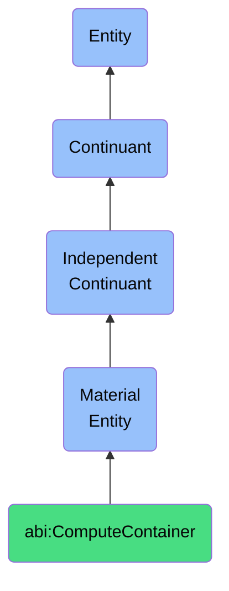

# ComputeContainer

## Definition
A compute container is a material entity that is a software-deployed, bounded material system that runs a defined set of tasks, often mapped to an ABI workflow or service.

## Hierarchy in BFO


## Ontological Schema (TBox)
```turtle
abi:ComputeContainer a owl:Class ;
  rdfs:subClassOf bfo:0000040 ;
  rdfs:label "Compute Container" ;
  skos:definition "A software-deployed, bounded material system that runs a defined set of tasks, often mapped to an ABI workflow or service." .

abi:runs_on a owl:ObjectProperty ;
  rdfs:domain abi:ComputeContainer ;
  rdfs:range abi:ComputeInfrastructure ;
  rdfs:label "runs on" .

abi:executes_service a owl:ObjectProperty ;
  rdfs:domain abi:ComputeContainer ;
  rdfs:range abi:SoftwareService ;
  rdfs:label "executes service" .

abi:has_resource_limits a owl:DatatypeProperty ;
  rdfs:domain abi:ComputeContainer ;
  rdfs:range xsd:string ;
  rdfs:label "has resource limits" .

abi:has_container_id a owl:DatatypeProperty ;
  rdfs:domain abi:ComputeContainer ;
  rdfs:range xsd:string ;
  rdfs:label "has container id" .
```

## Ontological Instance (ABox)
```turtle
ex:WebServiceContainer a abi:ComputeContainer ;
  rdfs:label "Web Service API Container" ;
  abi:runs_on ex:KubernetesCluster ;
  abi:executes_service ex:APIService ;
  abi:has_resource_limits "CPU: 2, Memory: 4GB" ;
  abi:has_container_id "web-api-svc-76f4d9b68b-2xv9j" .

ex:DataProcessingContainer a abi:ComputeContainer ;
  rdfs:label "Data Processing Container" ;
  abi:runs_on ex:ECSCluster ;
  abi:executes_service ex:ETLService ;
  abi:has_resource_limits "CPU: 4, Memory: 16GB" ;
  abi:has_container_id "data-proc-task-ec7a8d3f" .
```

## Related Classes
- **abi:DatabaseInstance** - A material entity that is a container that stores structured information used by ABI components.
- **abi:ObjectStorageFolder** - A material entity that is a physical or virtual folder within a file system that holds time-versioned or semantically grouped resources.
- **abi:WorkflowInstance** - A material entity that is a materialized instantiation of a process or set of tasks executing across systems or agents. 