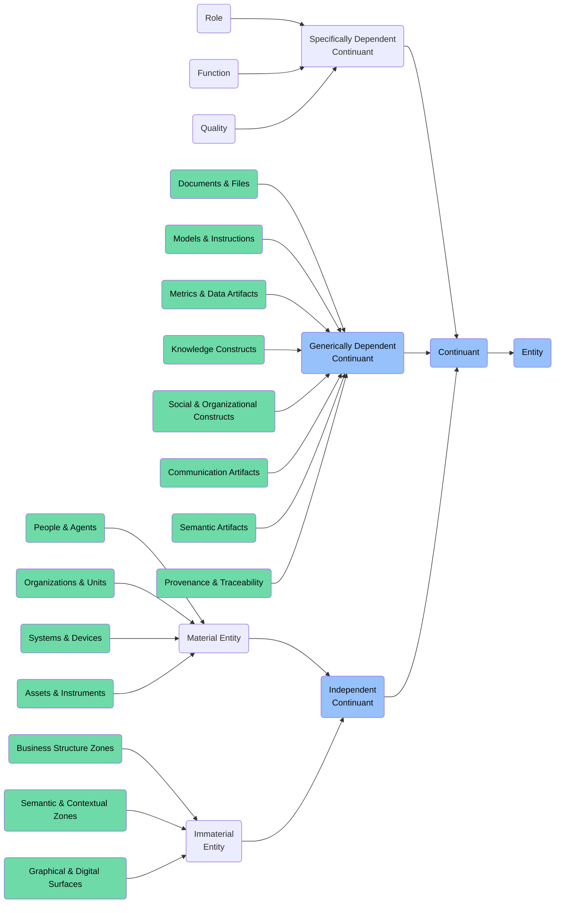

# Continuant: Enterprise Management Foundry

This folder contains ontology classes representing **Continuants** in the context of the **Enterprise Management Foundry** of the ABI Ontology.

Continuants are entities that **persist through time** and maintain their identity even as they undergo various changes. These entities form the backbone of enterprise structures, assets, roles, and information artifacts.

## Purpose
To model all persistent entities involved in enterprise management — including organizations, people, systems, roles, qualities, documents, and knowledge structures that support business operations, decision-making, and information flows.

## Structure
This folder includes:

### 1. **Independent Continuants** (`bfo:0000004`)
Entities that do not depend on other entities for their existence.

#### a. **Material Entities** (`bfo:0000040`)
Physical or digital entities with material existence.

- **Assets & Instruments**
  - `abi:FinancialAsset`
  - `abi:CapitalEquipment`
  - `abi:IntellectualProperty`

- **People & Agents**
  - `abi:Employee`
  - `abi:Manager`
  - `abi:Stakeholder`
  
- **Organizations & Units**
  - `abi:Department`
  - `abi:BusinessUnit`
  - `abi:Team`
  
- **Systems & Devices**
  - `abi:EnterpriseSystem`
  - `abi:NetworkInfrastructure`
  - `abi:WorkstationDevice`

- **Roles & Operational Artifacts**
  - `abi:OperationalProcess`
  - `abi:WorkInstruction`
  - `abi:ServiceRequest`

- **Physical or Storage-Backed Representations**
  - `abi:PhysicalDocument`
  - `abi:StorageSystem`
  - `abi:DataBackup`

#### b. **Immaterial Entities** (`bfo:0000141`)
Independent continuants that have no material parts at any time.

- **Business Structure Zones**
  - `abi:BusinessZone`
  - `abi:PersonaTerritory`
  - `abi:WorkflowStage`
  - `abi:LifecycleSegment`

- **Semantic & Contextual Zones**
  - `abi:SemanticFramework`
  - `abi:KnowledgeStructure`
  - `abi:ConceptualScheme`
  - `abi:InterpretationContext`
  - `abi:DiscourseContext`

- **Graphical & Digital Surfaces**
  - `abi:DashboardZone`
  - `abi:ContentPlacementZone`
  - `abi:GraphSubregion`

### 2. **Specifically Dependent Continuants** (`bfo:0000020`)
Entities that depend on specific bearers for their existence.

#### a. **Roles** (`bfo:0000023`)
Realizable entities that an entity can bear in certain contexts.
- `abi:LeadershipRole`
- `abi:ProjectManagerRole`
- `abi:AnalystRole`
- `abi:CustomerRole`
- `abi:SupplierRole`

#### b. **Functions** (`bfo:0000034`)
Special kinds of dispositions that exist because of an entity's physical makeup.
- `abi:DataProcessingFunction`
- `abi:ReportingFunction`
- `abi:CommunicationFunction`
- `abi:DecisionSupportFunction`
- `abi:ResourceAllocationFunction`

#### c. **Qualities** (`bfo:0000019`)
Dependent entities that are fully realized in their bearers.
- `abi:PerformanceQuality`
- `abi:CredentialStrength`
- `abi:TrustScore`
- `abi:Status`
- `abi:SentimentValue`

### 3. **Generically Dependent Continuants** (`bfo:0000031`)
Information artifacts that can exist in multiple copies.

#### a. **Documents & Files**
- `abi:ContractDocument`
- `abi:StrategyPlan`
- `abi:PolicyDocument`

#### b. **Models & Instructions**
- `abi:BusinessProcessModel`
- `abi:OperatingProcedure`
- `abi:WorkInstruction`

#### c. **Metrics & Data Artifacts**
- `abi:PerformanceMetric`
- `abi:DataSet`
- `abi:AnalyticsReport`

#### d. **Knowledge Constructs**
- `abi:KnowledgeBase`
- `abi:SkillFramework`
- `abi:CompetencyModel`

#### e. **Social & Organizational Constructs**
- `abi:OrganizationalStructure`
- `abi:TeamFormation`
- `abi:ReportingHierarchy`

#### f. **Communication Artifacts**
- `abi:Message`
- `abi:Announcement`
- `abi:Notification`

#### g. **Semantic Artifacts**
- `abi:Taxonomy`
- `abi:Ontology`
- `abi:TerminologySet`

#### h. **Provenance & Traceability Artifacts**
- `abi:AuditRecord`
- `abi:ChangeHistory`
- `abi:ActivityLog`

## BFO Hierarchy

## Usage
These classes are designed to:
- Model enterprise structures, actors, and their relationships
- Represent organizational knowledge, processes, and capabilities
- Support management decision-making and operational workflows
- Enable comprehensive enterprise architecture modeling
- Facilitate business analysis and process improvement

## Alignment
All classes in this folder:
- Are subclasses of `bfo:Continuant`
- Are scoped specifically to the **Enterprise Management Foundry**
- Can be imported modularly or reused in other domains

For time-bound processes, events, and activities related to enterprise management, see the `Occurrent` folder. 