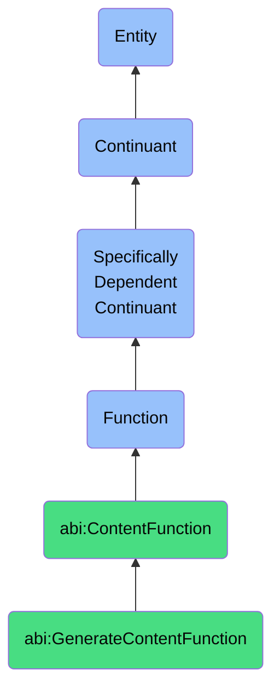

# GenerateContentFunction

## Definition
A generate content function is a specifically dependent continuant that inheres in its bearer, endowing the capacity to produce written, visual, or multimedia content according to specified parameters, audience requirements, and communication objectives.

## Hierarchy in BFO


## Ontological Schema (TBox)
```turtle
abi:GenerateContentFunction a owl:Class ;
  rdfs:subClassOf abi:ContentFunction ;
  rdfs:label "Generate Content Function" ;
  skos:definition "A function that enables a bearer to produce written, visual, or multimedia content." .

abi:ContentFunction a owl:Class ;
  rdfs:subClassOf bfo:0000034 ;
  rdfs:label "Content Function" ;
  skos:definition "A function related to the creation, transformation, or delivery of content." .

abi:inheres_in a owl:ObjectProperty ;
  rdfs:domain abi:GenerateContentFunction ;
  rdfs:range abi:ContentGenerator ;
  rdfs:label "inheres in" .

abi:produces_content_type a owl:ObjectProperty ;
  rdfs:domain abi:GenerateContentFunction ;
  rdfs:range abi:ContentType ;
  rdfs:label "produces content type" .

abi:follows_content_guidelines a owl:ObjectProperty ;
  rdfs:domain abi:GenerateContentFunction ;
  rdfs:range abi:ContentGuidelines ;
  rdfs:label "follows content guidelines" .

abi:targets_audience a owl:ObjectProperty ;
  rdfs:domain abi:GenerateContentFunction ;
  rdfs:range abi:Audience ;
  rdfs:label "targets audience" .

abi:realizes_communication_goal a owl:ObjectProperty ;
  rdfs:domain abi:GenerateContentFunction ;
  rdfs:range abi:CommunicationGoal ;
  rdfs:label "realizes communication goal" .

abi:uses_content_generation_method a owl:ObjectProperty ;
  rdfs:domain abi:GenerateContentFunction ;
  rdfs:range abi:ContentGenerationMethod ;
  rdfs:label "uses content generation method" .

abi:requires_input_data a owl:ObjectProperty ;
  rdfs:domain abi:GenerateContentFunction ;
  rdfs:range abi:InputData ;
  rdfs:label "requires input data" .

abi:has_content_complexity a owl:DatatypeProperty ;
  rdfs:domain abi:GenerateContentFunction ;
  rdfs:range xsd:string ;
  rdfs:label "has content complexity" .

abi:has_average_generation_time a owl:DatatypeProperty ;
  rdfs:domain abi:GenerateContentFunction ;
  rdfs:range xsd:decimal ;
  rdfs:label "has average generation time" .

abi:has_quality_score a owl:DatatypeProperty ;
  rdfs:domain abi:GenerateContentFunction ;
  rdfs:range xsd:decimal ;
  rdfs:label "has quality score" .
```

## Ontological Instance (ABox)
```turtle
ex:AIALinkedInPostGenerationFunction a abi:GenerateContentFunction ;
  rdfs:label "AIA LinkedIn Post Generation Function" ;
  abi:inheres_in ex:AIAAssistant ;
  abi:produces_content_type ex:LinkedInPost, ex:SocialMediaUpdate ;
  abi:follows_content_guidelines ex:BrandVoiceGuidelines, ex:LinkedInBestPractices ;
  abi:targets_audience ex:IndustryProfessionals, ex:PotentialClients ;
  abi:realizes_communication_goal ex:BrandAwarenessGoal, ex:ThoughtLeadershipGoal ;
  abi:uses_content_generation_method ex:NLPGenerationMethod, ex:TemplateBasedMethod ;
  abi:requires_input_data ex:IndustryTrendsData, ex:CompanyNewsData ;
  abi:has_content_complexity "Medium" ;
  abi:has_average_generation_time "2.5"^^xsd:decimal ;
  abi:has_quality_score "0.92"^^xsd:decimal .

ex:ContentTeamBlogGenerationFunction a abi:GenerateContentFunction ;
  rdfs:label "Content Team Blog Generation Function" ;
  abi:inheres_in ex:MarketingDepartment ;
  abi:produces_content_type ex:BlogPost, ex:IndustryArticle ;
  abi:follows_content_guidelines ex:SEOGuidelines, ex:ContentMarketingStandards ;
  abi:targets_audience ex:ExistingCustomers, ex:ProspectiveClients ;
  abi:realizes_communication_goal ex:LeadGenerationGoal, ex:CustomerEducationGoal ;
  abi:uses_content_generation_method ex:EditorialCalendarMethod, ex:SubjectMatterExpertCollaboration ;
  abi:requires_input_data ex:CustomerPainPointsData, ex:ProductFeaturesData ;
  abi:has_content_complexity "High" ;
  abi:has_average_generation_time "8.0"^^xsd:decimal ;
  abi:has_quality_score "0.95"^^xsd:decimal .
```

## Related Classes
- **abi:SummarizeTextFunction** - A function that condenses textual information, often used in conjunction with content generation.
- **abi:TranslateInsightFunction** - A function that transforms technical content into business language, complementing content generation.
- **abi:ContentEditingFunction** - A function focused on refining and improving existing content.
- **abi:ContentDistributionFunction** - A function focused on disseminating generated content across channels.
- **abi:ContentAnalysisFunction** - A function that evaluates content performance and quality. 