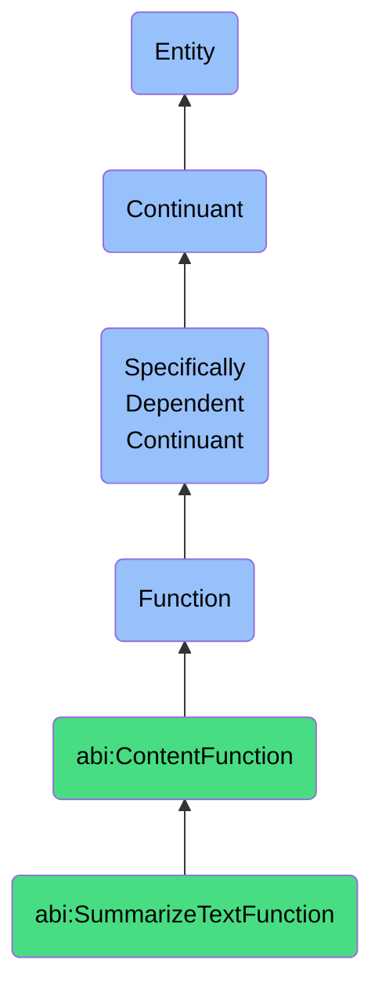

# SummarizeTextFunction

## Definition
A summarize text function is a specifically dependent continuant that inheres in its bearer, providing the capability to extract, condense, and articulate the key points, themes, and conclusions from larger textual inputs while preserving essential meaning and context.

## Hierarchy in BFO


## Ontological Schema (TBox)
```turtle
abi:SummarizeTextFunction a owl:Class ;
  rdfs:subClassOf abi:ContentFunction ;
  rdfs:label "Summarize Text Function" ;
  skos:definition "A function that enables the extraction of concise insights from larger textual inputs." .

abi:ContentFunction a owl:Class ;
  rdfs:subClassOf bfo:0000034 ;
  rdfs:label "Content Function" ;
  skos:definition "A function related to the creation, transformation, or delivery of content." .

abi:inheres_in a owl:ObjectProperty ;
  rdfs:domain abi:SummarizeTextFunction ;
  rdfs:range abi:TextProcessor ;
  rdfs:label "inheres in" .

abi:processes_text_type a owl:ObjectProperty ;
  rdfs:domain abi:SummarizeTextFunction ;
  rdfs:range abi:TextualContent ;
  rdfs:label "processes text type" .

abi:produces_summary_type a owl:ObjectProperty ;
  rdfs:domain abi:SummarizeTextFunction ;
  rdfs:range abi:SummaryType ;
  rdfs:label "produces summary type" .

abi:preserves_key_elements a owl:ObjectProperty ;
  rdfs:domain abi:SummarizeTextFunction ;
  rdfs:range abi:ContentElement ;
  rdfs:label "preserves key elements" .

abi:uses_summarization_technique a owl:ObjectProperty ;
  rdfs:domain abi:SummarizeTextFunction ;
  rdfs:range abi:SummarizationTechnique ;
  rdfs:label "uses summarization technique" .

abi:maintains_context a owl:ObjectProperty ;
  rdfs:domain abi:SummarizeTextFunction ;
  rdfs:range abi:ContentContext ;
  rdfs:label "maintains context" .

abi:supports_decision_process a owl:ObjectProperty ;
  rdfs:domain abi:SummarizeTextFunction ;
  rdfs:range abi:DecisionProcess ;
  rdfs:label "supports decision process" .

abi:has_compression_ratio a owl:DatatypeProperty ;
  rdfs:domain abi:SummarizeTextFunction ;
  rdfs:range xsd:decimal ;
  rdfs:label "has compression ratio" .

abi:has_accuracy_score a owl:DatatypeProperty ;
  rdfs:domain abi:SummarizeTextFunction ;
  rdfs:range xsd:decimal ;
  rdfs:label "has accuracy score" .

abi:has_processing_time a owl:DatatypeProperty ;
  rdfs:domain abi:SummarizeTextFunction ;
  rdfs:range xsd:decimal ;
  rdfs:label "has processing time" .
```

## Ontological Instance (ABox)
```turtle
ex:OpenAIResearchReportSummaryFunction a abi:SummarizeTextFunction ;
  rdfs:label "OpenAI Research Report Summarization Function" ;
  abi:inheres_in ex:OpenAIAgent ;
  abi:processes_text_type ex:ResearchReport, ex:AcademicPaper ;
  abi:produces_summary_type ex:ExecutiveSummary, ex:BulletPointSummary ;
  abi:preserves_key_elements ex:ResearchFindings, ex:Methodology, ex:Conclusions ;
  abi:uses_summarization_technique ex:ExtractiveSummarization, ex:AbstractiveSummarization ;
  abi:maintains_context ex:ResearchDomain, ex:StudyLimitations ;
  abi:supports_decision_process ex:ResearchInvestmentProcess, ex:TechnologyAdoptionProcess ;
  abi:has_compression_ratio "0.15"^^xsd:decimal ;
  abi:has_accuracy_score "0.88"^^xsd:decimal ;
  abi:has_processing_time "1.2"^^xsd:decimal .

ex:BusinessIntelligenceReportSummaryFunction a abi:SummarizeTextFunction ;
  rdfs:label "Business Intelligence Report Summarization Function" ;
  abi:inheres_in ex:AnalyticsDepartment ;
  abi:processes_text_type ex:QuarterlyReport, ex:MarketAnalysis, ex:CompetitorIntelligence ;
  abi:produces_summary_type ex:ManagementBriefing, ex:KeyMetricsDashboard ;
  abi:preserves_key_elements ex:FinancialTrends, ex:MarketOpportunities, ex:StrategicThreats ;
  abi:uses_summarization_technique ex:KeyInsightExtraction, ex:DataVisualization ;
  abi:maintains_context ex:IndustryTrends, ex:HistoricalPerformance ;
  abi:supports_decision_process ex:StrategicPlanningProcess, ex:ResourceAllocationProcess ;
  abi:has_compression_ratio "0.12"^^xsd:decimal ;
  abi:has_accuracy_score "0.92"^^xsd:decimal ;
  abi:has_processing_time "3.5"^^xsd:decimal .
```

## Related Classes
- **abi:GenerateContentFunction** - A function that creates content, which may incorporate summarized information.
- **abi:TranslateInsightFunction** - A function that often works with summarized text to transform it into business language.
- **abi:TextAnalysisFunction** - A function that examines text to identify patterns and insights, supporting summarization.
- **abi:InformationExtractionFunction** - A function that pulls specific data points from text, complementary to summarization.
- **abi:ContentPrioritizationFunction** - A function that ranks information by importance, aiding effective summarization. 