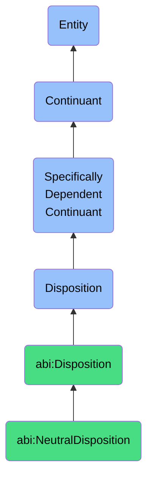

# NeutralDisposition

## Overview

### Definition
A neutral disposition is a specifically dependent continuant that inheres in its bearer, representing tendencies that are neither intrinsically positive nor negative for enterprise functioning, but which become significant in particular operational contexts. These dispositions describe potential for behavior, state change, or reaction that exists due to the inherent properties of the bearer and manifests under specific triggering conditions requiring management attention.

### Example
An information system's capacity to generate large volumes of log data is a neutral disposition. This tendency is neither inherently positive nor negative but requires appropriate management to become valuable (through effective analysis for security monitoring) or to prevent negative outcomes (such as storage exhaustion or performance degradation). Similarly, an organization's disposition to scale operations in response to demand is neutral until contextualized - requiring resource planning, process standardization, and governance mechanisms to yield positive business outcomes rather than uncontrolled growth and increased complexity.

### Comment
Neutral dispositions are particularly important in enterprise architecture as they often represent fundamental operational characteristics that require deliberate management to align with strategic objectives. Unlike positive or negative dispositions, neutral dispositions highlight the contingent nature of many enterprise capabilities, where the same underlying property can lead to different outcomes based on management approach, resource allocation, or environmental factors. Effective enterprise management requires identifying these neutral dispositions and implementing appropriate governance mechanisms to channel them toward value creation rather than allowing them to manifest in uncontrolled or suboptimal ways.

## Hierarchy in BFO


## Ontological Schema (TBox)
```turtle
abi:NeutralDisposition a owl:Class ;
  rdfs:subClassOf bfo:0000016 ;
  rdfs:label "Neutral Disposition" ;
  skos:definition "A disposition that is neither inherently beneficial nor detrimental to enterprise functioning, but which requires management within specific operational contexts." .

abi:inheres_in a owl:ObjectProperty ;
  rdfs:domain abi:NeutralDisposition ;
  rdfs:range abi:EnterpriseEntity ;
  rdfs:label "inheres in" .

abi:has_triggering_condition a owl:ObjectProperty ;
  rdfs:domain abi:NeutralDisposition ;
  rdfs:range abi:ContextualCondition ;
  rdfs:label "has triggering condition" .

abi:requires_management_through a owl:ObjectProperty ;
  rdfs:domain abi:NeutralDisposition ;
  rdfs:range abi:ManagementProcess ;
  rdfs:label "requires management through" .

abi:has_potential_outcome a owl:ObjectProperty ;
  rdfs:domain abi:NeutralDisposition ;
  rdfs:range abi:BusinessOutcome ;
  rdfs:label "has potential outcome" .

abi:has_associated_cost a owl:ObjectProperty ;
  rdfs:domain abi:NeutralDisposition ;
  rdfs:range abi:ResourceRequirement ;
  rdfs:label "has associated cost" .

abi:has_realization_rate a owl:DatatypeProperty ;
  rdfs:domain abi:NeutralDisposition ;
  rdfs:range xsd:float ;
  rdfs:label "has realization rate" .

abi:has_context_sensitivity a owl:DatatypeProperty ;
  rdfs:domain abi:NeutralDisposition ;
  rdfs:range xsd:integer ;
  rdfs:label "has context sensitivity" .

abi:has_disposition_strength a owl:DatatypeProperty ;
  rdfs:domain abi:NeutralDisposition ;
  rdfs:range xsd:integer ;
  rdfs:label "has disposition strength" .

abi:has_management_complexity a owl:DatatypeProperty ;
  rdfs:domain abi:NeutralDisposition ;
  rdfs:range xsd:integer ;
  rdfs:label "has management complexity" .
```

## Ontological Instance (ABox)
```turtle
ex:MaintenanceRequiringDisposition a abi:NeutralDisposition ;
  rdfs:label "Maintenance Requiring Disposition" ;
  skos:definition "The disposition of enterprise systems to need regular maintenance and updates to maintain functionality." ;
  abi:inheres_in ex:EnterpriseInformationSystem, ex:ProductionEnvironment ;
  abi:has_triggering_condition ex:TimeBasedTrigger, ex:PerformanceDegradationCondition ;
  abi:requires_management_through ex:PlannedMaintenanceProcess, ex:ChangeManagementProcess ;
  abi:has_potential_outcome ex:SystemStabilityOutcome, ex:OperationalContinuityOutcome ;
  abi:has_associated_cost ex:MaintenanceResources, ex:DowntimeOpportunityCost ;
  abi:has_realization_rate "0.95"^^xsd:float ;
  abi:has_context_sensitivity "7"^^xsd:integer ;
  abi:has_disposition_strength "8"^^xsd:integer ;
  abi:has_management_complexity "6"^^xsd:integer .

ex:ResourceConsumptionDisposition a abi:NeutralDisposition ;
  rdfs:label "Resource Consumption Disposition" ;
  skos:definition "The disposition of organizational processes and systems to consume computational, financial, and human resources during operation." ;
  abi:inheres_in ex:EnterpriseApplication, ex:BusinessProcess, ex:OrganizationalUnit ;
  abi:has_triggering_condition ex:OperationalActivity, ex:ScalingEvent, ex:BusinessCycleEvent ;
  abi:requires_management_through ex:ResourcePlanningProcess, ex:CapacityManagementProcess ;
  abi:has_potential_outcome ex:OperationalEfficiencyOutcome, ex:CostManagementOutcome ;
  abi:has_associated_cost ex:ComputationalResources, ex:FinancialAllocation, ex:StaffingRequirement ;
  abi:has_realization_rate "1.0"^^xsd:float ;
  abi:has_context_sensitivity "8"^^xsd:integer ;
  abi:has_disposition_strength "9"^^xsd:integer ;
  abi:has_management_complexity "7"^^xsd:integer .

ex:OrganizationalRoleTransitionDisposition a abi:NeutralDisposition ;
  rdfs:label "Organizational Role Transition Disposition" ;
  skos:definition "The disposition of staff roles and positions to change hands during personnel transitions, requiring knowledge transfer and continuity management." ;
  abi:inheres_in ex:ManagementPosition, ex:TechnicalRole, ex:OperationalFunction ;
  abi:has_triggering_condition ex:EmployeeDeparture, ex:Promotion, ex:OrganizationalRestructure ;
  abi:requires_management_through ex:SuccessionPlanningProcess, ex:KnowledgeTransferProcess ;
  abi:has_potential_outcome ex:WorkforceContinuityOutcome, ex:OperationalKnowledgeRetentionOutcome ;
  abi:has_associated_cost ex:TransitionTimeInvestment, ex:TrainingResource, ex:ProductivityDip ;
  abi:has_realization_rate "0.87"^^xsd:float ;
  abi:has_context_sensitivity "9"^^xsd:integer ;
  abi:has_disposition_strength "7"^^xsd:integer ;
  abi:has_management_complexity "8"^^xsd:integer .

ex:SystemDeprecationDisposition a abi:NeutralDisposition ;
  rdfs:label "System Deprecation Disposition" ;
  skos:definition "The disposition of enterprise technologies and systems to become obsolete over time, requiring replacement or modernization." ;
  abi:inheres_in ex:LegacySystem, ex:EnterpriseInfrastructure, ex:SoftwarePlatform ;
  abi:has_triggering_condition ex:TechnologyAdvancement, ex:VendorSupportTermination, ex:BusinessRequirementChange ;
  abi:requires_management_through ex:TechnologyRoadmapProcess, ex:ModernizationProcess, ex:MigrationPlanning ;
  abi:has_potential_outcome ex:TechnicalCurrencyOutcome, ex:CompetitiveCapabilityOutcome ;
  abi:has_associated_cost ex:CapitalInvestment, ex:MigrationEffort, ex:BusinessDisruption ;
  abi:has_realization_rate "0.92"^^xsd:float ;
  abi:has_context_sensitivity "6"^^xsd:integer ;
  abi:has_disposition_strength "8"^^xsd:integer ;
  abi:has_management_complexity "9"^^xsd:integer .
```

## Related Classes
- **abi:PositiveDisposition** - Dispositions that are beneficial for enterprise functioning when realized
- **abi:NegativeDisposition** - Dispositions that are detrimental to enterprise functioning when realized
- **abi:MaintenanceRequiringDisposition** - A specific neutral disposition representing the need for regular upkeep
- **abi:ResourceConsumptionDisposition** - A specific neutral disposition related to resource utilization
- **abi:OperationalCapabilityDisposition** - A specific neutral disposition reflecting teams' abilities to perform functions
- **abi:DisclosureReadinessDisposition** - A specific neutral disposition for information sharing readiness
- **abi:CapabilityAdaptationDisposition** - A specific neutral disposition for capability evolution
- **abi:ComplianceVerificationDisposition** - A specific neutral disposition for regulatory adherence assessment