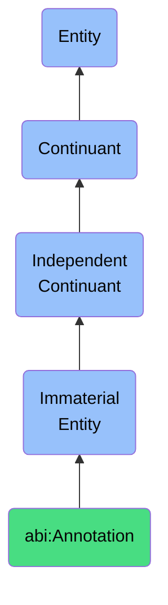

# Annotation

## Definition
An annotation is an immaterial entity that provides supplementary information, context, or interpretation to a primary object or content, enabling enhanced understanding, clarification, or analysis through the addition of notes, markers, or metadata that highlight specific aspects or provide explanatory context.

## Hierarchy in BFO


## Ontological Schema (TBox)
```turtle
abi:Annotation a owl:Class ;
  rdfs:subClassOf bfo:0000141 ;
  rdfs:label "Annotation" ;
  skos:definition "An immaterial entity that provides supplementary information, context, or interpretation to a primary object or content, enabling enhanced understanding, clarification, or analysis through the addition of notes, markers, or metadata that highlight specific aspects or provide explanatory context." .

abi:annotates_target a owl:ObjectProperty ;
  rdfs:domain abi:Annotation ;
  rdfs:range owl:Thing ;
  rdfs:label "annotates target" .

abi:created_by a owl:ObjectProperty ;
  rdfs:domain abi:Annotation ;
  rdfs:range abi:Agent ;
  rdfs:label "created by" .

abi:has_annotation_type a owl:ObjectProperty ;
  rdfs:domain abi:Annotation ;
  rdfs:range abi:AnnotationType ;
  rdfs:label "has annotation type" .

abi:references_evidence a owl:ObjectProperty ;
  rdfs:domain abi:Annotation ;
  rdfs:range abi:Evidence ;
  rdfs:label "references evidence" .

abi:highlights_section a owl:ObjectProperty ;
  rdfs:domain abi:Annotation ;
  rdfs:range abi:ContentSection ;
  rdfs:label "highlights section" .

abi:has_annotation_text a owl:DatatypeProperty ;
  rdfs:domain abi:Annotation ;
  rdfs:range xsd:string ;
  rdfs:label "has annotation text" .

abi:has_creation_date a owl:DatatypeProperty ;
  rdfs:domain abi:Annotation ;
  rdfs:range xsd:dateTime ;
  rdfs:label "has creation date" .

abi:has_visibility_setting a owl:DatatypeProperty ;
  rdfs:domain abi:Annotation ;
  rdfs:range xsd:string ;
  rdfs:label "has visibility setting" .

abi:has_priority_level a owl:DatatypeProperty ;
  rdfs:domain abi:Annotation ;
  rdfs:range xsd:integer ;
  rdfs:label "has priority level" .
```

## Ontological Instance (ABox)
```turtle
ex:KPITileAnnotation a abi:Annotation ;
  rdfs:label "KPI Spike Annotation" ;
  abi:annotates_target ex:MonthlyRevenueKPITile ;
  abi:created_by ex:DataAnalyst ;
  abi:has_annotation_type ex:ExplanatoryAnnotation ;
  abi:references_evidence ex:NovemberSalesData, ex:BlackFridayPromotionRecord ;
  abi:highlights_section ex:RevenueUptickSection ;
  abi:has_annotation_text "Spike due to Black Friday promotion, showing 215% increase over regular Friday sales" ;
  abi:has_creation_date "2023-12-05T10:15:00Z"^^xsd:dateTime ;
  abi:has_visibility_setting "Executive Dashboard Only" ;
  abi:has_priority_level "1"^^xsd:integer .

ex:ContractClauseAnnotation a abi:Annotation ;
  rdfs:label "Legal Risk Annotation" ;
  abi:annotates_target ex:ServiceAgreementSection3 ;
  abi:created_by ex:LegalCounsel ;
  abi:has_annotation_type ex:RiskAnnotation ;
  abi:references_evidence ex:PreviousLitigation, ex:RegulatoryGuidance ;
  abi:highlights_section ex:LiabilityClauseSection ;
  abi:has_annotation_text "Liability limitation clause requires revision to comply with recent regulatory changes in EU markets" ;
  abi:has_creation_date "2023-10-20T14:45:00Z"^^xsd:dateTime ;
  abi:has_visibility_setting "Legal and Compliance Teams" ;
  abi:has_priority_level "2"^^xsd:integer .
```

## Related Classes
- **abi:TopicLabel** - An immaterial entity that links content to a specific semantic domain or subject area.
- **abi:Category** - An immaterial entity that serves to classify a bearer within a known, structured set of groupings.
- **abi:ContextualNote** - An immaterial entity that provides additional information about the surrounding circumstances, conditions, or factors relevant to understanding a particular situation or content.
- **abi:MetadataElement** - An immaterial entity that represents structured information about other information, describing or explaining characteristics of data or content. 