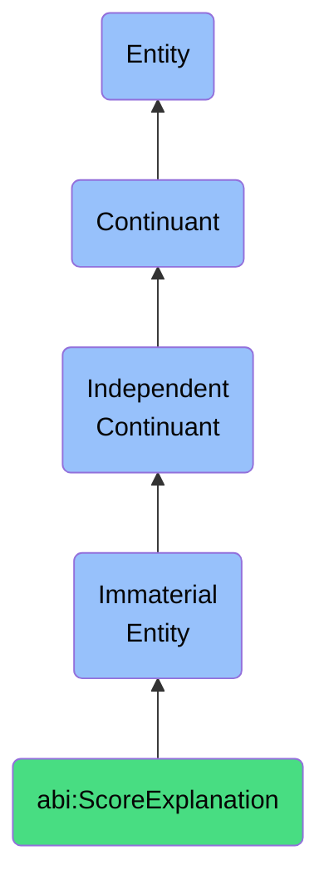

# ScoreExplanation

## Definition
A score explanation is an immaterial entity that provides the reasons, rationale, or justification behind a given score, assessment, or evaluation, enabling transparency, contextual understanding, and actionable insights from quantitative or qualitative judgments.

## Hierarchy in BFO


## Ontological Schema (TBox)
```turtle
abi:ScoreExplanation a owl:Class ;
  rdfs:subClassOf bfo:0000141 ;
  rdfs:label "Score Explanation" ;
  skos:definition "An immaterial entity that provides the reasons, rationale, or justification behind a given score, assessment, or evaluation, enabling transparency, contextual understanding, and actionable insights from quantitative or qualitative judgments." .

abi:explains_score a owl:ObjectProperty ;
  rdfs:domain abi:ScoreExplanation ;
  rdfs:range abi:Score ;
  rdfs:label "explains score" .

abi:references_evidence a owl:ObjectProperty ;
  rdfs:domain abi:ScoreExplanation ;
  rdfs:range abi:Evidence ;
  rdfs:label "references evidence" .

abi:cites_criteria a owl:ObjectProperty ;
  rdfs:domain abi:ScoreExplanation ;
  rdfs:range abi:EvaluationCriteria ;
  rdfs:label "cites criteria" .

abi:identifies_factors a owl:ObjectProperty ;
  rdfs:domain abi:ScoreExplanation ;
  rdfs:range abi:InfluencingFactor ;
  rdfs:label "identifies factors" .

abi:suggests_improvements a owl:ObjectProperty ;
  rdfs:domain abi:ScoreExplanation ;
  rdfs:range abi:Improvement ;
  rdfs:label "suggests improvements" .

abi:has_explanation_text a owl:DatatypeProperty ;
  rdfs:domain abi:ScoreExplanation ;
  rdfs:range xsd:string ;
  rdfs:label "has explanation text" .

abi:has_relative_importance a owl:DatatypeProperty ;
  rdfs:domain abi:ScoreExplanation ;
  rdfs:range xsd:decimal ;
  rdfs:label "has relative importance" .

abi:has_explanation_type a owl:DatatypeProperty ;
  rdfs:domain abi:ScoreExplanation ;
  rdfs:range xsd:string ;
  rdfs:label "has explanation type" .
```

## Ontological Instance (ABox)
```turtle
ex:TrustScoreExplanation a abi:ScoreExplanation ;
  rdfs:label "Low Trust Score Explanation" ;
  abi:explains_score ex:ContentTrustScore ;
  abi:references_evidence ex:ConflictingSourcesEvidence, ex:UnverifiableClaimsEvidence ;
  abi:cites_criteria ex:SourceCredibilityCriteria, ex:FactualConsistencyCriteria ;
  abi:identifies_factors ex:RecentInaccuracyHistory, ex:LimitedCitationsFactor ;
  abi:suggests_improvements ex:AdditionalSourceVerification, ex:PrimarySourceReference ;
  abi:has_explanation_text "Low trust score due to conflicting information from multiple sources and several claims that could not be independently verified." ;
  abi:has_relative_importance "0.85"^^xsd:decimal ;
  abi:has_explanation_type "Credibility Assessment" .

ex:CreditRiskExplanation a abi:ScoreExplanation ;
  rdfs:label "Credit Risk Score Explanation" ;
  abi:explains_score ex:BusinessCreditScore ;
  abi:references_evidence ex:FinancialStatementsEvidence, ex:PaymentHistoryEvidence ;
  abi:cites_criteria ex:CashFlowCriteria, ex:DebtServiceCoverageCriteria ;
  abi:identifies_factors ex:SeasonalRevenueFactor, ex:IndustryVolatilityFactor ;
  abi:suggests_improvements ex:WorkingCapitalManagement, ex:AccountsReceivableOptimization ;
  abi:has_explanation_text "Moderate credit risk score reflects volatile cash flow patterns and industry-specific challenges, despite generally positive payment history." ;
  abi:has_relative_importance "0.92"^^xsd:decimal ;
  abi:has_explanation_type "Risk Analysis" .
```

## Related Classes
- **abi:Score** - An immaterial entity that represents a numeric or categorical value resulting from an evaluation or measurement process.
- **abi:TrustScore** - An immaterial entity that represents a quality reflecting the perceived reliability, credibility, and integrity of a source, agent, or observation.
- **abi:ConfidenceScore** - An immaterial entity that expresses the system or reviewer certainty about an outcome or classification.
- **abi:Assessment** - An immaterial entity that expresses a general evaluative outcome based on specific criteria, standards, or frameworks. 