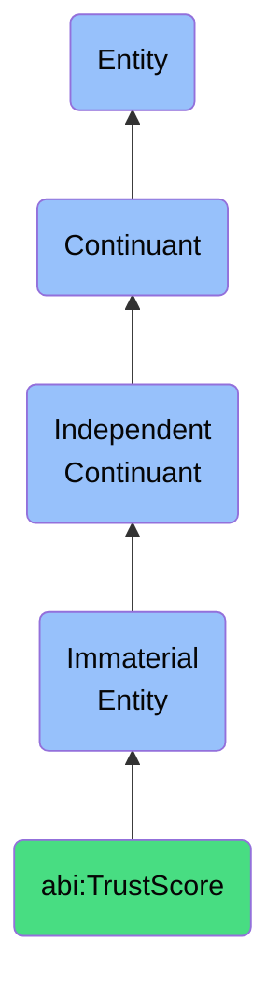

# TrustScore

## Definition
A trust score is an immaterial entity that represents a quality reflecting the perceived reliability, credibility, and integrity of a source, agent, or observation, enabling systematic assessment of trustworthiness within information ecosystems and decision-making processes.

## Hierarchy in BFO


## Ontological Schema (TBox)
```turtle
abi:TrustScore a owl:Class ;
  rdfs:subClassOf bfo:0000141 ;
  rdfs:label "Trust Score" ;
  skos:definition "An immaterial entity that represents a quality reflecting the perceived reliability, credibility, and integrity of a source, agent, or observation, enabling systematic assessment of trustworthiness within information ecosystems and decision-making processes." .

abi:evaluates_source a owl:ObjectProperty ;
  rdfs:domain abi:TrustScore ;
  rdfs:range abi:InformationSource ;
  rdfs:label "evaluates source" .

abi:applies_to_agent a owl:ObjectProperty ;
  rdfs:domain abi:TrustScore ;
  rdfs:range abi:Agent ;
  rdfs:label "applies to agent" .

abi:assesses_observation a owl:ObjectProperty ;
  rdfs:domain abi:TrustScore ;
  rdfs:range abi:Observation ;
  rdfs:label "assesses observation" .

abi:uses_measurement_criteria a owl:ObjectProperty ;
  rdfs:domain abi:TrustScore ;
  rdfs:range abi:TrustCriteria ;
  rdfs:label "uses measurement criteria" .

abi:has_explanation a owl:ObjectProperty ;
  rdfs:domain abi:TrustScore ;
  rdfs:range abi:ScoreExplanation ;
  rdfs:label "has explanation" .

abi:has_numeric_value a owl:DatatypeProperty ;
  rdfs:domain abi:TrustScore ;
  rdfs:range xsd:decimal ;
  rdfs:label "has numeric value" .

abi:has_scoring_scale a owl:DatatypeProperty ;
  rdfs:domain abi:TrustScore ;
  rdfs:range xsd:string ;
  rdfs:label "has scoring scale" .

abi:has_timestamp a owl:DatatypeProperty ;
  rdfs:domain abi:TrustScore ;
  rdfs:range xsd:dateTime ;
  rdfs:label "has timestamp" .
```

## Ontological Instance (ABox)
```turtle
ex:AIResponseTrustScore a abi:TrustScore ;
  rdfs:label "OpenAI Response Trust Score" ;
  abi:evaluates_source ex:OpenAIAPI ;
  abi:applies_to_agent ex:GPT4Model ;
  abi:assesses_observation ex:ModelResponse12345 ;
  abi:uses_measurement_criteria ex:SourceCitationCriteria, ex:FactualAccuracyCriteria, ex:ReasoningTransparencyCriteria ;
  abi:has_explanation ex:VaguePhrasingExplanation ;
  abi:has_numeric_value "0.82"^^xsd:decimal ;
  abi:has_scoring_scale "0.0 to 1.0 scale" ;
  abi:has_timestamp "2023-05-15T14:30:00Z"^^xsd:dateTime .

ex:MarketResearchTrustScore a abi:TrustScore ;
  rdfs:label "Market Research Report Trust Score" ;
  abi:evaluates_source ex:IndustryResearchFirm ;
  abi:applies_to_agent ex:ResearchAnalyst ;
  abi:assesses_observation ex:MarketForecastReport2023 ;
  abi:uses_measurement_criteria ex:MethodologyTransparencyCriteria, ex:DataSampleSizeCriteria, ex:AnalyticalRigorCriteria ;
  abi:has_explanation ex:LimitedDatasetExplanation ;
  abi:has_numeric_value "0.76"^^xsd:decimal ;
  abi:has_scoring_scale "0.0 to 1.0 scale" ;
  abi:has_timestamp "2023-04-20T09:15:00Z"^^xsd:dateTime .
```

## Related Classes
- **abi:ConfidenceScore** - An immaterial entity that expresses the system or reviewer certainty about an outcome or classification.
- **abi:ScoreExplanation** - An immaterial entity that provides reasons or rationale behind a given score or assessment.
- **abi:InformationSource** - An immaterial entity that represents the origin point of data, knowledge, or information used in analysis or decision-making.
- **abi:Assessment** - An immaterial entity that expresses a general evaluative outcome based on specific criteria. 