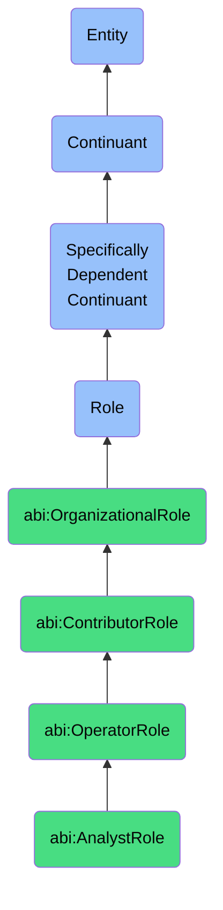

# AnalystRole

## Definition
An analyst role is a specifically dependent continuant that an agent bears when engaged in the systematic examination, interpretation, and synthesis of data to extract actionable insights, identify patterns, and support decision-making processes through quantitative and qualitative methods.

## Hierarchy in BFO


## Ontological Schema (TBox)
```turtle
abi:AnalystRole a owl:Class ;
  rdfs:subClassOf abi:OperatorRole ;
  rdfs:label "Analyst Role" ;
  skos:definition "A role that an agent bears when engaged in the systematic examination, interpretation, and synthesis of data to extract actionable insights and support decision-making." .

abi:OperatorRole a owl:Class ;
  rdfs:subClassOf abi:ContributorRole ;
  rdfs:label "Operator Role" ;
  skos:definition "A contributor role focused on executing specific operational functions with specialized skills in a particular domain." .

abi:ContributorRole a owl:Class ;
  rdfs:subClassOf bfo:0000023 ;
  rdfs:label "Contributor Role" ;
  skos:definition "An organizational role focused on specialized individual work rather than management or leadership responsibilities." .

abi:has_bearer a owl:ObjectProperty ;
  rdfs:domain abi:AnalystRole ;
  rdfs:range abi:Agent ;
  rdfs:label "has bearer" .

abi:realized_in a owl:ObjectProperty ;
  rdfs:domain abi:AnalystRole ;
  rdfs:range abi:AnalyticalProcess ;
  rdfs:label "realized in" .

abi:has_analytical_domain a owl:ObjectProperty ;
  rdfs:domain abi:AnalystRole ;
  rdfs:range abi:AnalyticalDomain ;
  rdfs:label "has analytical domain" .

abi:works_with_data_source a owl:ObjectProperty ;
  rdfs:domain abi:AnalystRole ;
  rdfs:range abi:DataSource ;
  rdfs:label "works with data source" .

abi:generates_insight a owl:ObjectProperty ;
  rdfs:domain abi:AnalystRole ;
  rdfs:range abi:Insight ;
  rdfs:label "generates insight" .

abi:supports_decision a owl:ObjectProperty ;
  rdfs:domain abi:AnalystRole ;
  rdfs:range abi:Decision ;
  rdfs:label "supports decision" .

abi:reports_to a owl:ObjectProperty ;
  rdfs:domain abi:AnalystRole ;
  rdfs:range abi:TeamLeadRole ;
  rdfs:label "reports to" .

abi:uses_analytical_tool a owl:ObjectProperty ;
  rdfs:domain abi:AnalystRole ;
  rdfs:range abi:AnalyticalTool ;
  rdfs:label "uses analytical tool" .

abi:has_experience_level a owl:DatatypeProperty ;
  rdfs:domain abi:AnalystRole ;
  rdfs:range xsd:string ;
  rdfs:label "has experience level" .

abi:has_role_start_date a owl:DatatypeProperty ;
  rdfs:domain abi:AnalystRole ;
  rdfs:range xsd:date ;
  rdfs:label "has role start date" .
```

## Ontological Instance (ABox)
```turtle
ex:SarahDataAnalystRole a abi:AnalystRole ;
  rdfs:label "Sarah's Data Analyst Role" ;
  abi:has_bearer ex:SarahPerson ;
  abi:realized_in ex:CustomerSegmentationProcess, ex:SalesPerformanceAnalysisProcess ;
  abi:has_analytical_domain ex:CustomerBehaviorAnalysis, ex:MarketTrendAnalysis ;
  abi:works_with_data_source ex:CRMDatabase, ex:SalesTransactionDB, ex:MarketSurveyData ;
  abi:generates_insight ex:CustomerChurnPredictionInsight, ex:SeasonalSalesTrendInsight ;
  abi:supports_decision ex:MarketingResourceAllocationDecision, ex:ProductPricingDecision ;
  abi:reports_to ex:AnalyticsTeamLeadRole ;
  abi:uses_analytical_tool ex:SQLTool, ex:TableauTool, ex:PythonDataTool ;
  abi:has_experience_level "Senior" ;
  abi:has_role_start_date "2019-09-01"^^xsd:date .

ex:JamalBusinessAnalystRole a abi:AnalystRole ;
  rdfs:label "Jamal's Business Analyst Role" ;
  abi:has_bearer ex:JamalPerson ;
  abi:realized_in ex:BusinessRequirementsProcess, ex:ProcessOptimizationAnalysisProcess ;
  abi:has_analytical_domain ex:OperationalEfficiencyAnalysis, ex:RequirementsAnalysis ;
  abi:works_with_data_source ex:ProcessDocumentation, ex:OperationalMetricsDB, ex:UserInterviewData ;
  abi:generates_insight ex:ProcessBottleneckInsight, ex:UserNeedsInsight ;
  abi:supports_decision ex:WorkflowRedesignDecision, ex:SystemFeaturePrioritizationDecision ;
  abi:reports_to ex:BusinessOperationsTeamLeadRole ;
  abi:uses_analytical_tool ex:JiraTool, ex:ExcelAdvancedTool, ex:ProcessMappingTool ;
  abi:has_experience_level "Mid-level" ;
  abi:has_role_start_date "2021-04-15"^^xsd:date .
```

## Related Classes
- **abi:EngineerRole** - A contributor role focused on designing and building technical systems and solutions.
- **abi:TeamLeadRole** - A management role responsible for leading analytical teams and individual contributors.
- **abi:DataScientistRole** - A specialized analytical role focused on advanced statistical methods and machine learning.
- **abi:ProductManagerRole** - A role that translates analytical insights into product requirements and strategies. 