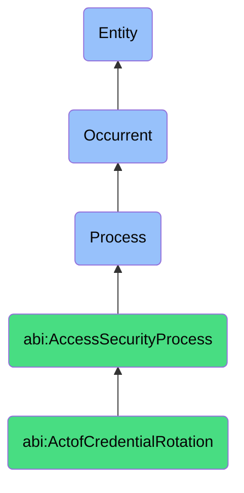

# ActofCredentialRotation

## Definition
An act of credential rotation is an occurrent process that unfolds through time, involving the systematic replacement, refreshment, or updating of authentication secrets, cryptographic materials, access tokens, or digital credentials with new values while preserving authorized access capabilities, typically performed on a scheduled or event-triggered basis to reduce the risk associated with credential compromise, enforce time-bound access policies, maintain compliance with security requirements, and ensure the ongoing integrity of authentication mechanisms.

## Hierarchy in BFO


## Ontological Schema (TBox)
```turtle
abi:ActofCredentialRotation a owl:Class ;
  rdfs:subClassOf abi:AccessSecurityProcess ;
  rdfs:label "Act of Credential Rotation" ;
  skos:definition "A process that refreshes, revokes, or replaces credentials such as passwords, API keys, SSH tokens, or OAuth secrets." .

abi:AccessSecurityProcess a owl:Class ;
  rdfs:subClassOf bfo:0000015 ;
  rdfs:label "Access Security Process" ;
  skos:definition "A time-bound process focused on securing and governing who/what can access what and how that access is authenticated." .

abi:has_rotation_performer a owl:ObjectProperty ;
  rdfs:domain abi:ActofCredentialRotation ;
  rdfs:range abi:RotationPerformer ;
  rdfs:label "has rotation performer" .

abi:rotates_credential_type a owl:ObjectProperty ;
  rdfs:domain abi:ActofCredentialRotation ;
  rdfs:range abi:CredentialType ;
  rdfs:label "rotates credential type" .

abi:affects_credential_subject a owl:ObjectProperty ;
  rdfs:domain abi:ActofCredentialRotation ;
  rdfs:range abi:CredentialSubject ;
  rdfs:label "affects credential subject" .

abi:follows_rotation_policy a owl:ObjectProperty ;
  rdfs:domain abi:ActofCredentialRotation ;
  rdfs:range abi:RotationPolicy ;
  rdfs:label "follows rotation policy" .

abi:uses_rotation_method a owl:ObjectProperty ;
  rdfs:domain abi:ActofCredentialRotation ;
  rdfs:range abi:RotationMethod ;
  rdfs:label "uses rotation method" .

abi:requires_rotation_verification a owl:ObjectProperty ;
  rdfs:domain abi:ActofCredentialRotation ;
  rdfs:range abi:RotationVerification ;
  rdfs:label "requires rotation verification" .

abi:produces_rotation_record a owl:ObjectProperty ;
  rdfs:domain abi:ActofCredentialRotation ;
  rdfs:range abi:RotationRecord ;
  rdfs:label "produces rotation record" .

abi:has_rotation_timestamp a owl:DatatypeProperty ;
  rdfs:domain abi:ActofCredentialRotation ;
  rdfs:range xsd:dateTime ;
  rdfs:label "has rotation timestamp" .

abi:has_rotation_frequency a owl:DatatypeProperty ;
  rdfs:domain abi:ActofCredentialRotation ;
  rdfs:range xsd:string ;
  rdfs:label "has rotation frequency" .

abi:has_rotation_trigger a owl:DatatypeProperty ;
  rdfs:domain abi:ActofCredentialRotation ;
  rdfs:range xsd:string ;
  rdfs:label "has rotation trigger" .
```

## Ontological Instance (ABox)
```turtle
ex:EngineerOffboardingCredentialRotation a abi:ActofCredentialRotation ;
  rdfs:label "Engineer Offboarding-Triggered Credential Rotation" ;
  abi:has_rotation_performer ex:SecurityOperationsTeam, ex:ITAdministrator ;
  abi:rotates_credential_type ex:APIKey, ex:RepositoryCredential, ex:SSHKey ;
  abi:affects_credential_subject ex:SharedDevelopmentSystems, ex:SourceCodeRepository, ex:DeploymentPipeline ;
  abi:follows_rotation_policy ex:EmployeeDeparturePolicy, ex:SecretManagementStandard ;
  abi:uses_rotation_method ex:SecretManagerRotation, ex:ManualKeyRevocation, ex:AutomatedCredentialReplacement ;
  abi:requires_rotation_verification ex:DeploymentValidation, ex:IntegrationTesting, ex:AccessConfirmation ;
  abi:produces_rotation_record ex:RotationTicket, ex:AuditLogEntry, ex:ComplianceEvidence ;
  abi:has_rotation_timestamp "2023-11-15T14:30:00Z"^^xsd:dateTime ;
  abi:has_rotation_frequency "Event-triggered" ;
  abi:has_rotation_trigger "Engineer Offboarding" .

ex:CloudIAMCredentialRotation a abi:ActofCredentialRotation ;
  rdfs:label "Scheduled Cloud Service Account Key Rotation" ;
  abi:has_rotation_performer ex:CloudPlatformTeam, ex:AutomatedRotationService ;
  abi:rotates_credential_type ex:ServiceAccountKey, ex:OAuthClientSecret, ex:APIScopeToken ;
  abi:affects_credential_subject ex:DataProcessingServiceAccount, ex:APIIntegrationClient, ex:StorageAccessService ;
  abi:follows_rotation_policy ex:CloudSecurityBaseline, ex:ThirtyDayRotationPolicy, ex:IndustryComplianceStandard ;
  abi:uses_rotation_method ex:CloudProviderAPIRotation, ex:GradualReplacement, ex:ParallelKeyOperation ;
  abi:requires_rotation_verification ex:ServiceAvailabilityCheck, ex:AuthenticationTest, ex:PerformanceValidation ;
  abi:produces_rotation_record ex:SecurityComplianceLog, ex:RotationStateDocument, ex:SuccessNotification ;
  abi:has_rotation_timestamp "2023-11-01T02:00:00Z"^^xsd:dateTime ;
  abi:has_rotation_frequency "Monthly" ;
  abi:has_rotation_trigger "Scheduled Automation" .
```

## Related Classes
- **abi:ActofFacilityAccessReview** - A process that may identify physical credentials requiring rotation.
- **abi:ActofServerAccessReview** - A process that may identify digital credentials requiring rotation.
- **abi:ActofCredentialIssuance** - A process that creates new credentials that will eventually require rotation.
- **abi:ActofCredentialRevocation** - A process that permanently removes credentials rather than rotating them.
- **abi:ActofCredentialAudit** - A process that may verify compliance with credential rotation policies.
- **abi:SecretManagementProcess** - A broader process that encompasses credential rotation as one component.
- **abi:IdentityLifecycleManagementProcess** - A process managing the full lifecycle of identities and their credentials. 