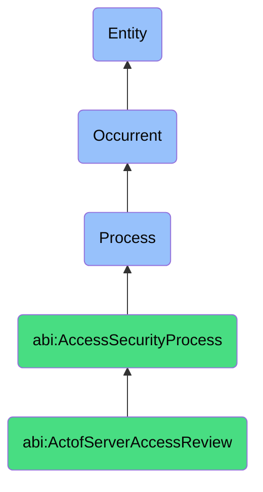

# ActofServerAccessReview

## Definition
An act of server access review is an occurrent process that unfolds through time, involving the systematic examination, validation, and adjustment of user accounts, service accounts, and technical identities with access rights to computational systems, databases, network infrastructure, or digital resources, ensuring proper authorization levels, appropriate permissions, and conformance to least-privilege principles while identifying and remediating orphaned accounts, excessive privileges, or unauthorized access through structured verification against established digital access control policies.

## Hierarchy in BFO


## Ontological Schema (TBox)
```turtle
abi:ActofServerAccessReview a owl:Class ;
  rdfs:subClassOf abi:AccessSecurityProcess ;
  rdfs:label "Act of Server Access Review" ;
  skos:definition "A process that checks digital accounts and machine-level access (e.g., IAM, SSH, sudoers)." .

abi:AccessSecurityProcess a owl:Class ;
  rdfs:subClassOf bfo:0000015 ;
  rdfs:label "Access Security Process" ;
  skos:definition "A time-bound process focused on securing and governing who/what can access what and how that access is authenticated." .

abi:has_review_administrator a owl:ObjectProperty ;
  rdfs:domain abi:ActofServerAccessReview ;
  rdfs:range abi:ReviewAdministrator ;
  rdfs:label "has review administrator" .

abi:reviews_digital_identity a owl:ObjectProperty ;
  rdfs:domain abi:ActofServerAccessReview ;
  rdfs:range abi:DigitalIdentity ;
  rdfs:label "reviews digital identity" .

abi:assesses_system_access a owl:ObjectProperty ;
  rdfs:domain abi:ActofServerAccessReview ;
  rdfs:range abi:SystemAccess ;
  rdfs:label "assesses system access" .

abi:applies_access_principle a owl:ObjectProperty ;
  rdfs:domain abi:ActofServerAccessReview ;
  rdfs:range abi:AccessPrinciple ;
  rdfs:label "applies access principle" .

abi:checks_access_requirement a owl:ObjectProperty ;
  rdfs:domain abi:ActofServerAccessReview ;
  rdfs:range abi:AccessRequirement ;
  rdfs:label "checks access requirement" .

abi:detects_access_issue a owl:ObjectProperty ;
  rdfs:domain abi:ActofServerAccessReview ;
  rdfs:range abi:AccessIssue ;
  rdfs:label "detects access issue" .

abi:implements_remediation a owl:ObjectProperty ;
  rdfs:domain abi:ActofServerAccessReview ;
  rdfs:range abi:Remediation ;
  rdfs:label "implements remediation" .

abi:has_review_date a owl:DatatypeProperty ;
  rdfs:domain abi:ActofServerAccessReview ;
  rdfs:range xsd:date ;
  rdfs:label "has review date" .

abi:has_accounts_modified_count a owl:DatatypeProperty ;
  rdfs:domain abi:ActofServerAccessReview ;
  rdfs:range xsd:integer ;
  rdfs:label "has accounts modified count" .

abi:has_review_compliance_status a owl:DatatypeProperty ;
  rdfs:domain abi:ActofServerAccessReview ;
  rdfs:range xsd:string ;
  rdfs:label "has review compliance status" .
```

## Ontological Instance (ABox)
```turtle
ex:ProductionInfrastructureAccessReview a abi:ActofServerAccessReview ;
  rdfs:label "Production Infrastructure Quarterly Access Review" ;
  abi:has_review_administrator ex:SecurityOperationsTeam, ex:CloudInfrastructureAdmin, ex:ComplianceManager ;
  abi:reviews_digital_identity ex:DeveloperAccounts, ex:ServiceAccounts, ex:AdministratorProfiles ;
  abi:assesses_system_access ex:CloudProviderIAM, ex:DatabaseAuthentication, ex:KubernetesRBAC, ex:SSHAccess ;
  abi:applies_access_principle ex:LeastPrivilegePolicy, ex:SegregationOfDuties, ex:JustInTimeAccess ;
  abi:checks_access_requirement ex:OperationalNeed, ex:BusinessJustification, ex:RoleAppropriateness ;
  abi:detects_access_issue ex:OverprovisionedPermissions, ex:UnusedCredentials, ex:UnapprovedAccessRights ;
  abi:implements_remediation ex:PermissionReduction, ex:AccountTermination, ex:RoleReconfiguration ;
  abi:has_review_date "2023-10-15"^^xsd:date ;
  abi:has_accounts_modified_count "23"^^xsd:integer ;
  abi:has_review_compliance_status "Completed - Non-compliant items remediated" .

ex:DevelopmentEnvironmentAccessReview a abi:ActofServerAccessReview ;
  rdfs:label "Development Environment Monthly Access Review" ;
  abi:has_review_administrator ex:DevOpsTeam, ex:SecurityEngineer, ex:DevelopmentManager ;
  abi:reviews_digital_identity ex:DeveloperAccounts, ex:BuildSystemUsers, ex:ContractorAccess ;
  abi:assesses_system_access ex:GitRepositoryAccess, ex:CICDPipelinePermissions, ex:TestEnvironmentAccess ;
  abi:applies_access_principle ex:NeedToKnowPrinciple, ex:RoleBasedAccessControl, ex:TemporaryAccessGrants ;
  abi:checks_access_requirement ex:ProjectAssignment, ex:DevelopmentResponsibilities, ex:ContractDuration ;
  abi:detects_access_issue ex:StaleAccounts, ex:ExcessiveRepoAccess, ex:MissingAccessRestrictions ;
  abi:implements_remediation ex:AccessRightScoping, ex:ExpiredAccountDeactivation, ex:PermissionAdjustment ;
  abi:has_review_date "2023-11-05"^^xsd:date ;
  abi:has_accounts_modified_count "14"^^xsd:integer ;
  abi:has_review_compliance_status "Completed - With exceptions documented" .
```

## Related Classes
- **abi:ActofFacilityAccessReview** - A parallel process focusing on physical rather than digital access.
- **abi:ActofCredentialRotation** - A process often triggered by findings from server access reviews.
- **abi:ActofCredentialIssuance** - A process for providing new digital access credentials.
- **abi:ActofCredentialRevocation** - A process for removing digital access credentials.
- **abi:ActofCredentialAudit** - A broader audit that may include digital credential checks.
- **abi:CloudPermissionManagementProcess** - A specialized process for managing cloud access permissions.
- **abi:IdentityGovernanceProcess** - A broader process encompassing digital identity lifecycle management. 