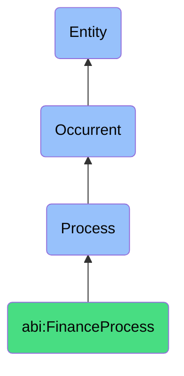

# FinanceProcess

## Definition
A finance process is an occurrent that unfolds through time, involving structured activities, evaluations, and/or transactions aimed at managing, monitoring, and/or optimizing an organization's financial resources, obligations, and/or performance through systematic procedures that ensure compliance, accuracy, and strategic financial alignment.

## Hierarchy in BFO


## Ontological Schema (TBox)
```turtle
abi:FinanceProcess a owl:Class ;
  rdfs:subClassOf bfo:0000015 ;
  rdfs:label "Finance Process" ;
  skos:definition "A time-bound activity related to the management, tracking, and optimization of financial resources and obligations." .

abi:has_finance_agent a owl:ObjectProperty ;
  rdfs:domain abi:FinanceProcess ;
  rdfs:range abi:FinanceAgent ;
  rdfs:label "has finance agent" .

abi:operates_on_financial_entity a owl:ObjectProperty ;
  rdfs:domain abi:FinanceProcess ;
  rdfs:range abi:FinancialEntity ;
  rdfs:label "operates on financial entity" .

abi:follows_accounting_standard a owl:ObjectProperty ;
  rdfs:domain abi:FinanceProcess ;
  rdfs:range abi:AccountingStandard ;
  rdfs:label "follows accounting standard" .

abi:adheres_to_financial_policy a owl:ObjectProperty ;
  rdfs:domain abi:FinanceProcess ;
  rdfs:range abi:FinancialPolicy ;
  rdfs:label "adheres to financial policy" .

abi:uses_financial_system a owl:ObjectProperty ;
  rdfs:domain abi:FinanceProcess ;
  rdfs:range abi:FinancialSystem ;
  rdfs:label "uses financial system" .

abi:produces_financial_output a owl:ObjectProperty ;
  rdfs:domain abi:FinanceProcess ;
  rdfs:range abi:FinancialOutput ;
  rdfs:label "produces financial output" .

abi:influences_financial_position a owl:ObjectProperty ;
  rdfs:domain abi:FinanceProcess ;
  rdfs:range abi:FinancialPosition ;
  rdfs:label "influences financial position" .

abi:has_process_frequency a owl:DatatypeProperty ;
  rdfs:domain abi:FinanceProcess ;
  rdfs:range xsd:string ;
  rdfs:label "has process frequency" .

abi:has_monetary_impact a owl:DatatypeProperty ;
  rdfs:domain abi:FinanceProcess ;
  rdfs:range xsd:decimal ;
  rdfs:label "has monetary impact" .

abi:has_financial_period a owl:DatatypeProperty ;
  rdfs:domain abi:FinanceProcess ;
  rdfs:range xsd:string ;
  rdfs:label "has financial period" .
```

## Ontological Instance (ABox)
```turtle
# FinanceProcess is a parent class with subclasses:
# - abi:ActofContracting
# - abi:ActofBilling
# - abi:ActofRevenueRecognition
# - abi:ActofAccountsReceivableMonitoring
# - abi:ActofAccountsPayableMonitoring
# - abi:ActofForecasting
# - abi:ActofCashReconciliation
# and other finance-related processes
```

## Related Classes
- **abi:ActofContracting** - A process that formalizes legal agreement between parties.
- **abi:ActofBilling** - A process of issuing financial documents to request payment.
- **abi:ActofRevenueRecognition** - A process that recognizes revenue based on milestones.
- **abi:ActofAccountsReceivableMonitoring** - A process tracking incoming customer payments.
- **abi:ActofAccountsPayableMonitoring** - A process monitoring outgoing vendor payments.
- **abi:ActofForecasting** - A process predicting future financial trajectories.
- **abi:ActofCashReconciliation** - A process aligning accounting records with bank statements. 