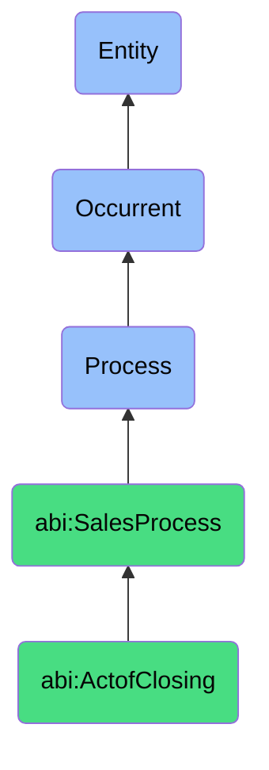

# ActofClosing

## Definition
An act of closing is an occurrent process that unfolds through time, involving the culmination of the sales cycle where a final agreement is reached, formal approval is obtained, contracts are executed, and the transaction is confirmed, converting a prospect into a customer and a potential deal into realized revenue, signaling the successful completion of the sales effort and initiation of the customer relationship.

## Hierarchy in BFO


## Ontological Schema (TBox)
```turtle
abi:ActofClosing a owl:Class ;
  rdfs:subClassOf abi:SalesProcess ;
  rdfs:label "Act of Closing" ;
  skos:definition "A process that finalizes a sales deal through agreement and contract execution, converting a prospect to a customer." .

abi:SalesProcess a owl:Class ;
  rdfs:subClassOf bfo:0000015 ;
  rdfs:label "Sales Process" ;
  skos:definition "A time-bound interaction or conversion of relationships into economic transactions." .

abi:has_closing_agent a owl:ObjectProperty ;
  rdfs:domain abi:ActofClosing ;
  rdfs:range abi:ClosingAgent ;
  rdfs:label "has closing agent" .

abi:finalizes_deal_with_customer a owl:ObjectProperty ;
  rdfs:domain abi:ActofClosing ;
  rdfs:range abi:Customer ;
  rdfs:label "finalizes deal with customer" .

abi:secures_final_approval a owl:ObjectProperty ;
  rdfs:domain abi:ActofClosing ;
  rdfs:range abi:ApprovalAuthority ;
  rdfs:label "secures final approval" .

abi:executes_contract_document a owl:ObjectProperty ;
  rdfs:domain abi:ActofClosing ;
  rdfs:range abi:ContractDocument ;
  rdfs:label "executes contract document" .

abi:completes_closing_action a owl:ObjectProperty ;
  rdfs:domain abi:ActofClosing ;
  rdfs:range abi:ClosingAction ;
  rdfs:label "completes closing action" .

abi:triggers_post_sale_process a owl:ObjectProperty ;
  rdfs:domain abi:ActofClosing ;
  rdfs:range abi:PostSaleProcess ;
  rdfs:label "triggers post sale process" .

abi:records_revenue_recognition a owl:ObjectProperty ;
  rdfs:domain abi:ActofClosing ;
  rdfs:range abi:RevenueRecognition ;
  rdfs:label "records revenue recognition" .

abi:has_closing_date a owl:DatatypeProperty ;
  rdfs:domain abi:ActofClosing ;
  rdfs:range xsd:date ;
  rdfs:label "has closing date" .

abi:has_deal_execution_status a owl:DatatypeProperty ;
  rdfs:domain abi:ActofClosing ;
  rdfs:range xsd:string ;
  rdfs:label "has deal execution status" .

abi:has_final_deal_value a owl:DatatypeProperty ;
  rdfs:domain abi:ActofClosing ;
  rdfs:range xsd:decimal ;
  rdfs:label "has final deal value" .
```

## Ontological Instance (ABox)
```turtle
ex:EnterpriseContractClosingProcess a abi:ActofClosing ;
  rdfs:label "Enterprise Contract Closing Process" ;
  abi:has_closing_agent ex:SeniorAccountExecutive, ex:SalesOperationsManager ;
  abi:finalizes_deal_with_customer ex:EnterpriseClientOrganization ;
  abi:secures_final_approval ex:ClientCFO, ex:ClientCIO, ex:VendorSalesDirector ;
  abi:executes_contract_document ex:MasterServiceAgreement, ex:OrderForm, ex:StatementOfWork ;
  abi:completes_closing_action ex:SignatureCollection, ex:PaymentProcessing, ex:SystemProvisioning ;
  abi:triggers_post_sale_process ex:CustomerOnboarding, ex:AccountSetup, ex:ImplementationPlanning ;
  abi:records_revenue_recognition ex:SalesCommissionCalculation, ex:ARBooking ;
  abi:has_closing_date "2023-11-30"^^xsd:date ;
  abi:has_deal_execution_status "Completed" ;
  abi:has_final_deal_value "475000.00"^^xsd:decimal .

ex:SMBSoftwareSubscriptionClosingProcess a abi:ActofClosing ;
  rdfs:label "SMB Software Subscription Closing Process" ;
  abi:has_closing_agent ex:InsideSalesRepresentative ;
  abi:finalizes_deal_with_customer ex:SmallBusinessClient ;
  abi:secures_final_approval ex:BusinessOwner, ex:SalesManager ;
  abi:executes_contract_document ex:SubscriptionAgreement, ex:TermsOfService ;
  abi:completes_closing_action ex:ElectronicSignature, ex:CreditCardAuthorization, ex:LicenseActivation ;
  abi:triggers_post_sale_process ex:AutomatedWelcomeSequence, ex:UserSetup ;
  abi:records_revenue_recognition ex:RecurringRevenueEntry ;
  abi:has_closing_date "2023-10-15"^^xsd:date ;
  abi:has_deal_execution_status "Completed" ;
  abi:has_final_deal_value "12500.00"^^xsd:decimal .
```

## Related Classes
- **abi:ActofNegotiation** - A process that typically precedes closing, finalizing terms and conditions.
- **abi:ActofDealCreation** - A process that initiates the structure later finalized in closing.
- **abi:CustomerOnboardingProcess** - A process typically triggered by successful closing.
- **abi:ContractExecutionProcess** - A specific subprocess often contained within closing.
- **abi:RevenueRecognitionProcess** - A financial process directly connected to successful closing. 