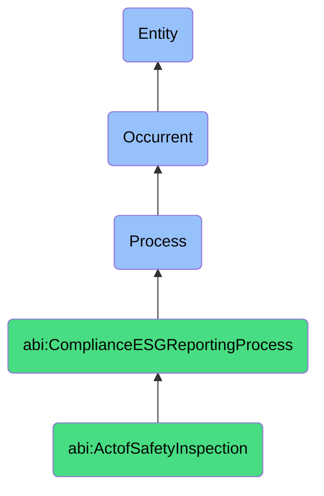

# ActofSafetyInspection

## Definition
An act of safety inspection is an occurrent process that unfolds through time, involving the systematic examination, assessment, and verification of physical environments, equipment, infrastructure, or operational procedures against established safety standards, regulatory requirements, or risk management protocols, to identify hazards, evaluate compliance, ensure protective measures, or validate safety controls through structured methodologies that incorporate visual inspection, documentation review, testing, and procedural verification aimed at preventing accidents, protecting occupants, or mitigating potential dangers.

## Hierarchy in BFO


## Ontological Schema (TBox)
```turtle
abi:ActofSafetyInspection a owl:Class ;
  rdfs:subClassOf abi:ComplianceESGReportingProcess ;
  rdfs:label "Act of Safety Inspection" ;
  skos:definition "A formal process of checking equipment, layout, or procedures for health and safety risks." .

abi:ComplianceESGReportingProcess a owl:Class ;
  rdfs:subClassOf bfo:0000015 ;
  rdfs:label "Compliance ESG Reporting Process" ;
  skos:definition "A time-bound process related to the evaluation, documentation, or verification of organizational practices against regulatory requirements, industry standards, or ESG frameworks." .

abi:has_inspection_conductor a owl:ObjectProperty ;
  rdfs:domain abi:ActofSafetyInspection ;
  rdfs:range abi:InspectionConductor ;
  rdfs:label "has inspection conductor" .

abi:inspects_safety_element a owl:ObjectProperty ;
  rdfs:domain abi:ActofSafetyInspection ;
  rdfs:range abi:SafetyElement ;
  rdfs:label "inspects safety element" .

abi:evaluates_physical_environment a owl:ObjectProperty ;
  rdfs:domain abi:ActofSafetyInspection ;
  rdfs:range abi:PhysicalEnvironment ;
  rdfs:label "evaluates physical environment" .

abi:applies_safety_standard a owl:ObjectProperty ;
  rdfs:domain abi:ActofSafetyInspection ;
  rdfs:range abi:SafetyStandard ;
  rdfs:label "applies safety standard" .

abi:conducts_safety_check a owl:ObjectProperty ;
  rdfs:domain abi:ActofSafetyInspection ;
  rdfs:range abi:SafetyCheck ;
  rdfs:label "conducts safety check" .

abi:identifies_safety_hazard a owl:ObjectProperty ;
  rdfs:domain abi:ActofSafetyInspection ;
  rdfs:range abi:SafetyHazard ;
  rdfs:label "identifies safety hazard" .

abi:produces_inspection_record a owl:ObjectProperty ;
  rdfs:domain abi:ActofSafetyInspection ;
  rdfs:range abi:InspectionRecord ;
  rdfs:label "produces inspection record" .

abi:has_inspection_date a owl:DatatypeProperty ;
  rdfs:domain abi:ActofSafetyInspection ;
  rdfs:range xsd:date ;
  rdfs:label "has inspection date" .

abi:has_inspection_frequency a owl:DatatypeProperty ;
  rdfs:domain abi:ActofSafetyInspection ;
  rdfs:range xsd:string ;
  rdfs:label "has inspection frequency" .

abi:has_compliance_finding a owl:DatatypeProperty ;
  rdfs:domain abi:ActofSafetyInspection ;
  rdfs:range xsd:string ;
  rdfs:label "has compliance finding" .
```

## Ontological Instance (ABox)
```turtle
ex:AnnualFireSafetyInspection a abi:ActofSafetyInspection ;
  rdfs:label "Annual Building Fire Safety Inspection" ;
  abi:has_inspection_conductor ex:FireSafetyInspector, ex:FacilitiesManager, ex:ComplianceOfficer ;
  abi:inspects_safety_element ex:FireSuppressionsystem, ex:EmergencyExits, ex:FireAlarms, ex:EvacuationProcedures ;
  abi:evaluates_physical_environment ex:OfficeBuilding, ex:CommonAreas, ex:MeetingRooms, ex:ServerRooms ;
  abi:applies_safety_standard ex:FireCodeRegulations, ex:OccupancyRequirements, ex:EquipmentCertificationStandards ;
  abi:conducts_safety_check ex:SprinklerSystemTest, ex:AlarmFunctionCheck, ex:ExitPathObstructionReview, ex:SignageVerification ;
  abi:identifies_safety_hazard ex:BlockedExitPath, ex:ExpiredFireExtinguisher, ex:DisabledAlarmSystem ;
  abi:produces_inspection_record ex:FireSafetyCertification, ex:ComplianceReport, ex:RemediationPlan ;
  abi:has_inspection_date "2023-11-15"^^xsd:date ;
  abi:has_inspection_frequency "Annual" ;
  abi:has_compliance_finding "Compliant with minor remediation required" .

ex:FactoryMachineryInspection a abi:ActofSafetyInspection ;
  rdfs:label "Manufacturing Equipment Safety Inspection" ;
  abi:has_inspection_conductor ex:OccupationalSafetySpecialist, ex:MachineryTechnician, ex:OperationsManager ;
  abi:inspects_safety_element ex:MachineGuards, ex:EmergencyShutoffs, ex:LockoutTagoutSystems, ex:PersonalProtectiveEquipment ;
  abi:evaluates_physical_environment ex:ManufacturingFloor, ex:AssemblyLine, ex:MaterialStorageArea, ex:MaintenanceArea ;
  abi:applies_safety_standard ex:OccupationalSafetyRegulations, ex:EquipmentManufacturerGuidelines, ex:IndustryBestPractices ;
  abi:conducts_safety_check ex:GuardingVerification, ex:EmergencyStopTest, ex:SafetyProtocolReview, ex:OperatorTrainingValidation ;
  abi:identifies_safety_hazard ex:MissingMachineGuard, ex:CompromisedSafetySwitch, ex:IncorrectOperationProcedure ;
  abi:produces_inspection_record ex:EquipmentSafetyReport, ex:ComplianceCertification, ex:MaintenanceWorkOrder ;
  abi:has_inspection_date "2023-10-28"^^xsd:date ;
  abi:has_inspection_frequency "Quarterly" ;
  abi:has_compliance_finding "Partial compliance - corrective actions required" .
```

## Related Classes
- **abi:ActofESGComplianceReview** - A process that may incorporate safety aspects within social responsibility dimensions.
- **abi:RiskAssessmentProcess** - A process that evaluates and analyzes safety risks identified during inspections.
- **abi:MaintenanceSchedulingProcess** - A process triggered by safety inspection findings requiring repairs.
- **abi:SafetyTrainingProcess** - A process for developing employee capabilities to maintain safe environments.
- **abi:EmergencyPreparednessProcess** - A process for ensuring readiness to respond to safety incidents.
- **abi:IncidentReportingProcess** - A process for documenting and investigating safety events.
- **abi:OccupationalHealthMonitoringProcess** - A process for tracking health metrics related to safety conditions. 