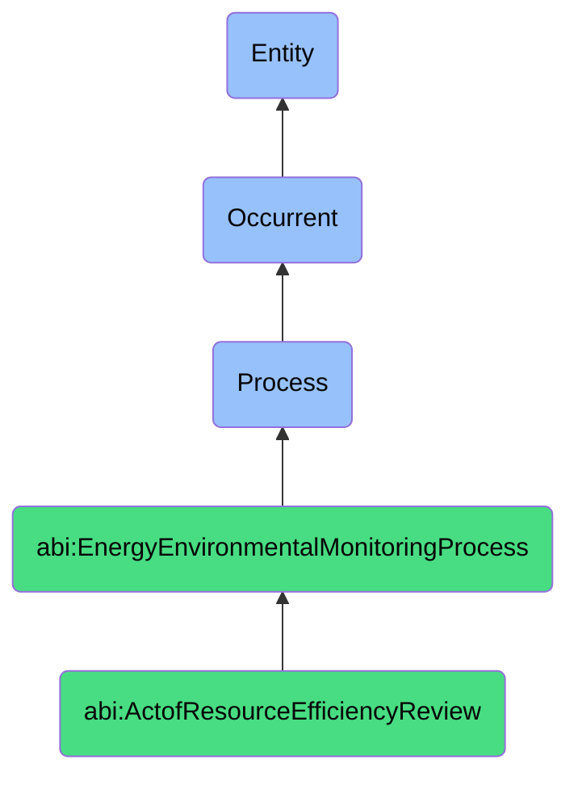

# ActofResourceEfficiencyReview

## Definition
An act of resource efficiency review is an occurrent process that unfolds through time, involving the systematic assessment, evaluation, and analysis of how effectively an organization, facility, or system utilizes energy, water, materials, or other resources in its operations, comparing actual consumption metrics against relevant benchmarks, industry standards, or optimization targets to identify inefficiencies, conservation opportunities, or sustainability improvements through structured methodologies that incorporate both quantitative measurement and qualitative assessment of resource utilization practices.

## Hierarchy in BFO


## Ontological Schema (TBox)
```turtle
abi:ActofResourceEfficiencyReview a owl:Class ;
  rdfs:subClassOf abi:EnergyEnvironmentalMonitoringProcess ;
  rdfs:label "Act of Resource Efficiency Review" ;
  skos:definition "A process that evaluates operational efficiency of utilities like electricity, heating, or water." .

abi:EnergyEnvironmentalMonitoringProcess a owl:Class ;
  rdfs:subClassOf bfo:0000015 ;
  rdfs:label "Energy Environmental Monitoring Process" ;
  skos:definition "A time-bound process related to the measurement, analysis, and management of energy consumption, resource utilization, or environmental impacts across systems or spaces." .

abi:has_review_conductor a owl:ObjectProperty ;
  rdfs:domain abi:ActofResourceEfficiencyReview ;
  rdfs:range abi:ReviewConductor ;
  rdfs:label "has review conductor" .

abi:evaluates_resource_type a owl:ObjectProperty ;
  rdfs:domain abi:ActofResourceEfficiencyReview ;
  rdfs:range abi:ResourceType ;
  rdfs:label "evaluates resource type" .

abi:analyzes_facility_system a owl:ObjectProperty ;
  rdfs:domain abi:ActofResourceEfficiencyReview ;
  rdfs:range abi:FacilitySystem ;
  rdfs:label "analyzes facility system" .

abi:applies_assessment_methodology a owl:ObjectProperty ;
  rdfs:domain abi:ActofResourceEfficiencyReview ;
  rdfs:range abi:AssessmentMethodology ;
  rdfs:label "applies assessment methodology" .

abi:compares_against_benchmark a owl:ObjectProperty ;
  rdfs:domain abi:ActofResourceEfficiencyReview ;
  rdfs:range abi:EfficiencyBenchmark ;
  rdfs:label "compares against benchmark" .

abi:identifies_efficiency_opportunity a owl:ObjectProperty ;
  rdfs:domain abi:ActofResourceEfficiencyReview ;
  rdfs:range abi:EfficiencyOpportunity ;
  rdfs:label "identifies efficiency opportunity" .

abi:produces_efficiency_report a owl:ObjectProperty ;
  rdfs:domain abi:ActofResourceEfficiencyReview ;
  rdfs:range abi:EfficiencyReport ;
  rdfs:label "produces efficiency report" .

abi:has_review_completion_date a owl:DatatypeProperty ;
  rdfs:domain abi:ActofResourceEfficiencyReview ;
  rdfs:range xsd:date ;
  rdfs:label "has review completion date" .

abi:has_assessment_scope a owl:DatatypeProperty ;
  rdfs:domain abi:ActofResourceEfficiencyReview ;
  rdfs:range xsd:string ;
  rdfs:label "has assessment scope" .

abi:has_certification_purpose a owl:DatatypeProperty ;
  rdfs:domain abi:ActofResourceEfficiencyReview ;
  rdfs:range xsd:string ;
  rdfs:label "has certification purpose" .
```

## Ontological Instance (ABox)
```turtle
ex:ESGCertificationFacilityReview a abi:ActofResourceEfficiencyReview ;
  rdfs:label "ESG Certification Facility Resource Efficiency Review" ;
  abi:has_review_conductor ex:SustainabilityConsultant, ex:CertificationBody, ex:FacilitiesManagementTeam ;
  abi:evaluates_resource_type ex:ElectricalEnergy, ex:ThermalEnergy, ex:WaterConsumption, ex:WasteGeneration ;
  abi:analyzes_facility_system ex:HeatingVentilationAirConditioning, ex:LightingSystem, ex:WaterUtilization, ex:BuildingEnvelope ;
  abi:applies_assessment_methodology ex:LEEDCertificationProtocol, ex:EnergyStarEvaluation, ex:ISO50001Assessment ;
  abi:compares_against_benchmark ex:IndustryBestPractices, ex:RegulatoryRequirements, ex:HistoricalPerformance ;
  abi:identifies_efficiency_opportunity ex:EnvelopeInsulationImprovement, ex:LightingControls, ex:HVACOptimization, ex:WaterReclamation ;
  abi:produces_efficiency_report ex:ESGCertificationDocumentation, ex:EfficiencyRecommendations, ex:CarbonReductionRoadmap ;
  abi:has_review_completion_date "2023-10-30"^^xsd:date ;
  abi:has_assessment_scope "Comprehensive facility audit for all resource systems" ;
  abi:has_certification_purpose "ESG rating improvement and sustainability certification" .

ex:DataCenterResourceOptimizationReview a abi:ActofResourceEfficiencyReview ;
  rdfs:label "Data Center Energy and Cooling Resource Efficiency Review" ;
  abi:has_review_conductor ex:DataCenterEngineer, ex:EnergyConsultant, ex:ITInfrastructureTeam ;
  abi:evaluates_resource_type ex:ElectricalPowerConsumption, ex:CoolingEnergy, ex:ComputationalEfficiency ;
  abi:analyzes_facility_system ex:ServerInfrastructure, ex:CoolingSystem, ex:PowerDistribution, ex:BackupPower ;
  abi:applies_assessment_methodology ex:PowerUsageEffectivenessCalculation, ex:CarbonUsageEffectiveness, ex:ThermalEfficiencyAssessment ;
  abi:compares_against_benchmark ex:IndustryPUEStandards, ex:VendorSpecifications, ex:DesignEfficiencyTargets ;
  abi:identifies_efficiency_opportunity ex:AirflowOptimization, ex:ServerConsolidation, ex:CoolingRedundancyReduction, ex:RenewableIntegration ;
  abi:produces_efficiency_report ex:DataCenterEfficiencyReport, ex:InfrastructureModernizationPlan, ex:ROIAnalysis ;
  abi:has_review_completion_date "2023-11-15"^^xsd:date ;
  abi:has_assessment_scope "Data center power and cooling systems" ;
  abi:has_certification_purpose "Operational cost reduction and capacity optimization" .
```

## Related Classes
- **abi:ActofEnergyMonitoring** - A process that provides data inputs for resource efficiency reviews.
- **abi:EnvironmentalComplianceProcess** - A process that assesses compliance with regulations related to resource usage.
- **abi:EnergyAuditProcess** - A specialized form of resource efficiency review focused specifically on energy.
- **abi:CarbonFootprintAssessmentProcess** - A process that calculates emissions based on resource consumption.
- **abi:SustainabilityPlanningProcess** - A process that uses efficiency review findings to develop improvement strategies.
- **abi:RetrofitAssessmentProcess** - A process for evaluating facility modifications based on efficiency reviews.
- **abi:UtilityBudgetingProcess** - A process that incorporates efficiency insights into financial planning. 