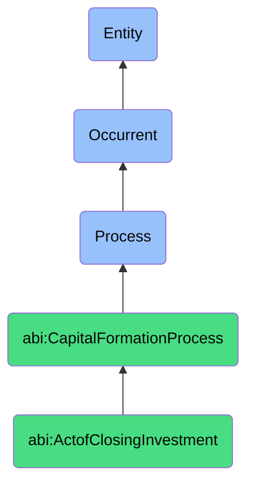

# ActofClosingInvestment

## Definition
An act of closing investment is an occurrent process that unfolds through time, involving the final formalization, execution, and completion of an investment transaction, including the preparation and signing of definitive legal agreements, fulfillment of closing conditions, transfer of funds, issuance of securities, and completion of regulatory filings, culminating in the official establishment of the investment relationship between the company and investor(s).

## Hierarchy in BFO


## Ontological Schema (TBox)
```turtle
abi:ActofClosingInvestment a owl:Class ;
  rdfs:subClassOf abi:CapitalFormationProcess ;
  rdfs:label "Act of Closing Investment" ;
  skos:definition "A process that completes legal signing and financial transfer for an investment round." .

abi:CapitalFormationProcess a owl:Class ;
  rdfs:subClassOf bfo:0000015 ;
  rdfs:label "Capital Formation Process" ;
  skos:definition "A time-bound process related to attracting, securing, and managing financial investments from external sources." .

abi:has_closing_participant a owl:ObjectProperty ;
  rdfs:domain abi:ActofClosingInvestment ;
  rdfs:range abi:ClosingParticipant ;
  rdfs:label "has closing participant" .

abi:executes_legal_document a owl:ObjectProperty ;
  rdfs:domain abi:ActofClosingInvestment ;
  rdfs:range abi:LegalDocument ;
  rdfs:label "executes legal document" .

abi:fulfills_closing_condition a owl:ObjectProperty ;
  rdfs:domain abi:ActofClosingInvestment ;
  rdfs:range abi:ClosingCondition ;
  rdfs:label "fulfills closing condition" .

abi:transfers_investment_funds a owl:ObjectProperty ;
  rdfs:domain abi:ActofClosingInvestment ;
  rdfs:range abi:InvestmentFunds ;
  rdfs:label "transfers investment funds" .

abi:issues_security_instrument a owl:ObjectProperty ;
  rdfs:domain abi:ActofClosingInvestment ;
  rdfs:range abi:SecurityInstrument ;
  rdfs:label "issues security instrument" .

abi:coordinates_closing_logistics a owl:ObjectProperty ;
  rdfs:domain abi:ActofClosingInvestment ;
  rdfs:range abi:ClosingLogistics ;
  rdfs:label "coordinates closing logistics" .

abi:produces_closing_deliverable a owl:ObjectProperty ;
  rdfs:domain abi:ActofClosingInvestment ;
  rdfs:range abi:ClosingDeliverable ;
  rdfs:label "produces closing deliverable" .

abi:has_closing_date a owl:DatatypeProperty ;
  rdfs:domain abi:ActofClosingInvestment ;
  rdfs:range xsd:date ;
  rdfs:label "has closing date" .

abi:has_investment_amount a owl:DatatypeProperty ;
  rdfs:domain abi:ActofClosingInvestment ;
  rdfs:range xsd:decimal ;
  rdfs:label "has investment amount" .

abi:has_post_money_valuation a owl:DatatypeProperty ;
  rdfs:domain abi:ActofClosingInvestment ;
  rdfs:range xsd:decimal ;
  rdfs:label "has post money valuation" .
```

## Ontological Instance (ABox)
```turtle
ex:SeriesAInvestmentClosing a abi:ActofClosingInvestment ;
  rdfs:label "Series A Preferred Stock Investment Closing" ;
  abi:has_closing_participant ex:CompanyCEO, ex:CompanyGeneralCounsel, ex:LeadInvestorPartner, ex:SupportingInvestors, ex:CompanyAttorneys, ex:InvestorCounsel ;
  abi:executes_legal_document ex:StockPurchaseAgreement, ex:InvestorsRightsAgreement, ex:RightOfFirstRefusalAgreement, ex:VotingAgreement, ex:CertificateOfIncorporation ;
  abi:fulfills_closing_condition ex:BoardApproval, ex:ShareholderConsent, ex:DueDiligenceCompletion, ex:LegalOpinion ;
  abi:transfers_investment_funds ex:WireTransferToCompanyAccount ;
  abi:issues_security_instrument ex:SeriesAPreferredStock ;
  abi:coordinates_closing_logistics ex:SignaturePageCollection, ex:FundingCoordination, ex:ClosingCall ;
  abi:produces_closing_deliverable ex:ClosingBinder, ex:CapitalizationTableUpdate, ex:StockCertificates ;
  abi:has_closing_date "2023-11-15"^^xsd:date ;
  abi:has_investment_amount "8000000.00"^^xsd:decimal ;
  abi:has_post_money_valuation "33000000.00"^^xsd:decimal .

ex:ConvertibleDebtClosing a abi:ActofClosingInvestment ;
  rdfs:label "Bridge Round Convertible Note Closing" ;
  abi:has_closing_participant ex:CompanyFounder, ex:AngelInvestors, ex:SeedFundManager, ex:StartupAttorney ;
  abi:executes_legal_document ex:ConvertibleNoteAgreement, ex:SecurityPurchaseAgreement, ex:DisclosureSchedules ;
  abi:fulfills_closing_condition ex:MinimumRaiseThreshold, ex:BoardAuthorizationResolution ;
  abi:transfers_investment_funds ex:EscrowRelease, ex:DirectDeposit ;
  abi:issues_security_instrument ex:SAFEInstrument, ex:EquityConvertibleNote ;
  abi:coordinates_closing_logistics ex:DigitalSignaturePlatform, ex:WireInstructions ;
  abi:produces_closing_deliverable ex:ExecutedNoteDocuments, ex:ConfirmationOfFunding, ex:UpdatedInvestorLedger ;
  abi:has_closing_date "2023-06-30"^^xsd:date ;
  abi:has_investment_amount "1500000.00"^^xsd:decimal ;
  abi:has_post_money_valuation "7500000.00"^^xsd:decimal .
```

## Related Classes
- **abi:ActofCapitalRaising** - A broader process that culminates in closing investment.
- **abi:ActofTermSheetNegotiation** - A process that precedes and sets terms for closing.
- **abi:ActofDueDiligence** - A process that must be completed before closing can occur.
- **abi:LegalDocumentPreparationProcess** - A process for creating the agreements needed for closing.
- **abi:FundsTransferProcess** - A process for moving investment capital to the company.
- **abi:PostClosingComplianceProcess** - A process that follows closing to ensure regulatory requirements are met.
- **abi:InvestorRelationsProcess** - A process that begins after closing to manage the new investor relationship. 