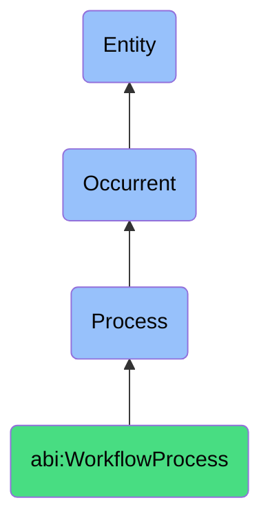

# WorkflowProcess

## Definition
A workflow process is an occurrent that unfolds through time, involving the systematic execution, validation, review, or collaboration on structured tasks or activities, enabling the coordinated progression from initial requirements to finished outputs according to defined procedures, rules, or protocols, often serving as core operational mechanisms across multiple business domains.

## Hierarchy in BFO


## Ontological Schema (TBox)
```turtle
abi:WorkflowProcess a owl:Class ;
  rdfs:subClassOf bfo:0000015 ;
  rdfs:label "Workflow Process" ;
  skos:definition "A time-bound process related to the systematic execution, validation, or collaboration on structured tasks or activities." .

abi:has_workflow_agent a owl:ObjectProperty ;
  rdfs:domain abi:WorkflowProcess ;
  rdfs:range abi:WorkflowAgent ;
  rdfs:label "has workflow agent" .

abi:operates_on_workflow_input a owl:ObjectProperty ;
  rdfs:domain abi:WorkflowProcess ;
  rdfs:range abi:WorkflowInput ;
  rdfs:label "operates on workflow input" .

abi:follows_workflow_protocol a owl:ObjectProperty ;
  rdfs:domain abi:WorkflowProcess ;
  rdfs:range abi:WorkflowProtocol ;
  rdfs:label "follows workflow protocol" .

abi:uses_workflow_tool a owl:ObjectProperty ;
  rdfs:domain abi:WorkflowProcess ;
  rdfs:range abi:WorkflowTool ;
  rdfs:label "uses workflow tool" .

abi:produces_workflow_output a owl:ObjectProperty ;
  rdfs:domain abi:WorkflowProcess ;
  rdfs:range abi:WorkflowOutput ;
  rdfs:label "produces workflow output" .

abi:involves_stakeholder a owl:ObjectProperty ;
  rdfs:domain abi:WorkflowProcess ;
  rdfs:range abi:Stakeholder ;
  rdfs:label "involves stakeholder" .

abi:fulfills_workflow_objective a owl:ObjectProperty ;
  rdfs:domain abi:WorkflowProcess ;
  rdfs:range abi:WorkflowObjective ;
  rdfs:label "fulfills workflow objective" .

abi:has_workflow_start_time a owl:DatatypeProperty ;
  rdfs:domain abi:WorkflowProcess ;
  rdfs:range xsd:dateTime ;
  rdfs:label "has workflow start time" .

abi:has_workflow_duration a owl:DatatypeProperty ;
  rdfs:domain abi:WorkflowProcess ;
  rdfs:range xsd:duration ;
  rdfs:label "has workflow duration" .

abi:has_workflow_status a owl:DatatypeProperty ;
  rdfs:domain abi:WorkflowProcess ;
  rdfs:range xsd:string ;
  rdfs:label "has workflow status" .
```

## Ontological Instance (ABox)
```turtle
# WorkflowProcess is a parent class with subclasses:
# - abi:ActofExecutingWorkflow
# - abi:ActofValidating
# - abi:ActofReviewing
# - abi:ActofMeeting
# and other workflow-related processes
```

## Related Classes
- **abi:ActofExecutingWorkflow** - A process that activates and progresses a predefined series of interrelated tasks.
- **abi:ActofValidating** - A process that checks data, content, or logic for correctness, quality, or policy conformance.
- **abi:ActofReviewing** - A process where a human or agent examines a deliverable to suggest or approve changes.
- **abi:ActofMeeting** - A temporally bounded process where participants share information, resolve issues, or make decisions.
- **abi:ProjectManagementProcess** - A related process for coordinating resources, timelines, and deliverables.
- **abi:TaskManagementProcess** - A process for organizing, tracking, and completing discrete units of work.
- **abi:QualityControlProcess** - A process that ensures outputs meet quality standards and specifications. 