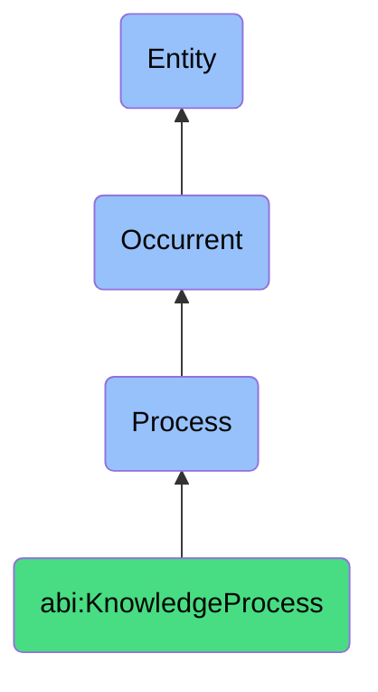

# KnowledgeProcess

## Definition
A knowledge process is an occurrent that unfolds through time, involving the systematic creation, capture, organization, transfer, maintenance, or application of informational content, insights, expertise, or procedural knowledge within organizational contexts, through structured methodologies that transform individual and collective understanding into documented artifacts, formalized practices, or accessible resources that support decision-making, operational consistency, and organizational learning.

## Hierarchy in BFO


## Ontological Schema (TBox)
```turtle
abi:KnowledgeProcess a owl:Class ;
  rdfs:subClassOf bfo:0000015 ;
  rdfs:label "Knowledge Process" ;
  skos:definition "A time-bound process related to the creation, capture, organization, transfer, maintenance, or application of knowledge within an organizational context." .

abi:has_knowledge_agent a owl:ObjectProperty ;
  rdfs:domain abi:KnowledgeProcess ;
  rdfs:range abi:KnowledgeAgent ;
  rdfs:label "has knowledge agent" .

abi:involves_knowledge_artifact a owl:ObjectProperty ;
  rdfs:domain abi:KnowledgeProcess ;
  rdfs:range abi:KnowledgeArtifact ;
  rdfs:label "involves knowledge artifact" .

abi:follows_knowledge_methodology a owl:ObjectProperty ;
  rdfs:domain abi:KnowledgeProcess ;
  rdfs:range abi:KnowledgeMethodology ;
  rdfs:label "follows knowledge methodology" .

abi:occurs_in_knowledge_context a owl:ObjectProperty ;
  rdfs:domain abi:KnowledgeProcess ;
  rdfs:range abi:KnowledgeContext ;
  rdfs:label "occurs in knowledge context" .

abi:uses_knowledge_tool a owl:ObjectProperty ;
  rdfs:domain abi:KnowledgeProcess ;
  rdfs:range abi:KnowledgeTool ;
  rdfs:label "uses knowledge tool" .

abi:produces_knowledge_output a owl:ObjectProperty ;
  rdfs:domain abi:KnowledgeProcess ;
  rdfs:range abi:KnowledgeOutput ;
  rdfs:label "produces knowledge output" .

abi:addresses_knowledge_need a owl:ObjectProperty ;
  rdfs:domain abi:KnowledgeProcess ;
  rdfs:range abi:KnowledgeNeed ;
  rdfs:label "addresses knowledge need" .

abi:has_knowledge_timestamp a owl:DatatypeProperty ;
  rdfs:domain abi:KnowledgeProcess ;
  rdfs:range xsd:dateTime ;
  rdfs:label "has knowledge timestamp" .

abi:has_knowledge_status a owl:DatatypeProperty ;
  rdfs:domain abi:KnowledgeProcess ;
  rdfs:range xsd:string ;
  rdfs:label "has knowledge status" .

abi:has_knowledge_accessibility a owl:DatatypeProperty ;
  rdfs:domain abi:KnowledgeProcess ;
  rdfs:range xsd:string ;
  rdfs:label "has knowledge accessibility" .
```

## Ontological Instance (ABox)
```turtle
# KnowledgeProcess is a parent class with subclasses:
# - abi:ActofKnowledgeCapture
# - abi:ActofDocumentVersioning
# - abi:ActofSOPExecution
# and other knowledge-related processes
```

## Related Classes
- **abi:ActofKnowledgeCapture** - A process that extracts, records, and formalizes tacit knowledge from discussions, projects, or workflows.
- **abi:ActofDocumentVersioning** - A process that tracks and maintains version states for evolving knowledge or policy artifacts.
- **abi:ActofSOPExecution** - A process that instantiates and follows a defined standard operating procedure.
- **abi:KnowledgeTransferProcess** - A process for sharing knowledge between individuals or teams.
- **abi:DocumentationCreationProcess** - A process for creating structured documentation of systems or processes.
- **abi:KnowledgeRepositoryMaintenanceProcess** - A process for organizing and managing knowledge artifacts.
- **abi:LessonsLearnedCaptureProcess** - A process for documenting insights from completed projects or activities. 