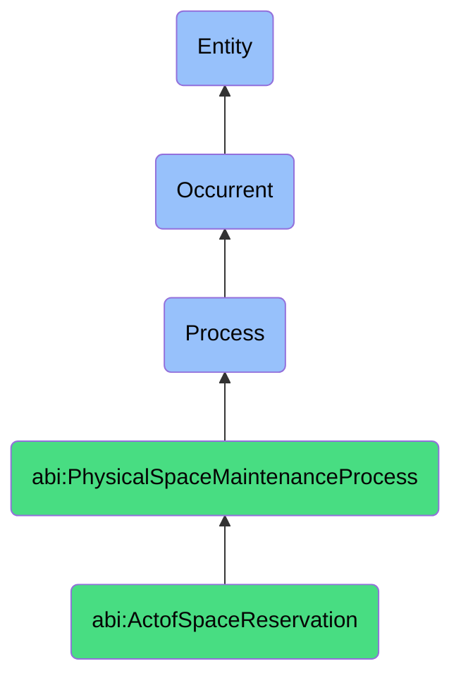

# ActofSpaceReservation

## Definition
An act of space reservation is an occurrent process that unfolds through time, involving the formal request, evaluation, approval, and allocation of physical environments, rooms, areas, or facilities for specific purposes, events, or activities during defined time periods, ensuring appropriate space utilization through systematic consideration of availability, suitability, authorization, and scheduling constraints while maintaining records of space assignments, usage patterns, and reservation status to support organizational operations and resource optimization.

## Hierarchy in BFO


## Ontological Schema (TBox)
```turtle
abi:ActofSpaceReservation a owl:Class ;
  rdfs:subClassOf abi:PhysicalSpaceMaintenanceProcess ;
  rdfs:label "Act of Space Reservation" ;
  skos:definition "A process that manages requests and approvals for using physical spaces (rooms, zones, labs)." .

abi:PhysicalSpaceMaintenanceProcess a owl:Class ;
  rdfs:subClassOf bfo:0000015 ;
  rdfs:label "Physical Space Maintenance Process" ;
  skos:definition "A time-bound process related to the management, maintenance, scheduling, or allocation of physical spaces, facilities, or infrastructure." .

abi:has_reservation_requestor a owl:ObjectProperty ;
  rdfs:domain abi:ActofSpaceReservation ;
  rdfs:range abi:ReservationRequestor ;
  rdfs:label "has reservation requestor" .

abi:reserves_physical_space a owl:ObjectProperty ;
  rdfs:domain abi:ActofSpaceReservation ;
  rdfs:range abi:PhysicalSpace ;
  rdfs:label "reserves physical space" .

abi:specifies_reservation_purpose a owl:ObjectProperty ;
  rdfs:domain abi:ActofSpaceReservation ;
  rdfs:range abi:ReservationPurpose ;
  rdfs:label "specifies reservation purpose" .

abi:requires_space_features a owl:ObjectProperty ;
  rdfs:domain abi:ActofSpaceReservation ;
  rdfs:range abi:SpaceFeature ;
  rdfs:label "requires space features" .

abi:follows_reservation_policy a owl:ObjectProperty ;
  rdfs:domain abi:ActofSpaceReservation ;
  rdfs:range abi:ReservationPolicy ;
  rdfs:label "follows reservation policy" .

abi:involves_approval_authority a owl:ObjectProperty ;
  rdfs:domain abi:ActofSpaceReservation ;
  rdfs:range abi:ApprovalAuthority ;
  rdfs:label "involves approval authority" .

abi:produces_reservation_record a owl:ObjectProperty ;
  rdfs:domain abi:ActofSpaceReservation ;
  rdfs:range abi:ReservationRecord ;
  rdfs:label "produces reservation record" .

abi:has_reservation_start_time a owl:DatatypeProperty ;
  rdfs:domain abi:ActofSpaceReservation ;
  rdfs:range xsd:dateTime ;
  rdfs:label "has reservation start time" .

abi:has_reservation_end_time a owl:DatatypeProperty ;
  rdfs:domain abi:ActofSpaceReservation ;
  rdfs:range xsd:dateTime ;
  rdfs:label "has reservation end time" .

abi:has_attendee_count a owl:DatatypeProperty ;
  rdfs:domain abi:ActofSpaceReservation ;
  rdfs:range xsd:integer ;
  rdfs:label "has attendee count" .
```

## Ontological Instance (ABox)
```turtle
ex:QuarterlyBusinessReviewReservation a abi:ActofSpaceReservation ;
  rdfs:label "Quarterly Business Review Location Assignment" ;
  abi:has_reservation_requestor ex:ExecutiveAssistant, ex:DepartmentHead ;
  abi:reserves_physical_space ex:MainConferenceRoom, ex:AdjacentBreakoutSpace ;
  abi:specifies_reservation_purpose ex:QuarterlyBusinessReviewMeeting, ex:StrategicPlanningSessions ;
  abi:requires_space_features ex:VideoConferenceEquipment, ex:WhiteboardWalls, ex:CateringSpace, ex:WiFiCapacity ;
  abi:follows_reservation_policy ex:ExecutiveMeetingPriority, ex:PriorSchedulingBlackoutPolicy ;
  abi:involves_approval_authority ex:FacilitiesManager, ex:CalendarAdministrator ;
  abi:produces_reservation_record ex:CalendarBooking, ex:ServiceRequestNotifications, ex:RoomSetupInstructions ;
  abi:has_reservation_start_time "2023-12-15T09:00:00Z"^^xsd:dateTime ;
  abi:has_reservation_end_time "2023-12-15T17:00:00Z"^^xsd:dateTime ;
  abi:has_attendee_count "24"^^xsd:integer .

ex:ProductDemoLabReservation a abi:ActofSpaceReservation ;
  rdfs:label "Client Product Demonstration Lab Reservation" ;
  abi:has_reservation_requestor ex:SalesDirector, ex:ProductSpecialist ;
  abi:reserves_physical_space ex:DemonstrationLab, ex:ClientMeetingArea ;
  abi:specifies_reservation_purpose ex:ProductDemonstration, ex:ClientConsultation ;
  abi:requires_space_features ex:TestingEnvironment, ex:ProductDisplayAreas, ex:PrivacyPartitions, ex:DedicatedNetworkAccess ;
  abi:follows_reservation_policy ex:ClientFacingSpacePolicy, ex:LabSecurityProtocol, ex:CleanupRequirements ;
  abi:involves_approval_authority ex:LabManager, ex:SecurityTeam ;
  abi:produces_reservation_record ex:LabBooking, ex:ClientVisitorRegistration, ex:EquipmentReservation ;
  abi:has_reservation_start_time "2023-11-20T13:30:00Z"^^xsd:dateTime ;
  abi:has_reservation_end_time "2023-11-20T16:30:00Z"^^xsd:dateTime ;
  abi:has_attendee_count "8"^^xsd:integer .
```

## Related Classes
- **abi:ActofCleaningScheduling** - A process that may be triggered by space reservations to prepare areas.
- **abi:ActofMaintenanceRequest** - A process that might be initiated based on issues discovered during space usage.
- **abi:EventPlanningProcess** - A broader process that includes space reservation as a component.
- **abi:ResourceAllocationProcess** - A broader process that includes allocation of space and related resources.
- **abi:AccessControlProcess** - A process that manages physical access to reserved spaces.
- **abi:SpaceUtilizationAnalysisProcess** - A process that analyzes patterns of space reservation and usage.
- **abi:CapacityPlanningProcess** - A process for planning space capacity to meet reservation demands. 