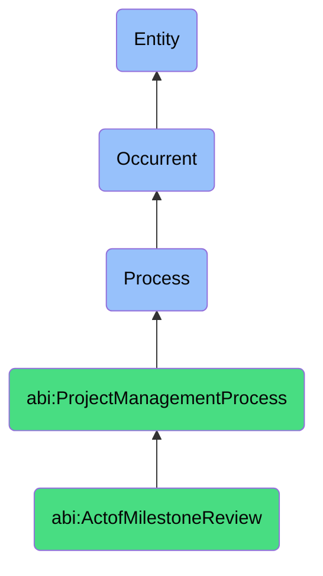

# ActofMilestoneReview

## Definition
An act of milestone review is an occurrent process that unfolds through time, involving the systematic assessment, verification, and evaluation of a project's achievement of predefined significant checkpoints or deliverables that mark the completion of critical phases or objectives, through formal inspection, demonstration, or measurement against established acceptance criteria, providing opportunities for stakeholder feedback, quality validation, progress confirmation, course correction if needed, and authorization for proceeding to subsequent project phases.

## Hierarchy in BFO


## Ontological Schema (TBox)
```turtle
abi:ActofMilestoneReview a owl:Class ;
  rdfs:subClassOf abi:ProjectManagementProcess ;
  rdfs:label "Act of Milestone Review" ;
  skos:definition "A process that verifies whether key outcomes have been achieved by specific delivery checkpoints." .

abi:ProjectManagementProcess a owl:Class ;
  rdfs:subClassOf bfo:0000015 ;
  rdfs:label "Project Management Process" ;
  skos:definition "A time-bound process related to the planning, execution, monitoring, and control of project activities to achieve specific objectives." .

abi:has_review_conductor a owl:ObjectProperty ;
  rdfs:domain abi:ActofMilestoneReview ;
  rdfs:range abi:ReviewConductor ;
  rdfs:label "has review conductor" .

abi:involves_milestone_stakeholder a owl:ObjectProperty ;
  rdfs:domain abi:ActofMilestoneReview ;
  rdfs:range abi:MilestoneStakeholder ;
  rdfs:label "involves milestone stakeholder" .

abi:assesses_project_milestone a owl:ObjectProperty ;
  rdfs:domain abi:ActofMilestoneReview ;
  rdfs:range abi:ProjectMilestone ;
  rdfs:label "assesses project milestone" .

abi:verifies_deliverable a owl:ObjectProperty ;
  rdfs:domain abi:ActofMilestoneReview ;
  rdfs:range abi:Deliverable ;
  rdfs:label "verifies deliverable" .

abi:applies_acceptance_criteria a owl:ObjectProperty ;
  rdfs:domain abi:ActofMilestoneReview ;
  rdfs:range abi:AcceptanceCriteria ;
  rdfs:label "applies acceptance criteria" .

abi:identifies_gap a owl:ObjectProperty ;
  rdfs:domain abi:ActofMilestoneReview ;
  rdfs:range abi:IdentifiedGap ;
  rdfs:label "identifies gap" .

abi:produces_review_artifact a owl:ObjectProperty ;
  rdfs:domain abi:ActofMilestoneReview ;
  rdfs:range abi:ReviewArtifact ;
  rdfs:label "produces review artifact" .

abi:has_review_date a owl:DatatypeProperty ;
  rdfs:domain abi:ActofMilestoneReview ;
  rdfs:range xsd:date ;
  rdfs:label "has review date" .

abi:has_milestone_status a owl:DatatypeProperty ;
  rdfs:domain abi:ActofMilestoneReview ;
  rdfs:range xsd:string ;
  rdfs:label "has milestone status" .

abi:has_completion_percentage a owl:DatatypeProperty ;
  rdfs:domain abi:ActofMilestoneReview ;
  rdfs:range xsd:decimal ;
  rdfs:label "has completion percentage" .
```

## Ontological Instance (ABox)
```turtle
ex:OnboardingPhase1Review a abi:ActofMilestoneReview ;
  rdfs:label "End of Phase 1 Onboarding Completion Validation" ;
  abi:has_review_conductor ex:ProgramManager, ex:OnboardingLead ;
  abi:involves_milestone_stakeholder ex:NewTeamMembers, ex:DepartmentLeads, ex:HRRepresentative, ex:ITSupport ;
  abi:assesses_project_milestone ex:OnboardingPhase1Completion, ex:SystemAccessProvisioning, ex:InitialTrainingCompletion ;
  abi:verifies_deliverable ex:CompletedOnboardingDocumentation, ex:SystemAccessConfirmation, ex:TrainingAttendanceRecord, ex:InitialObjectivesDocument ;
  abi:applies_acceptance_criteria ex:DocumentationCompleteness, ex:SystemAccessFunctionality, ex:TrainingParticipationRate, ex:InitialPerformanceFeedback ;
  abi:identifies_gap ex:SystemAccessDelay, ex:IncompleteComplianceTraining, ex:MissingDepartmentSpecificOrientation ;
  abi:produces_review_artifact ex:OnboardingChecklistVerification, ex:OnboardingPhaseCompletionReport, ex:GapRemediationPlan ;
  abi:has_review_date "2023-11-15"^^xsd:date ;
  abi:has_milestone_status "Partially Complete" ;
  abi:has_completion_percentage "0.85"^^xsd:decimal .

ex:ProductLaunchReadinessReview a abi:ActofMilestoneReview ;
  rdfs:label "Product Launch Readiness Milestone Review" ;
  abi:has_review_conductor ex:ProductOwner, ex:LaunchCoordinator, ex:QualityAssuranceManager ;
  abi:involves_milestone_stakeholder ex:MarketingTeam, ex:DevelopmentTeam, ex:CustomerSupport, ex:SalesLeadership, ex:ExecutiveTeam ;
  abi:assesses_project_milestone ex:FeatureFreeze, ex:QualityThresholdAchievement, ex:MarketingMaterialsCompletion, ex:SupportReadiness ;
  abi:verifies_deliverable ex:ProductBuild, ex:TestingResults, ex:MarketingAssets, ex:SupportDocumentation, ex:LaunchCommunicationPlan ;
  abi:applies_acceptance_criteria ex:FeatureCompleteness, ex:BugSeverityThresholds, ex:PerformanceMetrics, ex:DocumentationAccuracy, ex:MarketingMessageAlignment ;
  abi:identifies_gap ex:CriticalBugBacklog, ex:IncompleteLocalization, ex:MissingAPIDocumentation, ex:SupportTrainingGap ;
  abi:produces_review_artifact ex:LaunchReadinessReport, ex:GoNoGoDecisionDocument, ex:LaunchRiskAssessment, ex:RemediationPriorities ;
  abi:has_review_date "2023-10-28"^^xsd:date ;
  abi:has_milestone_status "Delayed" ;
  abi:has_completion_percentage "0.72"^^xsd:decimal .
```

## Related Classes
- **abi:ActofProjectPlanning** - A process that defines the milestones to be reviewed.
- **abi:ActofTaskScheduling** - A process that schedules tasks leading to milestone achievement.
- **abi:ActofProjectTracking** - A process that monitors progress toward milestones between reviews.
- **abi:ActofRetrospectiveReview** - A process that may follow milestone reviews to capture lessons learned.
- **abi:GoNoGoDecisionProcess** - A process for making critical project continuation decisions based on milestone reviews.
- **abi:DeliverableAcceptanceProcess** - A specialized process for formally accepting project deliverables.
- **abi:QualityAssuranceProcess** - A process for ensuring deliverables meet quality standards before milestone reviews. 