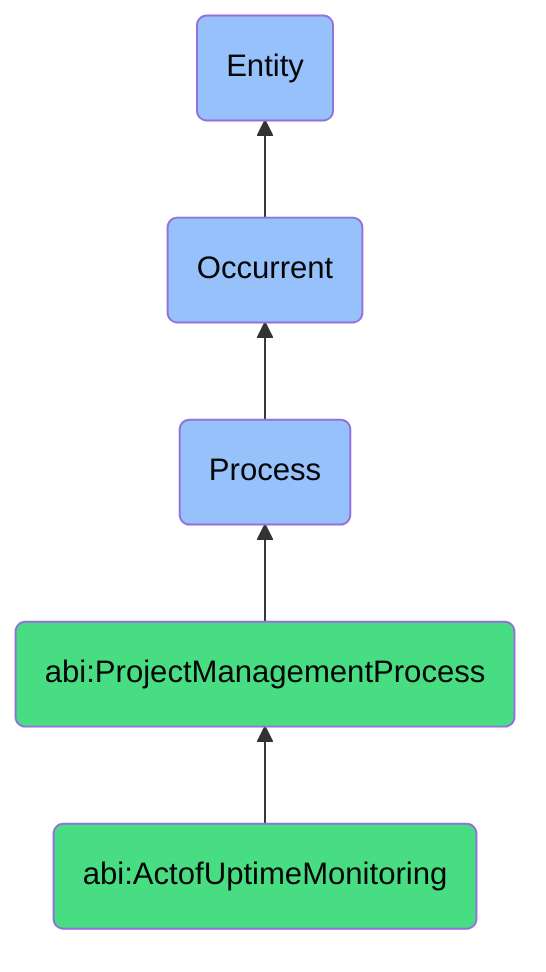

# ActofUptimeMonitoring

## Definition
An act of uptime monitoring is an occurrent process that unfolds through time, involving the continuous, automated, or manual observation, measurement, and assessment of system, service, application, infrastructure, or agent availability and performance against predefined operational thresholds and expectations, detecting anomalies, interruptions, degradations, or failures in real-time to enable prompt awareness, incident creation, diagnostic information collection, and remediation initiation that minimizes service disruption and maintains operational continuity.

## Hierarchy in BFO


## Ontological Schema (TBox)
```turtle
abi:ActofUptimeMonitoring a owl:Class ;
  rdfs:subClassOf abi:ProjectManagementProcess ;
  rdfs:label "Act of Uptime Monitoring" ;
  skos:definition "A process that verifies whether systems and agents are performing as expected in real time." .

abi:ProjectManagementProcess a owl:Class ;
  rdfs:subClassOf bfo:0000015 ;
  rdfs:label "Project Management Process" ;
  skos:definition "A time-bound process related to the planning, execution, monitoring, and control of project activities to achieve specific objectives." .

abi:has_monitoring_agent a owl:ObjectProperty ;
  rdfs:domain abi:ActofUptimeMonitoring ;
  rdfs:range abi:MonitoringAgent ;
  rdfs:label "has monitoring agent" .

abi:monitors_system a owl:ObjectProperty ;
  rdfs:domain abi:ActofUptimeMonitoring ;
  rdfs:range abi:MonitoredSystem ;
  rdfs:label "monitors system" .

abi:checks_service_endpoint a owl:ObjectProperty ;
  rdfs:domain abi:ActofUptimeMonitoring ;
  rdfs:range abi:ServiceEndpoint ;
  rdfs:label "checks service endpoint" .

abi:applies_monitoring_criteria a owl:ObjectProperty ;
  rdfs:domain abi:ActofUptimeMonitoring ;
  rdfs:range abi:MonitoringCriteria ;
  rdfs:label "applies monitoring criteria" .

abi:records_system_status a owl:ObjectProperty ;
  rdfs:domain abi:ActofUptimeMonitoring ;
  rdfs:range abi:SystemStatus ;
  rdfs:label "records system status" .

abi:triggers_alert_condition a owl:ObjectProperty ;
  rdfs:domain abi:ActofUptimeMonitoring ;
  rdfs:range abi:AlertCondition ;
  rdfs:label "triggers alert condition" .

abi:generates_monitoring_record a owl:ObjectProperty ;
  rdfs:domain abi:ActofUptimeMonitoring ;
  rdfs:range abi:MonitoringRecord ;
  rdfs:label "generates monitoring record" .

abi:has_monitoring_timestamp a owl:DatatypeProperty ;
  rdfs:domain abi:ActofUptimeMonitoring ;
  rdfs:range xsd:dateTime ;
  rdfs:label "has monitoring timestamp" .

abi:has_monitoring_frequency a owl:DatatypeProperty ;
  rdfs:domain abi:ActofUptimeMonitoring ;
  rdfs:range xsd:duration ;
  rdfs:label "has monitoring frequency" .

abi:has_uptime_percentage a owl:DatatypeProperty ;
  rdfs:domain abi:ActofUptimeMonitoring ;
  rdfs:range xsd:decimal ;
  rdfs:label "has uptime percentage" .
```

## Ontological Instance (ABox)
```turtle
ex:DocumentPipelineMonitoring a abi:ActofUptimeMonitoring ;
  rdfs:label "AI Assistant Document Pipeline Uptime Monitoring" ;
  abi:has_monitoring_agent ex:AIAssistant, ex:MonitoringService ;
  abi:monitors_system ex:DocumentProcessingPipeline, ex:DocumentStorage, ex:MetadataIndexer ;
  abi:checks_service_endpoint ex:DocumentAPIEndpoint, ex:ProcessorHealthEndpoint, ex:StorageStatusEndpoint ;
  abi:applies_monitoring_criteria ex:ResponseTimeThreshold, ex:AvailabilityCheck, ex:ErrorRateLimit ;
  abi:records_system_status ex:PipelineOperational, ex:StorageResponsive, ex:IndexerActive ;
  abi:triggers_alert_condition ex:ResponseTimeExceeded, ex:EndpointUnreachable, ex:ErrorRateHigh ;
  abi:generates_monitoring_record ex:UptimeLog, ex:PerformanceMetrics, ex:AlertHistory ;
  abi:has_monitoring_timestamp "2023-11-18T15:45:00Z"^^xsd:dateTime ;
  abi:has_monitoring_frequency "PT5M"^^xsd:duration ;
  abi:has_uptime_percentage "99.98"^^xsd:decimal .

ex:MicroserviceClusterMonitoring a abi:ActofUptimeMonitoring ;
  rdfs:label "Production Microservice Cluster Monitoring" ;
  abi:has_monitoring_agent ex:SiteReliabilitySystem, ex:CloudMonitoringService, ex:DevOpsAutomation ;
  abi:monitors_system ex:APIGateway, ex:AuthenticationService, ex:DataProcessors, ex:NotificationService ;
  abi:checks_service_endpoint ex:HealthCheckEndpoints, ex:LoadBalancerStatus, ex:MetricsExporters ;
  abi:applies_monitoring_criteria ex:ServiceAvailability, ex:LatencyThresholds, ex:ThroughputExpectations, ex:ErrorBudgets ;
  abi:records_system_status ex:ServicesOperational, ex:PerformanceWithinLimits, ex:ResourceUtilization ;
  abi:triggers_alert_condition ex:ServiceUnavailable, ex:LatencySpike, ex:ErrorRateExceeded, ex:ResourceConstraint ;
  abi:generates_monitoring_record ex:MonitoringDashboard, ex:IncidentLog, ex:TrendAnalysis, ex:UptimeReport ;
  abi:has_monitoring_timestamp "2023-11-18T16:00:00Z"^^xsd:dateTime ;
  abi:has_monitoring_frequency "PT1M"^^xsd:duration ;
  abi:has_uptime_percentage "99.95"^^xsd:decimal .
```

## Related Classes
- **abi:ActofServiceDelivery** - A process that depends on systems verified by uptime monitoring.
- **abi:ActofIncidentEscalation** - A process that may be triggered when uptime monitoring detects issues.
- **abi:ActofRunbookExecution** - A process that may be initiated to resolve issues identified by monitoring.
- **abi:ActofServiceLevelReview** - A process that uses monitoring data to assess service performance.
- **abi:PerformanceTestingProcess** - A process for evaluating system performance under controlled conditions.
- **abi:CapacityPlanningProcess** - A process for ensuring systems have resources to maintain uptime.
- **abi:AlertManagementProcess** - A process for handling alerts generated by uptime monitoring. 