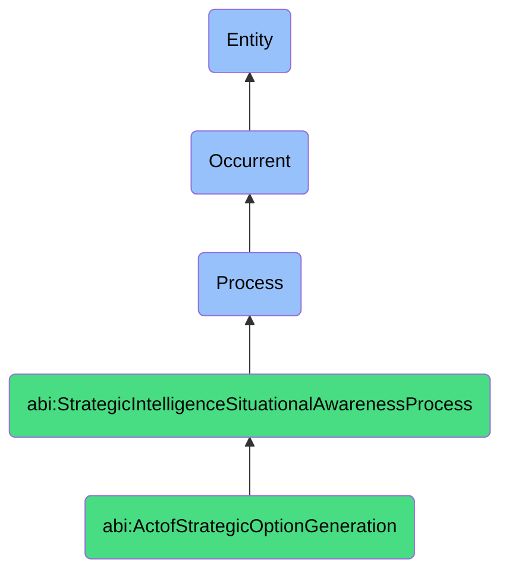

# ActofStrategicOptionGeneration

## Definition
An act of strategic option generation is an occurrent process that unfolds through time, involving the systematic identification, creation, or elaboration of a range of potential courses of action, interventions, or strategic pathways in response to a particular situation, opportunity, or challenge, drawing upon situational awareness, organizational capabilities, and creative problem-solving methodologies to develop multiple distinct, feasible, and valuable alternatives that enable decision-makers to evaluate and select among a diverse set of possibilities rather than defaulting to a single apparent solution.

## Hierarchy in BFO


## Ontological Schema (TBox)
```turtle
abi:ActofStrategicOptionGeneration a owl:Class ;
  rdfs:subClassOf abi:StrategicIntelligenceSituationalAwarenessProcess ;
  rdfs:label "Act of Strategic Option Generation" ;
  skos:definition "A process that systematically identifies and creates multiple potential courses of action in response to a situation or opportunity." .

abi:has_option_generator a owl:ObjectProperty ;
  rdfs:domain abi:ActofStrategicOptionGeneration ;
  rdfs:range abi:OptionGenerator ;
  rdfs:label "has option generator" .

abi:addresses_strategic_situation a owl:ObjectProperty ;
  rdfs:domain abi:ActofStrategicOptionGeneration ;
  rdfs:range abi:StrategicSituation ;
  rdfs:label "addresses strategic situation" .

abi:applies_ideation_method a owl:ObjectProperty ;
  rdfs:domain abi:ActofStrategicOptionGeneration ;
  rdfs:range abi:IdeationMethod ;
  rdfs:label "applies ideation method" .

abi:considers_organizational_capability a owl:ObjectProperty ;
  rdfs:domain abi:ActofStrategicOptionGeneration ;
  rdfs:range abi:OrganizationalCapability ;
  rdfs:label "considers organizational capability" .

abi:evaluates_external_factor a owl:ObjectProperty ;
  rdfs:domain abi:ActofStrategicOptionGeneration ;
  rdfs:range abi:ExternalFactor ;
  rdfs:label "evaluates external factor" .

abi:generates_strategic_option a owl:ObjectProperty ;
  rdfs:domain abi:ActofStrategicOptionGeneration ;
  rdfs:range abi:StrategicOption ;
  rdfs:label "generates strategic option" .

abi:assesses_option_feasibility a owl:ObjectProperty ;
  rdfs:domain abi:ActofStrategicOptionGeneration ;
  rdfs:range abi:OptionFeasibility ;
  rdfs:label "assesses option feasibility" .

abi:produces_option_document a owl:ObjectProperty ;
  rdfs:domain abi:ActofStrategicOptionGeneration ;
  rdfs:range abi:OptionDocument ;
  rdfs:label "produces option document" .

abi:has_generation_timestamp a owl:DatatypeProperty ;
  rdfs:domain abi:ActofStrategicOptionGeneration ;
  rdfs:range xsd:dateTime ;
  rdfs:label "has generation timestamp" .

abi:has_option_count a owl:DatatypeProperty ;
  rdfs:domain abi:ActofStrategicOptionGeneration ;
  rdfs:range xsd:integer ;
  rdfs:label "has option count" .

abi:has_divergence_score a owl:DatatypeProperty ;
  rdfs:domain abi:ActofStrategicOptionGeneration ;
  rdfs:range xsd:decimal ;
  rdfs:label "has divergence score" .
```

## Ontological Instance (ABox)
```turtle
ex:MarketEntryOptionGeneration a abi:ActofStrategicOptionGeneration ;
  rdfs:label "Asian Market Entry Strategy Options Generation" ;
  abi:has_option_generator ex:MarketExpansionTeam, ex:StrategyConsultant, ex:RegionalExpert ;
  abi:addresses_strategic_situation ex:AsianMarketOpportunity, ex:CompetitivePositioningChallenge ;
  abi:applies_ideation_method ex:ScenarioPlanning, ex:DesignThinking, ex:StrategicAnalogies ;
  abi:considers_organizational_capability ex:DistributionNetwork, ex:BrandEquity, ex:ProductAdaptation, ex:RegulatoryCompliance ;
  abi:evaluates_external_factor ex:LocalCompetition, ex:RegulatoryEnvironment, ex:ConsumerPreferences, ex:EconomicConditions ;
  abi:generates_strategic_option ex:JointVentureOption, ex:DirectEntryOption, ex:AcquisitionOption, ex:DistributorPartnershipOption ;
  abi:assesses_option_feasibility ex:CapitalRequirements, ex:TimeToMarket, ex:RegulatoryBarriers, ex:OrganizationalReadiness ;
  abi:produces_option_document ex:OptionsSummaryPresentation, ex:DetailedFeasibilityAnalysis ;
  abi:has_generation_timestamp "2023-09-25T13:45:00Z"^^xsd:dateTime ;
  abi:has_option_count "5"^^xsd:integer ;
  abi:has_divergence_score "0.85"^^xsd:decimal .

ex:ProductPortfolioEvolutionOptions a abi:ActofStrategicOptionGeneration ;
  rdfs:label "Digital Product Portfolio Evolution Options" ;
  abi:has_option_generator ex:ProductStrategy, ex:TechnologyRoadmapTeam, ex:CustomerInsightsAnalyst ;
  abi:addresses_strategic_situation ex:DigitalTransformationTrend, ex:CompetitiveFeatureGap, ex:UserNeedsEvolution ;
  abi:applies_ideation_method ex:JobsToBeDone, ex:FutureBackwardMapping, ex:PlatformThinking ;
  abi:considers_organizational_capability ex:TechnicalStack, ex:ProductDevelopmentCapacity, ex:DataAnalyticsMaturity ;
  abi:evaluates_external_factor ex:EmergingTechnologies, ex:CustomerExpectations, ex:MarketDisruptions ;
  abi:generates_strategic_option ex:CorePlatformExpansion, ex:AICapabilitiesIntegration, ex:VerticalSolutionDevelopment, ex:PartnerEcosystemStrategy ;
  abi:assesses_option_feasibility ex:EngineeringFeasibility, ex:InvestmentRequirements, ex:MarketReadiness ;
  abi:produces_option_document ex:ProductEvolutionRoadmapOptions, ex:CapabilityExpansionAnalysis ;
  abi:has_generation_timestamp "2023-10-30T10:15:00Z"^^xsd:dateTime ;
  abi:has_option_count "7"^^xsd:integer ;
  abi:has_divergence_score "0.78"^^xsd:decimal .
```

## Related Classes
- **abi:ActofSituationAssessment** - A process that provides context for option generation.
- **abi:ActofSituationalAwarenessGeneration** - A process that synthesizes a situation that options address.
- **abi:ActofSimulation** - A process that may test or explore potential options.
- **abi:ActofScenarioPlanning** - A process that develops detailed scenarios from strategic options.
- **abi:ActofNextBestMoveSelection** - A process that evaluates and selects among generated options.
- **abi:CreativeProblemSolvingProcess** - A process for innovative thinking that supports option generation.
- **abi:StrategicPlanningProcess** - A broader process that incorporates strategic option generation. 