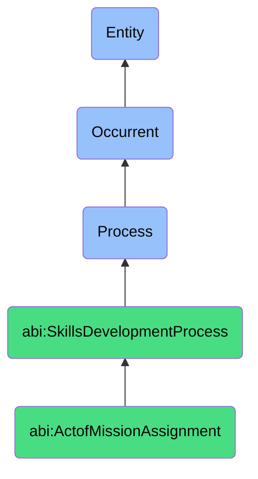

# ActofMissionAssignment

## Definition
An act of mission assignment is an occurrent process that unfolds through time, involving the deliberate selection, allocation, and tasking of individuals or agents to specific projects, challenges, initiatives, or responsibilities that are strategically designed to extend beyond their current capabilities, expertise, or comfort zones, with the dual purpose of accomplishing defined organizational objectives while simultaneously creating opportunities for skill development, knowledge expansion, perspective broadening, and professional growth through experiential learning in authentic contexts.

## Hierarchy in BFO


## Ontological Schema (TBox)
```turtle
abi:ActofMissionAssignment a owl:Class ;
  rdfs:subClassOf abi:SkillsDevelopmentProcess ;
  rdfs:label "Act of Mission Assignment" ;
  skos:definition "A process that assigns a person or agent to a defined project or challenge with potential to develop new capabilities." .

abi:SkillsDevelopmentProcess a owl:Class ;
  rdfs:subClassOf bfo:0000015 ;
  rdfs:label "Skills Development Process" ;
  skos:definition "A time-bound process related to the identification, acquisition, cultivation, enhancement, or transfer of knowledge, capabilities, competencies, or expertise within individuals or organizational contexts." .

abi:has_mission_assigner a owl:ObjectProperty ;
  rdfs:domain abi:ActofMissionAssignment ;
  rdfs:range abi:MissionAssigner ;
  rdfs:label "has mission assigner" .

abi:assigns_contributor a owl:ObjectProperty ;
  rdfs:domain abi:ActofMissionAssignment ;
  rdfs:range abi:Contributor ;
  rdfs:label "assigns contributor" .

abi:assigns_to_mission a owl:ObjectProperty ;
  rdfs:domain abi:ActofMissionAssignment ;
  rdfs:range abi:Mission ;
  rdfs:label "assigns to mission" .

abi:targets_development_goal a owl:ObjectProperty ;
  rdfs:domain abi:ActofMissionAssignment ;
  rdfs:range abi:DevelopmentGoal ;
  rdfs:label "targets development goal" .

abi:leverages_existing_capability a owl:ObjectProperty ;
  rdfs:domain abi:ActofMissionAssignment ;
  rdfs:range abi:ExistingCapability ;
  rdfs:label "leverages existing capability" .

abi:requires_growth_into_new_capability a owl:ObjectProperty ;
  rdfs:domain abi:ActofMissionAssignment ;
  rdfs:range abi:NewCapability ;
  rdfs:label "requires growth into new capability" .

abi:produces_assignment_artifact a owl:ObjectProperty ;
  rdfs:domain abi:ActofMissionAssignment ;
  rdfs:range abi:AssignmentArtifact ;
  rdfs:label "produces assignment artifact" .

abi:has_assignment_date a owl:DatatypeProperty ;
  rdfs:domain abi:ActofMissionAssignment ;
  rdfs:range xsd:date ;
  rdfs:label "has assignment date" .

abi:has_mission_duration a owl:DatatypeProperty ;
  rdfs:domain abi:ActofMissionAssignment ;
  rdfs:range xsd:duration ;
  rdfs:label "has mission duration" .

abi:has_stretch_factor a owl:DatatypeProperty ;
  rdfs:domain abi:ActofMissionAssignment ;
  rdfs:range xsd:string ;
  rdfs:label "has stretch factor" .
```

## Ontological Instance (ABox)
```turtle
ex:DigitalTwinPilotAssignment a abi:ActofMissionAssignment ;
  rdfs:label "Digital Twin Technology Pilot Project Assignment" ;
  abi:has_mission_assigner ex:InnovationDirector, ex:EngineeringLead ;
  abi:assigns_contributor ex:SeniorDeveloper, ex:SystemsAnalyst ;
  abi:assigns_to_mission ex:DigitalTwinPilotProject, ex:ManufacturingOptimizationInitiative ;
  abi:targets_development_goal ex:AdvancedSimulationExpertise, ex:CrossDisciplinaryIntegration, ex:EmergingTechnologyMastery ;
  abi:leverages_existing_capability ex:SoftwareDevelopmentSkill, ex:DataModelingExpertise, ex:SystemArchitectureKnowledge ;
  abi:requires_growth_into_new_capability ex:VirtualEnvironmentModeling, ex:RealTimeDataIntegration, ex:PhysicalSystemDigitization ;
  abi:produces_assignment_artifact ex:ProjectCharter, ex:SkillDevelopmentPlan, ex:CapabilityGrowthRoadmap ;
  abi:has_assignment_date "2023-09-15"^^xsd:date ;
  abi:has_mission_duration "P6M"^^xsd:duration ;
  abi:has_stretch_factor "Significant - 30% Beyond Current Capabilities" .

ex:AIStrategyTeamAssignment a abi:ActofMissionAssignment ;
  rdfs:label "Enterprise AI Strategy Development Team Assignment" ;
  abi:has_mission_assigner ex:ChiefInnovationOfficer, ex:TalentDevelopmentHead ;
  abi:assigns_contributor ex:BusinessAnalyst, ex:DataScientist, ex:ProductManager ;
  abi:assigns_to_mission ex:EnterpriseAIRoadmapDevelopment, ex:EmergingTechnologyIntegrationStrategy ;
  abi:targets_development_goal ex:StrategicThinking, ex:CrossFunctionalLeadership, ex:EmergingTechnologyForesight ;
  abi:leverages_existing_capability ex:AnalyticalThinking, ex:MachineLearningKnowledge, ex:BusinessDomainExpertise ;
  abi:requires_growth_into_new_capability ex:EnterpriseArchitecturePlanning, ex:ChangeManagementExpertise, ex:TechnologyRoadmapping ;
  abi:produces_assignment_artifact ex:TeamCharterDocument, ex:CompetencyDevelopmentPlan, ex:StrategyProjectMilestones ;
  abi:has_assignment_date "2023-08-01"^^xsd:date ;
  abi:has_mission_duration "P9M"^^xsd:duration ;
  abi:has_stretch_factor "Moderate - Executive-Level Strategy Exposure" .
```

## Related Classes
- **abi:ActofHiring** - A process that may precede mission assignment for new contributors.
- **abi:ActofOnboarding** - A process that introduces contributors before mission assignments.
- **abi:ActofInternalTraining** - A process that may prepare contributors for mission assignments.
- **abi:ActofMentoring** - A process that often supports contributors during challenging missions.
- **abi:ActofSkillAssessment** - A process that may identify readiness for stretch assignments.
- **abi:ActofSkillRecognition** - A process that occurs after successful mission completion.
- **abi:ActofSkillRealizationThroughWork** - A process that follows mission assignment as skills develop through application. 