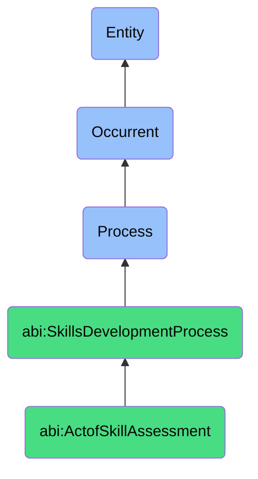

# ActofSkillAssessment

## Definition
An act of skill assessment is an occurrent process that unfolds through time, involving the systematic evaluation, measurement, and analysis of an individual's knowledge, capabilities, competencies, or expertise against predefined standards, requirements, or expectations, using objective or subjective methods to determine proficiency levels, identify gaps, validate mastery, or inform developmental priorities, providing insights that guide targeted improvement efforts, role assignments, or certification decisions within organizational or professional contexts.

## Hierarchy in BFO


## Ontological Schema (TBox)
```turtle
abi:ActofSkillAssessment a owl:Class ;
  rdfs:subClassOf abi:SkillsDevelopmentProcess ;
  rdfs:label "Act of Skill Assessment" ;
  skos:definition "A process designed to evaluate whether a skill is present, at what level, and in which contexts." .

abi:SkillsDevelopmentProcess a owl:Class ;
  rdfs:subClassOf bfo:0000015 ;
  rdfs:label "Skills Development Process" ;
  skos:definition "A time-bound process related to the identification, acquisition, cultivation, enhancement, or transfer of knowledge, capabilities, competencies, or expertise within individuals or organizational contexts." .

abi:has_assessment_administrator a owl:ObjectProperty ;
  rdfs:domain abi:ActofSkillAssessment ;
  rdfs:range abi:AssessmentAdministrator ;
  rdfs:label "has assessment administrator" .

abi:assesses_skill_subject a owl:ObjectProperty ;
  rdfs:domain abi:ActofSkillAssessment ;
  rdfs:range abi:SkillSubject ;
  rdfs:label "assesses skill subject" .

abi:evaluates_skill a owl:ObjectProperty ;
  rdfs:domain abi:ActofSkillAssessment ;
  rdfs:range abi:Skill ;
  rdfs:label "evaluates skill" .

abi:applies_assessment_method a owl:ObjectProperty ;
  rdfs:domain abi:ActofSkillAssessment ;
  rdfs:range abi:AssessmentMethod ;
  rdfs:label "applies assessment method" .

abi:uses_assessment_criteria a owl:ObjectProperty ;
  rdfs:domain abi:ActofSkillAssessment ;
  rdfs:range abi:AssessmentCriteria ;
  rdfs:label "uses assessment criteria" .

abi:documents_performance_evidence a owl:ObjectProperty ;
  rdfs:domain abi:ActofSkillAssessment ;
  rdfs:range abi:PerformanceEvidence ;
  rdfs:label "documents performance evidence" .

abi:produces_assessment_result a owl:ObjectProperty ;
  rdfs:domain abi:ActofSkillAssessment ;
  rdfs:range abi:AssessmentResult ;
  rdfs:label "produces assessment result" .

abi:has_assessment_date a owl:DatatypeProperty ;
  rdfs:domain abi:ActofSkillAssessment ;
  rdfs:range xsd:date ;
  rdfs:label "has assessment date" .

abi:has_proficiency_level a owl:DatatypeProperty ;
  rdfs:domain abi:ActofSkillAssessment ;
  rdfs:range xsd:string ;
  rdfs:label "has proficiency level" .

abi:has_assessment_context a owl:DatatypeProperty ;
  rdfs:domain abi:ActofSkillAssessment ;
  rdfs:range xsd:string ;
  rdfs:label "has assessment context" .
```

## Ontological Instance (ABox)
```turtle
ex:PromptEngineeringAssessment a abi:ActofSkillAssessment ;
  rdfs:label "AI Assistant Prompt Writing Skill Assessment" ;
  abi:has_assessment_administrator ex:AITrainingSpecialist, ex:PerformanceCoach ;
  abi:assesses_skill_subject ex:AIAssistant, ex:ContentTeamMember ;
  abi:evaluates_skill ex:PromptEngineeringSkill, ex:AISystemUnderstandingSkill, ex:ContextAwarenessSkill ;
  abi:applies_assessment_method ex:PracticalExercise, ex:BlindPromptEvaluation, ex:OutcomeComparison ;
  abi:uses_assessment_criteria ex:PromptEffectiveness, ex:ResponseQuality, ex:ContextualRelevance, ex:Efficiency ;
  abi:documents_performance_evidence ex:PromptResponseExamples, ex:AssessmentCases, ex:PerformanceMetrics ;
  abi:produces_assessment_result ex:SkillProficiencyRating, ex:StrengthsAnalysis, ex:DevelopmentRecommendations ;
  abi:has_assessment_date "2023-11-15"^^xsd:date ;
  abi:has_proficiency_level "Advanced Intermediate" ;
  abi:has_assessment_context "Post-Onboarding Evaluation" .

ex:TechnicalLeadershipAssessment a abi:ActofSkillAssessment ;
  rdfs:label "Engineering Manager Technical Leadership Assessment" ;
  abi:has_assessment_administrator ex:ChiefTechnologyOfficer, ex:LeadershipConsultant ;
  abi:assesses_skill_subject ex:EngineeringManager, ex:TechnicalLead ;
  abi:evaluates_skill ex:TechnicalDecisionMakingSkill, ex:ArchitecturalPlanningSkill, ex:TechnicalMentorshipSkill, ex:CodeReviewCompetency ;
  abi:applies_assessment_method ex:360FeedbackGathering, ex:ProjectOutcomeAnalysis, ex:TechnicalChallengeSimulation, ex:TeamPerformanceReview ;
  abi:uses_assessment_criteria ex:DecisionQuality, ex:TeamDevelopmentEffectiveness, ex:ArchitecturalVision, ex:TechnicalGuidanceImpact ;
  abi:documents_performance_evidence ex:ProjectCaseStudies, ex:TeamFeedbackData, ex:ArchitectureDocumentation, ex:MentorshipOutcomes ;
  abi:produces_assessment_result ex:TechnicalLeadershipProfile, ex:StrengthsAnalysis, ex:DevelopmentRoadmap ;
  abi:has_assessment_date "2023-10-20"^^xsd:date ;
  abi:has_proficiency_level "Senior Expert" ;
  abi:has_assessment_context "Annual Leadership Review" .
```

## Related Classes
- **abi:ActofHiring** - A process that often incorporates skill assessment for candidates.
- **abi:ActofOnboarding** - A process that may be followed by skill assessment to validate learning.
- **abi:ActofInternalTraining** - A process that develops skills later evaluated through assessment.
- **abi:ActofMentoring** - A process guided by skill assessment to identify development areas.
- **abi:ActofSkillRecognition** - A process that may follow skill assessment to formally acknowledge expertise.
- **abi:CompetencyFrameworkDevelopmentProcess** - A process that establishes criteria used in skill assessment.
- **abi:CareerAdvancementEvaluationProcess** - A process that uses skill assessment results for promotion decisions. 