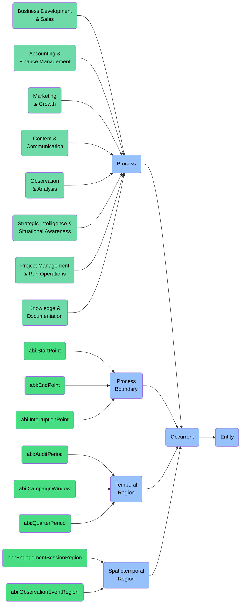

# Occurrent: Enterprise Management Foundry

This folder contains ontology classes representing **Occurrents** in the context of the **Enterprise Management Foundry** of the ABI Ontology.

Occurrents are entities that **unfold themselves in time** and represent the dynamic aspects of enterprise operations, including processes, events, activities, and temporal regions that are essential for business management and operations.

## Purpose
To model all time-bound activities, processes, events, and temporal phenomena involved in enterprise management — including business processes, workflow activities, operational events, and time-based patterns that support decision-making, operations, and strategic management.

## Structure
This folder includes:

### 1. **Process** (`bfo:0000015`)
Entities that unfold through time with different temporal parts in different time periods.

#### a. **Business Development & Sales**
- `abi:ActofLeadQualification`
- `abi:ActofSalesEngagement`
- `abi:ActofProposalCreation`
- `abi:ContractNegotiationProcess`

#### b. **Accounting & Finance Management**
- `abi:ActofForecasting`
- `abi:ActofBudgeting`
- `abi:FinancialReportingProcess`
- `abi:ExpenseManagementProcess`

#### c. **Marketing & Growth**
- `abi:ActofCampaignExecution`
- `abi:ActofMarketResearch`
- `abi:BrandDevelopmentProcess`
- `abi:CustomerAcquisitionProcess`

#### d. **Content & Communication**
- `abi:ActofPublishing`
- `abi:ActofContentCreation`
- `abi:CommunicationCampaignProcess`
- `abi:MessagingDistributionProcess`

#### e. **Observation & Analysis**
- `abi:ActofObserving`
- `abi:ActofScoring`
- `abi:ActofExplaining`
- `abi:AnalysisProcess`

#### f. **Strategic Intelligence & Situational Awareness**
- `abi:ActofNextBestMoveSelection`
- `abi:ActofStrategyFormulation`
- `abi:CompetitiveAnalysisProcess`
- `abi:TrendMonitoringProcess`

#### g. **Project Management & Run Operations**
- `abi:ActofRunbookExecution`
- `abi:ProjectExecutionProcess`
- `abi:ResourceAllocationProcess`
- `abi:OperationalHandoverProcess`

#### h. **Knowledge & Documentation Processes**
- `abi:ActofKnowledgeCapture`
- `abi:DocumentationCreationProcess`
- `abi:KnowledgeDistributionProcess`
- `abi:LearningCaptureProcess`

#### i. **Additional Process Categories**
- **Governance, Compliance & Control**
- **Cybersecurity & Risk Operations**
- **Strategic Alignment & Organizational Modeling**
- **Access & Security**
- **Physical Space & Maintenance**
- **Energy & Environmental Monitoring**
- **Compliance & ESG Reporting**
- **Equity & Investor Relations**
- **Strategic Skills & Expertise**
- **General Workflow & Execution**

### 2. **Process Boundary** (`bfo:0000035`)
Instantaneous temporal boundaries of enterprise processes.
- `abi:StartPoint`
- `abi:EndPoint`
- `abi:InterruptionPoint`
- `abi:ProcessBoundary`

### 3. **Temporal Region** (`bfo:0000008`)
Time periods relevant to enterprise operations.
- `abi:AuditPeriod`
- `abi:CampaignWindow`
- `abi:QuarterPeriod`
- `abi:TemporalRegion`

### 4. **Spatiotemporal Region** (`bfo:0000011`)
Space-time regions in which enterprise events occur.
- `abi:EngagementSessionRegion`
- `abi:ObservationEventRegion`
- `abi:SpatiotemporalRegion`

## BFO Hierarchy

## Usage
These classes are designed to:
- Model business processes, workflows, and activities across all enterprise domains
- Represent events, changes, and time-bound phenomena in business operations
- Capture the timing, sequence, and temporal aspects of enterprise management
- Enable process analysis, optimization, and automation
- Support business process management and workflow orchestration

## Alignment
All classes in this folder:
- Are subclasses of `bfo:Occurrent`
- Are scoped specifically to the **Enterprise Management Foundry**
- Can be imported modularly or reused in other domains

For persistent entities related to enterprise management (e.g., organizations, roles, assets), see the `Continuant` folder. 