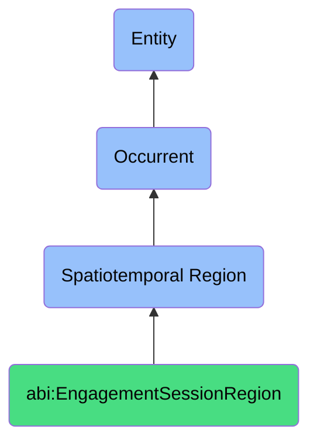

# EngagementSessionRegion

## Definition
An engagement session region is a specific type of spatiotemporal region (bfo:0000011) that represents the combined temporal and contextual dimensions of a bounded interaction episode between two or more participants, establishing a framework for capturing the communication exchange, relational dynamics, and information flow that occurs within a specific medium (such as a call, meeting, chat thread, or direct message conversation), with defined boundaries that delineate the beginning and conclusion of the interactive engagement.

## Hierarchy in BFO


## Ontological Schema (TBox)
```turtle
abi:EngagementSessionRegion a owl:Class ;
  rdfs:subClassOf bfo:0000011 ;
  rdfs:label "Engagement Session Region" ;
  skos:definition "A bounded interaction episode, like a call, thread, or DM exchange." .

bfo:0000011 a owl:Class ;
  rdfs:label "Spatiotemporal Region" ;
  skos:definition "The combination of spatial and temporal context for processes." .

abi:has_temporal_component a owl:ObjectProperty ;
  rdfs:domain abi:EngagementSessionRegion ;
  rdfs:range bfo:0000008 ;
  rdfs:label "has temporal component" .

abi:has_spatial_component a owl:ObjectProperty ;
  rdfs:domain abi:EngagementSessionRegion ;
  rdfs:range bfo:0000006 ;
  rdfs:label "has spatial component" .

abi:has_session_start_datetime a owl:DatatypeProperty ;
  rdfs:domain abi:EngagementSessionRegion ;
  rdfs:range xsd:dateTime ;
  rdfs:label "has session start datetime" .

abi:has_session_end_datetime a owl:DatatypeProperty ;
  rdfs:domain abi:EngagementSessionRegion ;
  rdfs:range xsd:dateTime ;
  rdfs:label "has session end datetime" .

abi:has_session_duration a owl:DatatypeProperty ;
  rdfs:domain abi:EngagementSessionRegion ;
  rdfs:range xsd:duration ;
  rdfs:label "has session duration" .

abi:has_session_id a owl:DatatypeProperty ;
  rdfs:domain abi:EngagementSessionRegion ;
  rdfs:range xsd:string ;
  rdfs:label "has session id" .

abi:has_engagement_medium a owl:ObjectProperty ;
  rdfs:domain abi:EngagementSessionRegion ;
  rdfs:range abi:EngagementMedium ;
  rdfs:label "has engagement medium" .

abi:has_participant a owl:ObjectProperty ;
  rdfs:domain abi:EngagementSessionRegion ;
  rdfs:range abi:Participant ;
  rdfs:label "has participant" .

abi:has_session_context a owl:DatatypeProperty ;
  rdfs:domain abi:EngagementSessionRegion ;
  rdfs:range xsd:string ;
  rdfs:label "has session context" .

abi:produces_interaction_record a owl:ObjectProperty ;
  rdfs:domain abi:EngagementSessionRegion ;
  rdfs:range abi:InteractionRecord ;
  rdfs:label "produces interaction record" .

abi:addresses_topic a owl:ObjectProperty ;
  rdfs:domain abi:EngagementSessionRegion ;
  rdfs:range abi:DiscussionTopic ;
  rdfs:label "addresses topic" .

abi:results_in_outcome a owl:ObjectProperty ;
  rdfs:domain abi:EngagementSessionRegion ;
  rdfs:range abi:EngagementOutcome ;
  rdfs:label "results in outcome" .

abi:has_engagement_type a owl:DatatypeProperty ;
  rdfs:domain abi:EngagementSessionRegion ;
  rdfs:range xsd:string ;
  rdfs:label "has engagement type" .

abi:has_engagement_platform a owl:ObjectProperty ;
  rdfs:domain abi:EngagementSessionRegion ;
  rdfs:range abi:EngagementPlatform ;
  rdfs:label "has engagement platform" .
```

## Ontological Instance (ABox)
```turtle
ex:CustomerSupportChatSession_12345 a abi:EngagementSessionRegion ;
  rdfs:label "Customer Support Chat Session #12345" ;
  abi:has_temporal_component ex:BusinessDay_2023_11_28 ;
  abi:has_spatial_component ex:VirtualChatSpace ;
  abi:has_session_start_datetime "2023-11-28T14:30:00Z"^^xsd:dateTime ;
  abi:has_session_end_datetime "2023-11-28T15:05:20Z"^^xsd:dateTime ;
  abi:has_session_duration "PT35M20S"^^xsd:duration ;
  abi:has_session_id "CHAT-12345-20231128" ;
  abi:has_engagement_medium ex:TextBasedChat ;
  abi:has_participant ex:CustomerSupportAgent42, ex:CustomerJohnDoe ;
  abi:has_session_context "Product subscription renewal assistance" ;
  abi:produces_interaction_record ex:ChatTranscript12345 ;
  abi:addresses_topic ex:SubscriptionRenewalProcess, ex:BillingQuestions ;
  abi:results_in_outcome ex:SubscriptionRenewed, ex:CustomerSatisfactionSurveyCompleted ;
  abi:has_engagement_type "Support" ;
  abi:has_engagement_platform ex:CompanySupportPortal .

ex:WeeklyTeamMeeting_Q4Planning a abi:EngagementSessionRegion ;
  rdfs:label "Weekly Team Meeting - Q4 Planning Session" ;
  abi:has_temporal_component ex:MorningMeetingSlot_2023_10_02 ;
  abi:has_spatial_component ex:VirtualMeetingRoom ;
  abi:has_session_start_datetime "2023-10-02T10:00:00Z"^^xsd:dateTime ;
  abi:has_session_end_datetime "2023-10-02T11:15:00Z"^^xsd:dateTime ;
  abi:has_session_duration "PT1H15M"^^xsd:duration ;
  abi:has_session_id "MEET-TEAM-20231002" ;
  abi:has_engagement_medium ex:VideoConference ;
  abi:has_participant ex:TeamLead, ex:ProjectManager, ex:TeamMember1, ex:TeamMember2, ex:TeamMember3 ;
  abi:has_session_context "Q4 strategy planning and task allocation" ;
  abi:produces_interaction_record ex:MeetingRecording, ex:MeetingNotes ;
  abi:addresses_topic ex:Q4Deliverables, ex:ResourceAllocation, ex:ProjectTimelines ;
  abi:results_in_outcome ex:UpdatedProjectPlan, ex:TaskAssignments ;
  abi:has_engagement_type "Internal Planning" ;
  abi:has_engagement_platform ex:ZoomMeeting .

ex:ProductDemoCall_ProspectXYZ a abi:EngagementSessionRegion ;
  rdfs:label "Product Demonstration Call with Prospect XYZ Corp" ;
  abi:has_temporal_component ex:AfternoonSlot_2023_11_15 ;
  abi:has_spatial_component ex:VirtualDemoEnvironment ;
  abi:has_session_start_datetime "2023-11-15T15:00:00Z"^^xsd:dateTime ;
  abi:has_session_end_datetime "2023-11-15T16:30:00Z"^^xsd:dateTime ;
  abi:has_session_duration "PT1H30M"^^xsd:duration ;
  abi:has_session_id "DEMO-XYZ-20231115" ;
  abi:has_engagement_medium ex:VideoAndScreenshare ;
  abi:has_participant ex:SalesRepresentative, ex:ProductSpecialist, ex:ProspectDecisionMaker, ex:ProspectTechnicalLead ;
  abi:has_session_context "Enterprise solution capabilities demonstration" ;
  abi:produces_interaction_record ex:DemoRecording, ex:QANotes ;
  abi:addresses_topic ex:ProductCapabilities, ex:IntegrationOptions, ex:PricingStructure ;
  abi:results_in_outcome ex:FollowUpMeetingScheduled, ex:RequirementsDocumentShared ;
  abi:has_engagement_type "Sales" ;
  abi:has_engagement_platform ex:TeamsVideoCall .
```

## Examples
1. "Meeting held via chat log tracked in EngagementSessionRegion" - Interaction between participants was documented and tracked within a defined engagement context.

2. "The customer support call was contained within EngagementSessionRegion CS-2023-10-15-43" - A customer interaction had defined boundaries and was tracked as a specific engagement episode.

3. "Team collaboration occurred in EngagementSessionRegion PLANNING-SESSION-Q1-2024" - A structured team discussion was captured within a defined spatiotemporal region for planning purposes.

4. "The sales negotiation took place in EngagementSessionRegion PROSPECT-MEETING-XYZ-CORP" - A business development interaction with a potential client occurred within a defined engagement context.

5. "User feedback was collected within EngagementSessionRegion BETA-USER-INTERVIEW-15" - A structured conversation to gather user feedback was conducted within a defined session framework.

## Related Classes
- **bfo:0000011 (Spatiotemporal Region)** - The parent class of EngagementSessionRegion.
- **abi:InteractionEpisode** - A discrete engagement between participants.
- **abi:CommunicationMedium** - The mode or channel through which engagement occurs.
- **abi:ConversationTranscript** - The recorded content of an engagement session.
- **abi:EngagementParticipant** - An agent involved in the engagement session.
- **abi:SessionOutcome** - Results or deliverables from an engagement session.
- **abi:InteractionContext** - Situational factors that frame an engagement session. 