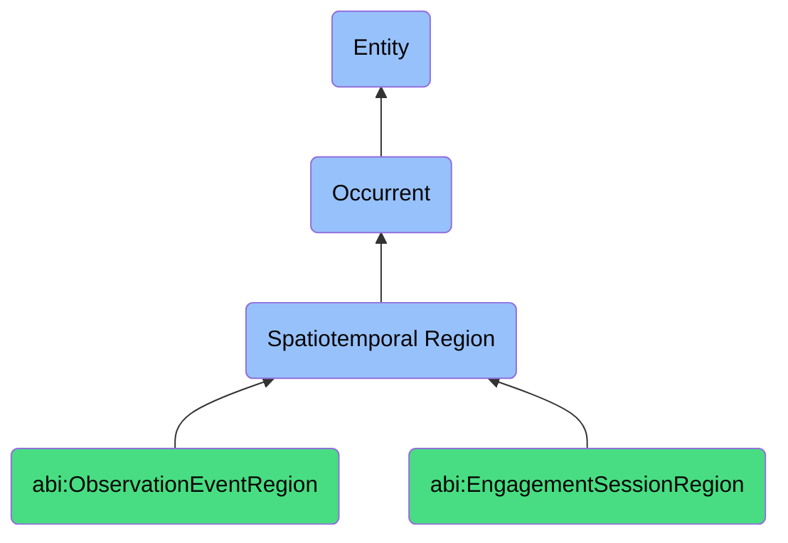

# SpatiotemporalRegion

## Definition
A spatiotemporal region (bfo:0000011) is an occurrent that combines both spatial and temporal dimensions to represent the space-time context in which processes, events, and activities unfold, providing a unified framework for capturing where and when occurrents take place, enabling the modeling of complex interactions between entities across both space and time, and serving as a container for the localization of processes within specific physical and temporal boundaries.

## Hierarchy in BFO


## Ontological Schema (TBox)
```turtle
bfo:0000011 a owl:Class ;
  rdfs:label "Spatiotemporal Region" ;
  skos:definition "The combination of spatial and temporal context for processes." .

abi:ObservationEventRegion a owl:Class ;
  rdfs:subClassOf bfo:0000011 ;
  rdfs:label "Observation Event Region" ;
  skos:definition "A region combining time and context for a specific data capture." .

abi:EngagementSessionRegion a owl:Class ;
  rdfs:subClassOf bfo:0000011 ;
  rdfs:label "Engagement Session Region" ;
  skos:definition "A bounded interaction episode, like a call, thread, or DM exchange." .

abi:has_temporal_component a owl:ObjectProperty ;
  rdfs:domain bfo:0000011 ;
  rdfs:range bfo:0000008 ;
  rdfs:label "has temporal component" .

abi:has_spatial_component a owl:ObjectProperty ;
  rdfs:domain bfo:0000011 ;
  rdfs:range bfo:0000006 ;
  rdfs:label "has spatial component" .

abi:has_start_datetime a owl:DatatypeProperty ;
  rdfs:domain bfo:0000011 ;
  rdfs:range xsd:dateTime ;
  rdfs:label "has start datetime" .

abi:has_end_datetime a owl:DatatypeProperty ;
  rdfs:domain bfo:0000011 ;
  rdfs:range xsd:dateTime ;
  rdfs:label "has end datetime" .

abi:has_location a owl:DatatypeProperty ;
  rdfs:domain bfo:0000011 ;
  rdfs:range xsd:string ;
  rdfs:label "has location" .

abi:has_context a owl:DatatypeProperty ;
  rdfs:domain bfo:0000011 ;
  rdfs:range xsd:string ;
  rdfs:label "has context" .

abi:spatiotemporally_contains a owl:ObjectProperty ;
  rdfs:domain bfo:0000011 ;
  rdfs:range bfo:0000003 ;
  rdfs:label "spatiotemporally contains" .

abi:has_participant a owl:ObjectProperty ;
  rdfs:domain bfo:0000011 ;
  rdfs:range abi:Participant ;
  rdfs:label "has participant" .
```

## Ontological Instance (ABox)
```turtle
ex:TeamStrategyWorkshop2023 a bfo:0000011 ;
  rdfs:label "2023 Team Strategy Workshop" ;
  abi:has_temporal_component ex:WorkshopDay2023 ;
  abi:has_spatial_component ex:ConferenceRoomA ;
  abi:has_start_datetime "2023-06-15T09:00:00Z"^^xsd:dateTime ;
  abi:has_end_datetime "2023-06-15T17:00:00Z"^^xsd:dateTime ;
  abi:has_location "Headquarters, Conference Room A" ;
  abi:has_context "Annual strategy planning session" ;
  abi:spatiotemporally_contains ex:StrategyDiscussionProcess, ex:TeamAlignmentActivity ;
  abi:has_participant ex:LeadershipTeam, ex:DepartmentHeads .

ex:ProductLaunchEvent2023 a bfo:0000011 ;
  rdfs:label "2023 Product Launch Event" ;
  abi:has_temporal_component ex:LaunchDay2023 ;
  abi:has_spatial_component ex:VirtualLaunchEnvironment ;
  abi:has_start_datetime "2023-09-20T10:00:00Z"^^xsd:dateTime ;
  abi:has_end_datetime "2023-09-20T12:30:00Z"^^xsd:dateTime ;
  abi:has_location "Virtual livestream platform" ;
  abi:has_context "Major product announcement and demonstration" ;
  abi:spatiotemporally_contains ex:ProductDemonstrationProcess, ex:LiveQASession ;
  abi:has_participant ex:ProductTeam, ex:MarketingTeam, ex:CustomerAudience .

ex:DataCollectionCampaignQ4 a bfo:0000011 ;
  rdfs:label "Q4 2023 Field Data Collection Campaign" ;
  abi:has_temporal_component ex:Q4_2023 ;
  abi:has_spatial_component ex:NorthEastRegion ;
  abi:has_start_datetime "2023-10-01T00:00:00Z"^^xsd:dateTime ;
  abi:has_end_datetime "2023-12-31T23:59:59Z"^^xsd:dateTime ;
  abi:has_location "Northeast regional locations" ;
  abi:has_context "Quarterly customer preference data gathering" ;
  abi:spatiotemporally_contains ex:SurveyCollection, ex:InterviewProcess, ex:DataAnalysis ;
  abi:has_participant ex:FieldResearchTeam, ex:DataAnalysts, ex:CustomerParticipants .
```

## Related Classes
- **bfo:0000003 (Occurrent)** - The parent class of Spatiotemporal Region, representing entities that unfold through time.
- **bfo:0000008 (Temporal Region)** - A region that represents the temporal dimension of a spatiotemporal region.
- **bfo:0000006 (Spatial Region)** - A region that represents the spatial dimension of a spatiotemporal region.
- **abi:EventContext** - The situational setting and circumstances of a spatiotemporal region.
- **abi:LocationTimeFrame** - A combination of location and time frame for activities.
- **abi:InteractionSpace** - A region where participants engage with each other.
- **abi:ProcessEnvironment** - The combined spatial and temporal context in which processes occur. 