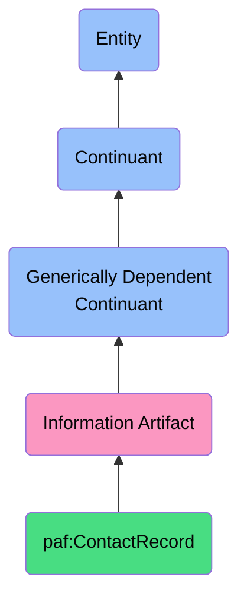

# ContactRecord

## Definition
A ContactRecord is a generically dependent continuant that provides a structured representation of information about a contact, drawn from multiple sources, with provenance, enabling unified access while preserving source context.

## Hierarchy in BFO


## Overview
ContactRecord serves as the foundation for platform-independent contact management within the Personal AI ecosystem. It represents a unified view of an individual's contact information aggregated from multiple sources (LinkedIn, Facebook, Instagram, email platforms) while maintaining source attribution and confidence levels for each attribute.

Unlike traditional contact records that exist in siloed platform databases, the ContactRecord maintains rich provenance metadata, enabling intelligent context-aware usage of contact information. It supports the sovereignty principle by keeping ownership and control of contact data with the individual rather than platforms.

The ContactRecord is a key information artifact supporting the Social domain of the Personal AI Flywheel, enabling cross-domain enrichment through relationship context.

## Properties

### Core Properties
| Property | Type | Description | Example |
|----------|------|-------------|---------|
| identifier | URI | Unique identifier for the contact | `urn:uuid:12345678-1234-5678-1234-567812345678` |
| primaryName | String | Primary display name | "Jane Smith" |
| alternateNames | String[] | Alternative names/nicknames | ["Jane Doe", "J. Smith"] |
| emailAddresses | EmailAddress[] | Associated email addresses | ["jane.smith@work.com", "janesmith@personal.com"] |
| phoneNumbers | PhoneNumber[] | Associated phone numbers | ["+1-555-123-4567", "+1-555-987-6543"] |
| postalAddresses | PostalAddress[] | Physical addresses | ["123 Main St, Anytown USA 12345"] |
| socialProfiles | SocialProfile[] | Social media identifiers | ["linkedin.com/in/janesmith", "facebook.com/janesmith"] |
| websites | URL[] | Associated websites | ["janesmith.com", "janesmithportfolio.net"] |
| organizations | Organization[] | Associated organizations | ["Acme Corp", "Tech Association"] |
| imageURI | URI | Profile image reference | `urn:paf:image:12345678` |
| notes | String | Free-form notes about contact | "Met at conference in June 2023" |

### Metadata Properties
| Property | Type | Description | Example |
|----------|------|-------------|---------|
| hasOriginalSource | ContactPlatform[] | Platforms this contact appears on | [LinkedInPlatform, GmailPlatform] |
| hasAttributeSource | Map<Attribute, Platform> | Source platform for each attribute | {"emailAddresses[0]": LinkedInPlatform, "phoneNumbers[0]": FacebookPlatform} |
| hasConfidenceScore | Map<Attribute, Decimal> | Confidence score for each attribute | {"primaryName": 0.95, "phoneNumbers[0]": 0.85} |
| hasLastUpdateTime | Map<Attribute, DateTime> | Last update timestamp per attribute | {"emailAddresses[0]": "2023-10-15T14:30:00Z"} |
| hasMergeHistory | MergeEvent[] | History of merge operations | [{"sourceContact": "12345", "timestamp": "2023-09-01T10:15:00Z"}] |
| hasCategory | ContactCategory[] | Classification categories | ["Professional", "Frequent Collaborator"] |
| hasContactRelevanceScore | Decimal | Overall relevance score | 0.87 |
| hasPrivacyLevel | PrivacyLevel | Privacy classification | "Sensitive" |

### Relationship Properties
| Property | Type | Description | Example |
|----------|------|-------------|---------|
| hasRelationshipTo | Map<ContactRecord, RelationshipType> | Relationships to other contacts | {"contact123": "Colleague", "contact456": "Family"} |
| hasInteractionFrequency | InteractionFrequency | Frequency of interactions | "Weekly" |
| hasLastInteractionDate | DateTime | When last interacted | "2023-11-10T09:15:00Z" |
| hasCommunicationChannelPreference | CommunicationChannel | Preferred contact method | "Email" |
| hasImportanceRank | Integer | Relative importance (1-5) | 2 |

## Security

### Access Control
- **Owner**: Full read/write access to all attributes
- **Personal AI**: Read access with user consent, write access for synchronization
- **Third-party applications**: Attribute-specific access via explicit consent grants
- **Contacts app**: Read/write access to non-sensitive fields

### Privacy Controls
- **Attribute-level privacy**: Each attribute can have different visibility settings
- **Purpose limitation**: Data usage limited to explicitly authorized purposes
- **Minimal sharing**: Only essential attributes shared with third parties
- **Anonymization**: Options for anonymized contact sharing for specific uses

### Encryption
- **Storage encryption**: AES-256 encryption at rest
- **Transfer encryption**: TLS 1.3 for all data transfers
- **Field-level encryption**: Additional encryption for highly sensitive fields
- **Local storage priority**: Preference for device-based storage over cloud

## Datasources

### Primary Sources
| Source | Data Provided | Authentication Method | Sync Frequency |
|--------|---------------|----------------------|----------------|
| LinkedIn | Professional profile, work email, job title | OAuth 2.0 | Weekly |
| Facebook | Personal contact info, events, relationships | OAuth 2.0 | Weekly |
| Instagram | Visual content, creative connections | OAuth 2.0 | Weekly |
| Gmail | Email addresses, communication frequency | OAuth 2.0 | Daily |
| iPhone Contacts | Phone numbers, addresses, native grouping | Apple API | Real-time |

### Source Reliability Assessment
- **LinkedIn**: High reliability for professional information (0.90-0.95)
- **Facebook**: Medium reliability for personal information (0.75-0.85)
- **Instagram**: Medium reliability for visual identification (0.70-0.80)
- **Gmail**: High reliability for email addresses (0.85-0.95)
- **iPhone Contacts**: Variable reliability (0.60-0.90) based on manual entry

### Synchronization Mechanisms
- **Push updates**: Real-time updates from iPhone Contacts app
- **Pull updates**: Scheduled retrievals from platform APIs
- **Change detection**: Attribute-level change tracking
- **Conflict resolution**: Source priority and timestamp-based resolution

## Capabilities

### Identity Resolution
- **Cross-platform matching**: Identify the same person across platforms
- **Fuzzy name matching**: Handle variations in name spelling and formatting
- **Email-based matching**: Primary matching using email addresses
- **Social graph analysis**: Use mutual connections to improve matching
- **Confidence scoring**: Assign confidence levels to matches

### Contact Enrichment
- **Field completion**: Fill in missing fields from multiple sources
- **Freshness evaluation**: Identify and prioritize most recent data
- **Context preservation**: Maintain original context of each attribute
- **Image selection**: Choose highest quality profile image
- **Professional details enhancement**: Add job titles, company information

### Relationship Intelligence
- **Connection strength analysis**: Evaluate relationship importance
- **Interaction frequency tracking**: Monitor communication patterns
- **Relationship categorization**: Classify by context (work, personal, etc.)
- **Group detection**: Identify natural clusters of contacts
- **Network visualization**: Map social connections between contacts

## Object Views

### Default View
```json
{
  "id": "urn:uuid:12345678-1234-5678-1234-567812345678",
  "primaryName": "Jane Smith",
  "emailAddresses": ["jane.smith@work.com", "janesmith@personal.com"],
  "phoneNumbers": ["+1-555-123-4567"],
  "imageURI": "urn:paf:image:12345678",
  "category": ["Professional"]
}
```

### Full View
```json
{
  "id": "urn:uuid:12345678-1234-5678-1234-567812345678",
  "primaryName": "Jane Smith",
  "alternateNames": ["Jane Doe", "J. Smith"],
  "emailAddresses": ["jane.smith@work.com", "janesmith@personal.com"],
  "phoneNumbers": ["+1-555-123-4567", "+1-555-987-6543"],
  "postalAddresses": ["123 Main St, Anytown USA 12345"],
  "socialProfiles": ["linkedin.com/in/janesmith", "facebook.com/janesmith"],
  "websites": ["janesmith.com"],
  "organizations": ["Acme Corp"],
  "imageURI": "urn:paf:image:12345678",
  "notes": "Met at conference in June 2023",
  "metadata": {
    "sources": ["LinkedIn", "Gmail", "Facebook"],
    "lastUpdated": "2023-11-01T12:30:45Z",
    "relevanceScore": 0.87,
    "category": ["Professional", "Frequent Collaborator"]
  }
}
```

### Provenance View
```json
{
  "id": "urn:uuid:12345678-1234-5678-1234-567812345678",
  "attributes": {
    "primaryName": {
      "value": "Jane Smith",
      "source": "LinkedIn",
      "confidence": 0.95,
      "lastUpdated": "2023-10-15T14:30:00Z"
    },
    "emailAddresses": [
      {
        "value": "jane.smith@work.com",
        "source": "LinkedIn",
        "confidence": 0.95,
        "lastUpdated": "2023-10-15T14:30:00Z"
      },
      {
        "value": "janesmith@personal.com",
        "source": "Gmail",
        "confidence": 0.90,
        "lastUpdated": "2023-09-22T08:15:30Z"
      }
    ],
    "phoneNumbers": [
      {
        "value": "+1-555-123-4567",
        "source": "Facebook",
        "confidence": 0.85,
        "lastUpdated": "2023-08-05T16:42:10Z"
      }
    ]
  }
}
```

## Interfaces

### Data Access Interface
```typescript
interface ContactRecordRepository {
  getContactById(id: string): ContactRecord;
  findContactsByName(name: string): ContactRecord[];
  findContactsByEmail(email: string): ContactRecord[];
  findContactsByPhone(phone: string): ContactRecord[];
  findContactsByCategory(category: string): ContactRecord[];
  saveContact(contact: ContactRecord): void;
  mergeContacts(contact1: ContactRecord, contact2: ContactRecord): ContactRecord;
  deleteContact(id: string): void;
}
```

### Synchronization Interface
```typescript
interface ContactSynchronizationService {
  syncWithPlatform(platform: ContactPlatform): SyncResult;
  scheduleSync(platform: ContactPlatform, frequency: SyncFrequency): void;
  getSyncStatus(platform: ContactPlatform): SyncStatus;
  resolveConflicts(conflicts: ConflictResolutionStrategy): void;
  getLastSyncTime(platform: ContactPlatform): DateTime;
}
```

### Analytics Interface
```typescript
interface ContactAnalyticsService {
  getContactFrequency(contactId: string): InteractionFrequency;
  getTopContacts(limit: number): ContactRecord[];
  getNetworkClusters(): ContactCluster[];
  getContactsByRelevance(): ContactRecord[];
  getInteractionTimeline(contactId: string): InteractionEvent[];
}
```

## Materializations

### Physical Materializations
- **iPhone Contacts App**: Native iOS contacts with synchronized data
- **Address Book**: Exportable VCF/vCard format for standards compliance
- **CRM Systems**: Export to customer relationship management systems
- **Email Clients**: Integration with email platform contact lists

### Digital Materializations
- **Personal AI Memory Store**: In-memory representation for AI context
- **Universal Contact Graph**: Networked representation of all contacts
- **Personal Data Vault**: Encrypted long-term storage
- **Cross-platform Sync Buffer**: Temporary materialization during sync

### Visualization Materializations
- **Contact Card**: Visual representation of contact details
- **Relationship Graph**: Network visualization of contact connections
- **Timeline View**: Historical view of interactions with contact
- **Relevance Heatmap**: Visual representation of contact importance

## Automations

### Synchronization Automations
- **Scheduled Sync**: Regular synchronization with platforms based on policy
- **Change-triggered Sync**: Update when source platform changes detected
- **Conflict Resolution**: Automated handling of conflicting information
- **Deduplication Maintenance**: Ongoing identification of duplicate records

### Enhancement Automations
- **Data Enrichment**: Automatically filling missing fields from available sources
- **Decay Function**: Reducing relevance scores for outdated or unused contacts
- **Category Assignment**: Automated labeling based on interaction patterns
- **Group Detection**: Identifying natural clusters of connected contacts

### User Experience Automations
- **Contextual Surfacing**: Presenting relevant contacts based on user activity
- **Search Enhancement**: Improving search with synonyms and fuzzy matching
- **Birthday/Event Notifications**: Reminders for contact-related events
- **Introduction Suggestions**: Identifying potential valuable connections

## Usage

### Primary Use Cases
- **Universal Contact Management**: Single source of truth for all contacts
- **Cross-application Availability**: Consistent contact data across apps
- **Social Domain Enhancement**: Foundation for the social domain in Personal AI Flywheel
- **Relationship Context Preservation**: Maintaining the full context of connections
- **Privacy-preserving Sharing**: Controlled sharing of contact information

### Integration Patterns
- **Device Contacts Integration**: Bidirectional sync with native contacts
- **Social Platform Connection**: Regular imports from social platforms
- **API-based Access**: Controlled access for approved applications
- **Export Functionality**: Standards-based export for portability

### Query Patterns
```sparql
# Find contacts who appear on both LinkedIn and Facebook
SELECT ?contact ?name
WHERE {
  ?contact a paf:ContactRecord ;
           paf:primaryName ?name ;
           paf:hasOriginalSource ?linkedIn ;
           paf:hasOriginalSource ?facebook .
  ?linkedIn a cs:LinkedInPlatform .
  ?facebook a cs:FacebookPlatform .
}

# Find all professional contacts with high relevance
SELECT ?contact ?name ?score
WHERE {
  ?contact a paf:ContactRecord ;
           paf:primaryName ?name ;
           paf:hasCategory "Professional" ;
           paf:hasContactRelevanceScore ?score .
  FILTER(?score > 0.8)
}
```

## History

### Conceptual Origin
- **Initial Concept**: Personal data sovereignty initiative (2022)
- **Theoretical Foundation**: Cross-platform identity resolution research (2020-2022)
- **Integration into PAF**: Added to Personal AI Foundry ontology (2023)

### Version History
- **v0.1**: Basic contact record structure with platform attribution (2023-Q1)
- **v0.2**: Added confidence scoring and attribute-level provenance (2023-Q2)
- **v1.0**: Full integration with Personal AI Flywheel model (2023-Q3)
- **v1.1**: Enhanced cross-domain enrichment capabilities (2023-Q4)
- **v1.2**: Added temporal relevance and relationship context (2024-Q1)

### Future Development
- **Planned v2.0**: Integration with communication history across platforms
- **Planned v2.1**: Enhanced relationship strength modeling
- **Planned v2.2**: Collaborative interest mapping
- **Research Area**: Federated contact management with multi-user permissions
- **Exploration**: Decentralized identity integration for sovereign contact verification 