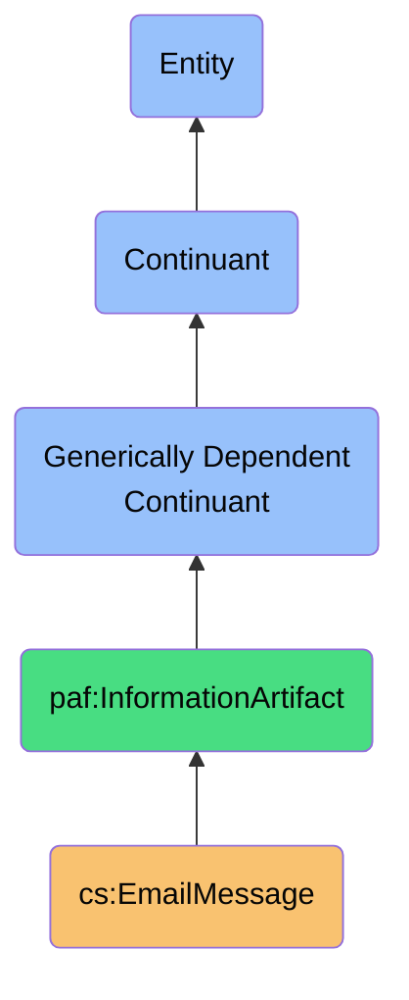

# EmailMessage

## Definition
An email message is a generically dependent continuant that provides a time-stamped, directed communication artifact used to convey structured or unstructured content between agents. It includes metadata for routing, identification, and categorization to facilitate effective human-to-human digital communication.

## Hierarchy in BFO


## Overview
EmailMessage entities represent discrete units of digital communication transmitted via email protocols. Each message is structured with standardized header information, body content, and optional attachments. EmailMessages are central to personal communication infrastructure and form the basis for contact-driven prioritization systems.

## Properties

### Identity Properties
| Property | Type | Description | Example |
|----------|------|-------------|---------|
| messageId | String | Globally unique identifier for the email | `<CAE+iOf1MCWSMVzP3=1-i2wLK@mail.gmail.com>` |
| conversationId | String | Thread identifier grouping related emails | `thread-f:1687934582439631289` |
| sender | EmailAddress | The originating address of the message | `john.doe@example.com` |
| recipients | EmailAddress[] | All addresses receiving the message | `["jane@example.com", "team@example.com"]` |

### Content Properties
| Property | Type | Description | Example |
|----------|------|-------------|---------|
| subject | String | Email subject line | `"Project update - April 2023"` |
| body | EmailContent | The primary content of the message | `{ "text": "Hello team,...", "html": "<div>Hello team,...</div>" }` |
| attachments | Attachment[] | Files attached to the email | `[{ "filename": "report.pdf", "size": 2048576 }]` |
| hasSignature | Boolean | Whether the email contains a signature block | `true` |

### Temporal Properties
| Property | Type | Description | Example |
|----------|------|-------------|---------|
| sentTimestamp | DateTime | When the message was sent | `2023-04-15T10:32:17Z` |
| receivedTimestamp | DateTime | When the message was received | `2023-04-15T10:32:21Z` |
| modifiedTimestamp | DateTime | When the message was last modified | `2023-04-15T11:15:03Z` |

### Organizational Properties
| Property | Type | Description | Example |
|----------|------|-------------|---------|
| labels | Label[] | Service-specific categorization tags | `["INBOX", "IMPORTANT", "CATEGORY_PERSONAL"]` |
| folder | String | Storage location within email system | `"Work/Projects/2023"` |
| priority | PriorityLevel | Message importance designation | `"high"` |
| readStatus | Boolean | Whether the message has been read | `false` |

### Relational Properties
| Property | Type | Description | Example |
|----------|------|-------------|---------|
| inReplyTo | MessageId | Reference to the message being replied to | `<CAE+iOf1MCWSMVzP3=1-i2wLK@mail.gmail.com>` |
| references | MessageId[] | Chain of message references in a thread | `["<msg1@example.com>", "<msg2@example.com>"]` |
| contactRelationship | ContactRelationship | Association with known contact | `{ "contactId": "c123", "relationship": "colleague" }` |

## Security Qualifiers
| Security Aspect | Description |
|-----------------|-------------|
| Confidentiality | EmailMessages may contain sensitive personal or business data requiring privacy controls |
| Integrity | Message content should be preserved as-is during storage and retrieval |
| Availability | Messages should be accessible to the owner when needed |
| Ownership | Messages are owned by the account holder but may be subject to service provider terms |
| Data Sovereignty | Messages may be stored in various jurisdictions affecting legal protections |

## Data Sources
| Source Type | Description | Examples |
|-------------|-------------|----------|
| Email Providers | Commercial email service platforms | Gmail, Outlook, Yahoo Mail |
| Self-hosted Email | Email servers operated by the user | Exchange Server, Postfix |
| Email Clients | Applications that access and display email | Apple Mail, Thunderbird |
| Email Archives | Exported email collections | .mbox files, .pst files |

## Capabilities

### Storage Capabilities
- Persistence in email provider databases
- Local caching in email clients
- Export/import across systems

### Processing Capabilities
- Filtering and categorization
- Full-text search
- Thread reconstruction
- Contact extraction

### Integration Capabilities
- Accessibility via standardized protocols (IMAP, POP3, SMTP)
- API-based access for automation
- Event-driven triggers (new message alerts)

## Interfaces

### Email Access Interface
```typescript
interface EmailMessageAccess {
  // Retrieval methods
  getMessage(messageId: string): Promise<EmailMessage>;
  searchMessages(query: EmailSearchQuery): Promise<EmailMessage[]>;
  getThread(threadId: string): Promise<EmailMessage[]>;
  
  // Modification methods
  markAsRead(messageId: string, isRead: boolean): Promise<void>;
  applyLabels(messageId: string, labels: string[]): Promise<void>;
  moveToFolder(messageId: string, folderPath: string): Promise<void>;
}
```

### Email Creation Interface
```typescript
interface EmailMessageCreation {
  // Composition methods
  createDraft(draft: EmailDraft): Promise<string>; // Returns draft ID
  sendMessage(message: EmailDraft): Promise<string>; // Returns message ID
  replyTo(messageId: string, content: EmailContent): Promise<string>;
  forward(messageId: string, recipients: string[], content?: EmailContent): Promise<string>;
}
```

## Materializations

### Message Instance
```json
{
  "messageId": "<CAE+iOf1MCWSMVzP3=1-i2wLK@mail.gmail.com>",
  "conversationId": "thread-f:1687934582439631289",
  "sender": "john.doe@example.com",
  "recipients": ["jane@example.com", "team@example.com"],
  "subject": "Project update - April 2023",
  "body": {
    "text": "Hello team, attached is the latest report...",
    "html": "<div>Hello team,<br><br>attached is the latest report...</div>"
  },
  "sentTimestamp": "2023-04-15T10:32:17Z",
  "receivedTimestamp": "2023-04-15T10:32:21Z",
  "labels": ["INBOX", "IMPORTANT", "CATEGORY_WORK"],
  "readStatus": false,
  "contactRelationship": {
    "contactId": "c123",
    "relationship": "colleague"
  }
}
```

### Email Account Configuration
```json
{
  "accountId": "acc_12345",
  "emailAddress": "user@example.com",
  "provider": "gmail",
  "syncSettings": {
    "frequency": "real-time",
    "includeAttachments": true,
    "maxHistoryDays": 90
  },
  "folderMapping": {
    "INBOX": "Primary",
    "SENT": "Sent Mail",
    "TRASH": "Bin"
  }
}
```

## Usage Scenarios

### Primary Usage
- Communication between individuals and groups
- Information sharing through text and attachments
- Record-keeping of conversations and decisions
- Task assignments and notifications
- Contact information discovery and maintenance

### Integration Points
- Contact management systems (extracting information about people)
- Calendar systems (identifying event-related emails)
- Task management systems (converting emails to tasks)
- Document management (storing and organizing attachments)
- AI processing (extracting intent, sentiment, and actions)

### SPARQL Query Patterns
```sparql
# Find all emails from a specific contact
SELECT ?email ?subject ?date
WHERE {
  ?email a cs:EmailMessage ;
         cs:sender "john.doe@example.com" ;
         cs:subject ?subject ;
         cs:sentTimestamp ?date .
}

# Find unread high-priority emails
SELECT ?email ?sender ?subject
WHERE {
  ?email a cs:EmailMessage ;
         cs:sender ?sender ;
         cs:subject ?subject ;
         cs:priority "high" ;
         cs:readStatus false .
}

# Find emails with specific contact relationships
SELECT ?email ?subject
WHERE {
  ?email a cs:EmailMessage ;
         cs:subject ?subject ;
         cs:contactRelationship ?rel .
  ?rel cs:contactId "c123" ;
       cs:relationship "colleague" .
}
```

## History
- **Conceptual Origin**: Email messages emerged from electronic mail systems in the 1970s, standardized through RFC 822 and later standards
- **Ontological Placement**: Positioned as a generically dependent continuant as it relies on digital storage but maintains identity across representations
- **Versions**: 
  - v1.0: Basic email message structure
  - v1.1: Added contact relationship properties
  - v1.2: Enhanced with priority and organization features
- **Future Development**: 
  - Integration with semantic processing for content classification
  - Enhanced metadata for privacy control and data lifecycle management
  - Cross-reference capabilities with other digital communication artifacts 