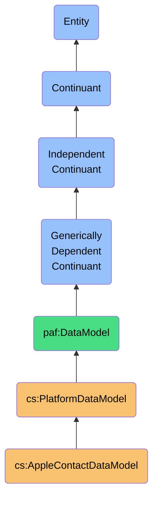
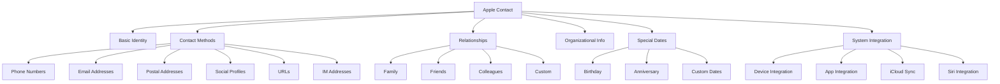

# AppleContactDataModel

## Definition
An AppleContactDataModel is an independent continuant immaterial entity that represents the platform-specific structure, semantics, and constraints of Apple's contact data, including its unique relationship designations, property labeling system, device-based storage paradigms, and operating system integration concepts.

## Hierarchy in BFO


## Overview
The AppleContactDataModel captures the distinct ontological structure and semantics of Apple's contact data. Unlike social platform models, it precisely represents Apple's device-centric contact management concepts, including the vCard-based storage format, structured relationship designations, operating system integration points, and multi-device synchronization mechanisms.

This model maintains Apple's native concepts rather than forcing them into generic social constructs, preserving critical semantic distinctions like the difference between standardized relationship designations (e.g., spouse, parent, child) versus platform-specific connection types. By explicitly modeling Apple-specific behaviors like contact groups, smart groups, custom labels, and system integration points, the model enables accurate interpretation of Apple contact data.

As a platform-specific model, it provides high-fidelity semantic mappings for integrating Apple contact data into a sovereign personal data ecosystem, supporting precise reasoning about personal relationships, communication patterns, and system-level integration points derived from this platform.

## Platform-Specific Properties

### Basic Contact Properties
| Property | Type | Description | Example |
|----------|------|-------------|---------|
| fullName | String | Person's full name | "John Smith" |
| firstName | String | Person's first name | "John" |
| lastName | String | Person's last name | "Smith" |
| middleName | String | Person's middle name | "Robert" |
| nameSuffix | String | Name suffix | "Jr." |
| namePrefix | String | Name prefix | "Dr." |
| nickname | String | Person's nickname | "Johnny" |
| birthday | Date | Birth date | "1990-01-01" |
| note | String | Biographical information | "Software engineer passionate about building scalable systems..." |

### Contact Method Properties
| Property | Type | Description | Example |
|----------|------|-------------|---------|
| phoneNumbers | PhoneNumber[] | Phone contact methods | [{"value": "+1 555 123 4567", "label": "mobile", "isPrimary": true}] |
| emailAddresses | EmailAddress[] | Email contact methods | [{"value": "john.smith@gmail.com", "label": "home", "isPrimary": true}] |
| postalAddresses | PostalAddress[] | Physical addresses | [{"street": "123 Main Street", "city": "San Francisco", "state": "CA", "postalCode": "94105", "country": "USA", "label": "home", "isPrimary": true}] | 
| socialProfiles | SocialProfile[] | Social media accounts | [{"service": "twitter", "username": "johnsmith", "url": "https://twitter.com/johnsmith"}] |
| urls | URL[] | Web addresses | [{"label": "homepage", "value": "http://www.johnsmith.com/"}] |
| instantMessagingAddresses | IMAddress[] | IM contact methods | [{"service": "MSN", "username": "john.smith@example.com"}] |

### Relationship Properties
| Property | Type | Description | Example |
|----------|------|-------------|---------|
| relationships | Relationship[] | Related people | [{"name": "Jane Smith", "label": "spouse", "contactId": "ABC123"}] |
| organizationName | String | Company or organization | "TechCorp" |
| departmentName | String | Department within organization | "Engineering" |
| jobTitle | String | Professional title | "Senior Software Engineer" |
| organizationRole | String | Role in organization | "Team Lead" |

### Special Date Properties
| Property | Type | Description | Example |
|----------|------|-------------|---------|
| dates | CustomDate[] | Important dates | [{"label": "anniversary", "value": "1990-01-01"}, {"label": "wedding", "value": "2015-06-15"}] |

## Platform-Specific Entities

### Apple-Specific Relationship Types
- **Spouse**: Marital or partnership relationship
- **Parent**: Biological or legal parent
- **Child**: Biological or legal child
- **Mother**: Maternal parent
- **Father**: Paternal parent
- **Brother**: Male sibling
- **Sister**: Female sibling
- **Friend**: Personal friendship
- **Assistant**: Professional assistant
- **Manager**: Professional supervisor
- **Partner**: Business partnership
- **Custom Label**: User-defined relationship type

### Apple-Specific Label Types
- **Home**: Home-related contact information
- **Work**: Work-related contact information
- **School**: Education-related contact information
- **iPhone**: iPhone-specific contact method
- **Mobile**: Mobile device contact method
- **Main**: Primary contact method
- **HomeFax**: Home fax machine
- **WorkFax**: Work fax machine
- **OtherFax**: Alternative fax machine
- **Pager**: Pager device
- **Custom Label**: User-defined label type

### Apple-Specific Contact Components


## Semantic Differences

### Platform-Specific Semantics
- **Apple Contact** vs **Facebook Friend**: System-level personal data vs social platform relationship
- **Apple Relationship** vs **LinkedIn Connection**: Structured relationship type vs professional networking connection
- **Apple Contact Group** vs **Social Platform List**: Local organization tool vs platform-managed collection
- **Apple Contact Sharing** vs **Social Sharing**: Direct vCard exchange vs platform-mediated introduction
- **Apple Contact Image** vs **Social Platform Avatar**: Personal photo identification vs platform identity representation

### Semantic Comparison Table
| Concept | Apple Semantics | Social Platform Semantics | Professional Platform Semantics |
|---------|-----------------|---------------------------|--------------------------------|
| Identity | System contact record | Platform profile | Professional representation |
| Connection | Structured relationship designation | Friend/follow relationship | Professional network connection |
| Organization | Affiliation information | Page/group membership | Company/role affiliation |
| Communication | System-integrated contact methods | Platform messaging | Professional contact info |
| Integration | OS-level service integration | Web/app platform features | Professional tool integration |

### Semantic Preservation Requirements
- **Relationship Type Preservation**: Maintain structured family/colleague designations
- **Label Context Preservation**: Preserve contact method context (home/work/other)
- **System Integration Context**: Maintain OS-level integration semantics
- **Multi-Device Semantics**: Preserve device-specific contact information
- **Contact Grouping Semantics**: Maintain group membership and smart group rules

## Data Model Schema

### vCard Contact Schema
```json
{
  "$id": "https://personal-ai-foundry.org/schemas/apple/contact-schema",
  "$schema": "http://json-schema.org/draft-07/schema#",
  "title": "Apple Contact Schema",
  "type": "object",
  "properties": {
    "id": {
      "type": "string",
      "description": "Unique identifier for the contact"
    },
    "name": {
      "type": "object",
      "properties": {
        "firstName": {
          "type": "string"
        },
        "lastName": {
          "type": "string"
        },
        "middleName": {
          "type": "string"
        },
        "prefix": {
          "type": "string"
        },
        "suffix": {
          "type": "string"
        },
        "nickname": {
          "type": "string"
        }
      }
    },
    "birthday": {
      "type": "string",
      "format": "date",
      "description": "Contact's birthday"
    },
    "note": {
      "type": "string",
      "description": "Additional notes about the contact"
    },
    "phoneNumbers": {
      "type": "array",
      "items": {
        "type": "object",
        "properties": {
          "value": {
            "type": "string"
          },
          "label": {
            "type": "string",
            "enum": ["mobile", "iPhone", "home", "work", "main", "homeFax", "workFax", "otherFax", "pager", "other"]
          },
          "customLabel": {
            "type": "string"
          },
          "isPrimary": {
            "type": "boolean"
          }
        },
        "required": ["value", "label"]
      }
    },
    "emailAddresses": {
      "type": "array",
      "items": {
        "type": "object",
        "properties": {
          "value": {
            "type": "string",
            "format": "email"
          },
          "label": {
            "type": "string",
            "enum": ["home", "work", "school", "other"]
          },
          "customLabel": {
            "type": "string"
          },
          "isPrimary": {
            "type": "boolean"
          }
        },
        "required": ["value", "label"]
      }
    },
    "postalAddresses": {
      "type": "array",
      "items": {
        "type": "object",
        "properties": {
          "street": {
            "type": "string"
          },
          "city": {
            "type": "string"
          },
          "state": {
            "type": "string"
          },
          "postalCode": {
            "type": "string"
          },
          "country": {
            "type": "string"
          },
          "label": {
            "type": "string",
            "enum": ["home", "work", "other"]
          },
          "customLabel": {
            "type": "string"
          },
          "isPrimary": {
            "type": "boolean"
          }
        },
        "required": ["label"]
      }
    },
    "relationships": {
      "type": "array",
      "items": {
        "type": "object",
        "properties": {
          "name": {
            "type": "string"
          },
          "contactId": {
            "type": "string"
          },
          "label": {
            "type": "string",
            "enum": ["spouse", "partner", "mother", "father", "parent", "brother", "sister", "child", "friend", "manager", "assistant", "other"]
          },
          "customLabel": {
            "type": "string"
          }
        },
        "required": ["name", "label"]
      }
    },
    "socialProfiles": {
      "type": "array",
      "items": {
        "type": "object",
        "properties": {
          "service": {
            "type": "string",
            "enum": ["twitter", "facebook", "linkedin", "flickr", "myspace", "sinaWeibo", "tencentWeibo", "yelp", "instagram", "snapchat", "reddit", "tiktok", "other"]
          },
          "username": {
            "type": "string"
          },
          "url": {
            "type": "string",
            "format": "uri"
          },
          "customLabel": {
            "type": "string"
          }
        },
        "required": ["service", "username"]
      }
    },
    "urlAddresses": {
      "type": "array",
      "items": {
        "type": "object",
        "properties": {
          "value": {
            "type": "string",
            "format": "uri"
          },
          "label": {
            "type": "string",
            "enum": ["homepage", "home", "work", "other"]
          },
          "customLabel": {
            "type": "string"
          }
        },
        "required": ["value", "label"]
      }
    },
    "instantMessages": {
      "type": "array",
      "items": {
        "type": "object",
        "properties": {
          "service": {
            "type": "string",
            "enum": ["AIM", "MSN", "Yahoo", "Skype", "QQ", "GoogleTalk", "Facebook", "ICQ", "Jabber", "other"]
          },
          "username": {
            "type": "string"
          },
          "customLabel": {
            "type": "string"
          }
        },
        "required": ["service", "username"]
      }
    },
    "dates": {
      "type": "array",
      "items": {
        "type": "object",
        "properties": {
          "value": {
            "type": "string",
            "format": "date"
          },
          "label": {
            "type": "string",
            "enum": ["anniversary", "other"]
          },
          "customLabel": {
            "type": "string"
          }
        },
        "required": ["value", "label"]
      }
    },
    "organization": {
      "type": "object",
      "properties": {
        "name": {
          "type": "string"
        },
        "department": {
          "type": "string"
        },
        "jobTitle": {
          "type": "string"
        },
        "role": {
          "type": "string"
        }
      }
    },
    "groups": {
      "type": "array",
      "items": {
        "type": "string",
        "description": "Group identifiers this contact belongs to"
      }
    },
    "image": {
      "type": "object",
      "properties": {
        "data": {
          "type": "string",
          "format": "byte",
          "description": "Base64 encoded image data"
        },
        "type": {
          "type": "string",
          "enum": ["JPEG", "PNG", "GIF"]
        }
      }
    },
    "source": {
      "type": "object",
      "properties": {
        "type": {
          "type": "string",
          "enum": ["iCloud", "Exchange", "Google", "Local", "CardDAV"]
        },
        "accountId": {
          "type": "string"
        },
        "lastModifiedDate": {
          "type": "string",
          "format": "date-time"
        }
      }
    }
  },
  "required": ["id", "name"]
}
```

## Platform-Specific Behaviors

### Data Access Patterns
- **Device-Based Storage**: Primary local storage with cloud synchronization
- **Contact Authority**: Multiple upstream data sources (iCloud, Exchange, etc.)
- **Contact Merging**: Device-based duplicate detection and merging
- **Group Membership**: Static and smart (rule-based) groupings
- **App Integration**: System-level contact picker integration
- **Data Export**: vCard and CSV export formats

### Update Mechanisms
- **Direct UI Edits**: Changes through Contacts app or third-party apps
- **iCloud Sync**: Background synchronization with iCloud
- **Exchange Sync**: Corporate directory synchronization
- **CardDAV Sync**: Standard protocol-based synchronization
- **Import Mechanisms**: vCard import and merge behaviors
- **Contact Linking**: Unified contact presentation with linked records

### Platform-Specific Constraints
- **Field Validation**: Format constraints for phone, email, address
- **Label Limitations**: Preset labels with custom label option
- **Relationship Constraints**: Structured relationship types
- **API Limitations**: Privacy-focused with permission requirements
- **Card Size Limitations**: Maximum vCard field sizes
- **Integration Boundaries**: App-based permission model for access

## Semantic Mappings

### External Ontology Mappings
```turtle
@prefix apple: <https://www.apple.com/contacts/schema/> .
@prefix paf: <https://personal-ai-foundry.org/ontology/> .
@prefix schema: <https://schema.org/> .
@prefix foaf: <http://xmlns.com/foaf/0.1/> .
@prefix vcard: <http://www.w3.org/2006/vcard/ns#> .

# Class mappings
apple:Contact rdfs:subClassOf schema:Person .
apple:Contact rdfs:subClassOf foaf:Person .
apple:Contact rdfs:subClassOf vcard:Individual .
apple:Contact rdfs:subClassOf paf:Contact .

apple:PhoneNumber rdfs:subClassOf schema:ContactPoint .
apple:EmailAddress rdfs:subClassOf schema:ContactPoint .
apple:PostalAddress rdfs:subClassOf schema:PostalAddress .

# Property mappings
apple:firstName schema:sameAs schema:givenName .
apple:lastName schema:sameAs schema:familyName .
apple:birthday schema:sameAs schema:birthDate .
apple:organizationName schema:sameAs schema:worksFor .
apple:jobTitle schema:sameAs schema:jobTitle .

# Relationship mappings
apple:spouse schema:sameAs schema:spouse .
apple:child schema:sameAs schema:children .
apple:parent schema:sameAs schema:parent .
```

### PAF Core Model Mappings
| Apple Entity | PAF Entity | Mapping Type | Notes |
|--------------|------------|--------------|-------|
| Contact | Contact | Direct | Apple Contact is a specific type of PAF Contact |
| PhoneNumber | ContactMethod | Specialization | Adds label designations and preference flags |
| EmailAddress | ContactMethod | Specialization | Adds context labels and validation |
| PostalAddress | ContactLocation | Specialization | Adds structured address format and labeling |
| Relationship | Relationship | Specialization | Adds structured relationship designations |
| SocialProfile | SocialIdentity | Specialization | Links to platform identities with service type |
| ContactGroup | ContactGroup | Direct | Organization unit for contacts |
| ContactDate | TemporalProperty | Specialization | Adds special date designation types |

### Transformation Examples
```typescript
// Mapping Apple contact to PAF Contact
function mapAppleContactToPafContact(appleContact: AppleContact): PafContact {
  return {
    id: `apple-${appleContact.id}`,
    source: {
      platform: 'Apple',
      sourceId: appleContact.id,
      retrievedAt: new Date(),
      accountType: appleContact.source?.type || 'Local'
    },
    name: {
      givenName: appleContact.name.firstName,
      familyName: appleContact.name.lastName,
      middleName: appleContact.name.middleName,
      prefix: appleContact.name.prefix,
      suffix: appleContact.name.suffix,
      nickname: appleContact.name.nickname,
      formattedName: formatFullName(appleContact.name)
    },
    birthdate: appleContact.birthday ? new Date(appleContact.birthday) : undefined,
    phoneNumbers: mapPhoneNumbers(appleContact.phoneNumbers),
    emailAddresses: mapEmailAddresses(appleContact.emailAddresses),
    postalAddresses: mapPostalAddresses(appleContact.postalAddresses),
    relationships: mapRelationships(appleContact.relationships),
    organizations: mapOrganizations(appleContact),
    importantDates: mapImportantDates(appleContact.dates, appleContact.birthday),
    socialProfiles: mapSocialProfiles(appleContact.socialProfiles),
    websites: mapWebsites(appleContact.urlAddresses),
    instantMessaging: mapInstantMessages(appleContact.instantMessages),
    notes: appleContact.note ? [{ content: appleContact.note }] : [],
    groups: appleContact.groups,
    images: appleContact.image ? [{
      type: 'avatar',
      data: appleContact.image.data,
      format: appleContact.image.type.toLowerCase()
    }] : []
  };
}

// Helper function to format full name
function formatFullName(name: any): string {
  const parts = [];
  if (name.prefix) parts.push(name.prefix);
  if (name.firstName) parts.push(name.firstName);
  if (name.middleName) parts.push(name.middleName);
  if (name.lastName) parts.push(name.lastName);
  if (name.suffix) parts.push(name.suffix);
  return parts.join(' ');
}

// Mapping phone numbers with context preservation
function mapPhoneNumbers(phoneNumbers: any[] = []): any[] {
  return phoneNumbers.map(phone => ({
    value: phone.value,
    type: 'phone',
    label: mapAppleLabelToPaf(phone.label, phone.customLabel),
    isPrimary: !!phone.isPrimary,
    verificationStatus: 'unverified'
  }));
}

// Mapping email addresses with context preservation
function mapEmailAddresses(emailAddresses: any[] = []): any[] {
  return emailAddresses.map(email => ({
    value: email.value,
    type: 'email',
    label: mapAppleLabelToPaf(email.label, email.customLabel),
    isPrimary: !!email.isPrimary,
    verificationStatus: 'unverified'
  }));
}

// Mapping postal addresses with context preservation
function mapPostalAddresses(addresses: any[] = []): any[] {
  return addresses.map(address => ({
    type: 'physical',
    label: mapAppleLabelToPaf(address.label, address.customLabel),
    street: address.street,
    city: address.city,
    region: address.state,
    postalCode: address.postalCode,
    country: address.country,
    isPrimary: !!address.isPrimary,
    formattedAddress: formatAddress(address)
  }));
}

// Helper function to format address
function formatAddress(address: any): string {
  const parts = [];
  if (address.street) parts.push(address.street);
  if (address.city) parts.push(address.city);
  if (address.state) parts.push(address.state);
  if (address.postalCode) parts.push(address.postalCode);
  if (address.country) parts.push(address.country);
  return parts.join(', ');
}

// Mapping relationships with semantic preservation
function mapRelationships(relationships: any[] = []): any[] {
  return relationships.map(rel => ({
    id: `apple-relationship-${generateId()}`,
    type: mapAppleRelationshipToPaf(rel.label, rel.customLabel),
    contactId: rel.contactId ? `apple-${rel.contactId}` : undefined,
    name: rel.name,
    source: {
      platform: 'Apple',
      label: rel.label,
      customLabel: rel.customLabel
    }
  }));
}

// Mapping organization information
function mapOrganizations(contact: any): any[] {
  if (!contact.organization?.name) return [];
  
  return [{
    name: contact.organization.name,
    department: contact.organization.department,
    title: contact.organization.jobTitle,
    role: contact.organization.role,
    isPrimary: true
  }];
}

// Mapping important dates with context preservation
function mapImportantDates(dates: any[] = [], birthday?: string): any[] {
  const result = dates.map(date => ({
    type: mapAppleDateTypeToPaf(date.label, date.customLabel),
    date: new Date(date.value),
    label: date.customLabel || date.label
  }));
  
  // Add birthday if not already included
  if (birthday && !result.some(d => d.type === 'birthday')) {
    result.push({
      type: 'birthday',
      date: new Date(birthday),
      label: 'Birthday'
    });
  }
  
  return result;
}

// Mapping social profiles
function mapSocialProfiles(profiles: any[] = []): any[] {
  return profiles.map(profile => ({
    platform: profile.service,
    username: profile.username,
    url: profile.url,
    label: profile.customLabel || profile.service
  }));
}

// Mapping websites
function mapWebsites(urls: any[] = []): any[] {
  return urls.map(url => ({
    type: 'url',
    value: url.value,
    label: mapAppleLabelToPaf(url.label, url.customLabel)
  }));
}

// Mapping instant messaging accounts
function mapInstantMessages(ims: any[] = []): any[] {
  return ims.map(im => ({
    service: im.service,
    username: im.username,
    label: im.customLabel || im.service
  }));
}

// Helper function to map Apple labels to PAF labels
function mapAppleLabelToPaf(label: string, customLabel?: string): string {
  if (customLabel) return customLabel;
  
  // Standard mapping
  switch (label) {
    case 'home': return 'home';
    case 'work': return 'work';
    case 'mobile': return 'mobile';
    case 'iPhone': return 'mobile';
    case 'main': return 'primary';
    case 'school': return 'education';
    case 'homeFax': return 'home_fax';
    case 'workFax': return 'work_fax';
    case 'pager': return 'pager';
    case 'homepage': return 'website';
    case 'other': return 'other';
    default: return label;
  }
}

// Helper function to map Apple relationship types to PAF relationship types
function mapAppleRelationshipToPaf(label: string, customLabel?: string): string {
  if (customLabel) return 'custom';
  
  // Standard mapping
  switch (label) {
    case 'spouse': return 'spouse';
    case 'partner': return 'partner';
    case 'mother': return 'parent';
    case 'father': return 'parent';
    case 'parent': return 'parent';
    case 'child': return 'child';
    case 'brother': return 'sibling';
    case 'sister': return 'sibling';
    case 'friend': return 'friend';
    case 'manager': return 'professional';
    case 'assistant': return 'professional';
    default: return 'other';
  }
}

// Helper function to map Apple date types to PAF date types
function mapAppleDateTypeToPaf(label: string, customLabel?: string): string {
  if (customLabel) return 'custom';
  
  // Standard mapping
  switch (label) {
    case 'anniversary': return 'anniversary';
    default: return 'other';
  }
}

// Helper function to generate IDs
function generateId(): string {
  return Math.random().toString(36).substring(2, 10);
}
```

## Implementation

### Platform API Integration
```typescript
class AppleContactDataModel implements PlatformDataModel {
  readonly id = 'apple';
  readonly version = '1.0.0';
  readonly schema: Schema;
  
  constructor(private contactsProvider: AppleContactsProvider) {
    this.schema = this.loadSchema();
  }
  
  async getContacts(options?: ContactOptions): Promise<AppleContact[]> {
    // Request permission if needed
    if (!await this.contactsProvider.requestPermission()) {
      throw new Error('Permission denied for accessing contacts');
    }
    
    const rawContacts = await this.contactsProvider.getContacts(options);
    return rawContacts.map(c => this.validateAndTransformContact(c));
  }
  
  async getContact(contactId: string): Promise<AppleContact | null> {
    // Request permission if needed
    if (!await this.contactsProvider.requestPermission()) {
      throw new Error('Permission denied for accessing contacts');
    }
    
    const rawContact = await this.contactsProvider.getContact(contactId);
    if (!rawContact) return null;
    
    return this.validateAndTransformContact(rawContact);
  }
  
  async getContactGroups(): Promise<ContactGroup[]> {
    // Request permission if needed
    if (!await this.contactsProvider.requestPermission()) {
      throw new Error('Permission denied for accessing contacts');
    }
    
    return await this.contactsProvider.getContactGroups();
  }
  
  async saveContact(contact: AppleContact): Promise<string> {
    // Request permission if needed
    if (!await this.contactsProvider.requestPermission()) {
      throw new Error('Permission denied for modifying contacts');
    }
    
    // Validate contact
    const validationResult = this.validateData(contact);
    if (!validationResult.valid) {
      throw new Error(`Invalid Apple contact data: ${validationResult.errors.join(', ')}`);
    }
    
    // Save contact
    return await this.contactsProvider.saveContact(contact);
  }
  
  async deleteContact(contactId: string): Promise<boolean> {
    // Request permission if needed
    if (!await this.contactsProvider.requestPermission()) {
      throw new Error('Permission denied for modifying contacts');
    }
    
    return await this.contactsProvider.deleteContact(contactId);
  }
  
  mapToPAF(sourceData: AppleContact): PafContact {
    return mapAppleContactToPafContact(sourceData);
  }
  
  mapFromPAF(pafContact: PafContact): Partial<AppleContact> {
    // Implementation of reverse mapping...
    return {
      name: {
        firstName: pafContact.name.givenName,
        lastName: pafContact.name.familyName,
        middleName: pafContact.name.middleName,
        prefix: pafContact.name.prefix,
        suffix: pafContact.name.suffix,
        nickname: pafContact.name.nickname
      },
      birthday: pafContact.birthdate ? formatDate(pafContact.birthdate) : undefined,
      // Map other fields...
    };
  }
  
  validateData(data: any): ValidationResult {
    return this.schema.validate(data);
  }
  
  private validateAndTransformContact(rawContact: any): AppleContact {
    const validationResult = this.validateData(rawContact);
    if (!validationResult.valid) {
      console.warn(`Invalid Apple contact data: ${validationResult.errors.join(', ')}`);
      // Apply fixes for common issues...
    }
    
    return rawContact as AppleContact;
  }
  
  private loadSchema(): Schema {
    // Load and return JSON schema for Apple contact data
    return new Schema({
      contact: require('./schemas/apple/contact-schema.json')
    });
  }
}

// Helper function to format date
function formatDate(date: Date): string {
  return date.toISOString().split('T')[0];
}
```

### Usage Example
```typescript
// Initialize the Apple-specific data model
const contactsProvider = new AppleContactsProvider();
const appleModel = new AppleContactDataModel(contactsProvider);

// Use the platform-specific model for Apple contact operations
async function syncAppleContacts() {
  try {
    // Get all contacts
    const contacts = await appleModel.getContacts();
    
    // Map to PAF model using semantic-preserving transformation
    const pafContacts = contacts.map(c => appleModel.mapToPAF(c));
    
    // Get contact groups
    const groups = await appleModel.getContactGroups();
    
    // Store in unified personal data store
    await personalDataStore.storeContacts(pafContacts);
    await personalDataStore.storeContactGroups(groups);
    
    // Record platform-specific semantics for future reference
    pafContacts.forEach(contact => {
      personalDataStore.recordMapping({
        pafContactId: contact.id,
        platformContactId: contact.source.sourceId,
        platform: 'Apple',
        semanticMappings: {
          labelPreservation: true,
          relationshipPreservation: true
        }
      });
    });
    
    return {
      success: true,
      contactCount: pafContacts.length,
      groupCount: groups.length
    };
  } catch (error) {
    console.error('Apple contacts sync error:', error);
    throw new Error(`Apple contacts synchronization failed: ${error.message}`);
  }
}

// Import a vCard file
async function importVCardFile(filePath: string) {
  try {
    const vCardData = await fs.promises.readFile(filePath, 'utf8');
    const contacts = parseVCardData(vCardData);
    
    // Process each vCard entry
    for (const contact of contacts) {
      // Transform vCard to Apple contact model
      const appleContact = transformVCardToAppleContact(contact);
      
      // Save to device
      const contactId = await appleModel.saveContact(appleContact);
      console.log(`Imported contact with ID: ${contactId}`);
    }
    
    return {
      success: true,
      importedCount: contacts.length
    };
  } catch (error) {
    console.error('vCard import error:', error);
    throw new Error(`vCard import failed: ${error.message}`);
  }
}

// Helper function to parse vCard data
function parseVCardData(vCardData: string): any[] {
  // Implementation of vCard parsing logic
  // Would handle the full vCard specification
  return [];
}

// Helper function to transform vCard data to Apple contact model
function transformVCardToAppleContact(vCardContact: any): AppleContact {
  // Implementation of vCard to Apple contact transformation
  return {
    id: '',
    name: {
      firstName: '',
      lastName: ''
    }
  };
}
```

## Platform Relationship

### Integration with Device Ecosystem
- **iCloud Synchronization**: Cloud-based contact replication across devices
- **OS-Level Integration**: System contacts framework integration
- **App Integration**: Contact picker and contact field completion
- **Siri Integration**: Voice assistant contact interaction
- **Permission Model**: Privacy-based access permission system

### System-Level Integrations

```mermaid
graph TD
    A[Apple Contact] -->|Phone App| B[Phone Calls]
    A -->|Messages App| C[SMS/iMessage]
    A -->|Mail App| D[Email]
    A -->|Maps App| E[Location/Navigation]
    A -->|Calendar App| F[Event Invites]
    A -->|FaceTime| G[Video Calls]
    A -->|Wallet| H[Payment Contacts]
    A -->|Reminder App| I[Shared Lists]
    A -->|Notes App| J[Shared Notes]
    
    A -->|Siri| K[Voice Assistant]
    A -->|Shortcuts| L[Automation]
    A -->|CarPlay| M[Car Integration]
    A -->|HomeKit| N[Home Sharing]
    
    A -->|Find My| O[Location Sharing]
    A -->|Family Sharing| P[Account Relationships]
    A -->|Screen Time| Q[Communication Limits]
```


### Device-Specific Customizations
- **Platform Integration**: iOS, macOS, watchOS, iPadOS specific features
- **Contact UI Differences**: Platform-specific contact display formatting
- **Feature Availability**: Device-dependent contact features
- **Synchronization Behavior**: Device-category sync preferences
- **Security Model**: Device-specific security requirements

## Integration with Other Entities

### Related Platform-Specific Entities
- **AppleAccount**: Apple ID and authentication system
- **iCloudAccount**: Cloud storage and synchronization system
- **AppleDevice**: Specific device representation
- **AppleCalendarEvent**: Calendar integration points
- **AppleMessageThread**: Messaging system integration

### Other Platform Relationships
- **Social Platform Contact**: Different semantics for platform relationships
- **Email Provider Contact**: Different semantics for communication-oriented contacts
- **Professional Network Connection**: Different semantics for career-focused connections
- **Messaging Platform Contact**: Different semantics for communication-focused contacts
- **CRM Contact**: Different semantics for business relationship contacts

### Cross-Platform Mappings
- **Identity Resolution**: Mapping Apple contact to platform identities
- **Contact Method Correlation**: Relating Apple contact methods to platform communication channels
- **Contact Integration**: Importing/exporting between Apple and other systems
- **Social Profile Linking**: Connecting social profiles to Apple contact
- **Unified Contact Views**: Creating unified representation from multiple sources

## Governance

### Data Quality Governance
- **Apple Field Validation**: Platform-specific validation rules
- **Data Deduplication**: Contact duplicate detection and merging
- **vCard Standard Compliance**: Industry standard format adherence
- **Field Format Enforcement**: Contact method format validation
- **Integration Quality Metrics**: Success criteria for Apple contact model

### Privacy and Compliance
- **Contact Permission Model**: Apple's permission framework for contact access
- **Data Protection**: On-device encryption for contact data
- **Synchronization Security**: Secure sync protocols for contact transfer
- **Data Locality**: Regional storage considerations for cloud sync
- **Cross-Platform Sharing**: Rules for contact export and sharing

### Ethical Considerations
- **Contact Consent**: Ethical considerations for contact storage
- **Relationship Representation**: Respectful labeling of relationships
- **Data Minimization**: Storing only necessary contact information
- **Purpose Limitation**: Using contact data only for intended purposes
- **Platform-Specific Norms**: Respecting Apple ecosystem conventions

## History

### Conceptual Origin
- **Initial Concept**: Address Book in early Mac OS
- **Evolution**: iOS Contacts app and vCard standard adoption
- **Modern Implementation**: iCloud synchronization and CardDAV support
- **PAF Integration**: Reformulated for ontological alignment (2022)

### Version History
- **v0.1**: Basic contact schema (2022-Q1)
- **v0.2**: Added semantic mappings to PAF (2022-Q2)
- **v1.0**: Full platform-specific model (2022-Q4)
- **v1.1**: Enhanced with relationship context (2023-Q1)
- **v1.2**: Added bidirectional transformation capabilities (2023-Q3)

### Evolution Roadmap
- **Planned v2.0**: Enhanced vCard support for vCard 4.0
- **Planned v2.1**: Improved relationship modeling
- **Planned v2.2**: Advanced integration with communication channels
- **Research Area**: Multi-platform contact sovereignty models
- **Exploration**: Cross-device contact synchronization optimization 