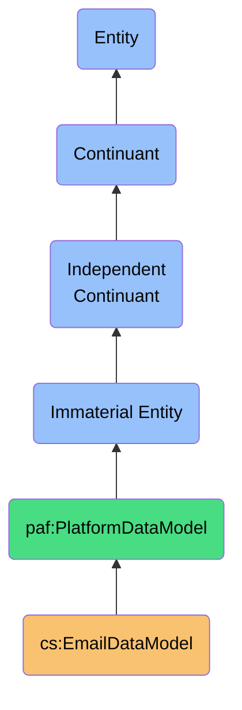

# EmailDataModel

## Definition
The Email Data Model is an immaterial independent continuant that defines the structure, properties, and relationships of email data within email service platforms. It standardizes the representation of email communication artifacts across providers to enable consistent data access, integration, and processing.

## Hierarchy in BFO


## Overview
The Email Data Model represents the canonical structure of email data within digital communication platforms. It encompasses the organization of messages, folders/labels, threads, attachments, and associated metadata that constitute email systems. This model bridges vendor-specific implementations across email service providers to establish a uniform interface for email management, aggregation, and analysis.

## Properties

### Provider-specific Properties
| Property | Type | Description | Example |
|----------|------|-------------|---------|
| providerName | String | Name of the email service provider | `"Gmail"`, `"Outlook"`, `"ProtonMail"` |
| apiVersion | String | Version of provider API being used | `"v1"`, `"beta"`, `"2.0"` |
| dataSchemaUrl | URL | Reference to provider's schema documentation | `"https://developers.google.com/gmail/api/reference/rest"` |
| protocolSupport | String[] | Email protocols supported by provider | `["IMAP", "SMTP", "POP3", "OAuth2"]` |

### Structural Properties
| Property | Type | Description | Example |
|----------|------|-------------|---------|
| folderHierarchy | Boolean | Whether folders can be nested | `true` |
| labelSystem | Boolean | Whether the system uses labels vs folders | `true` |
| threadingModel | String | How messages are grouped into threads | `"conversation-id"`, `"subject-matching"` |
| messageSizeLimit | Number | Maximum message size in bytes | `25000000` |
| attachmentLimit | Number | Maximum attachment size in bytes | `20000000` |

### Access Properties
| Property | Type | Description | Example |
|----------|------|-------------|---------|
| userAccess | AccessLevel | User access level to email data | `"full"`, `"read-only"`, `"limited"` |
| queryCapabilities | String[] | Supported query mechanisms | `["full-text", "advanced-search", "filter"]` |
| batchOperations | Boolean | Support for batch operations | `true` |
| rateLimits | RateLimit | API usage restrictions | `{ "queries": 250, "timeframe": "minute" }` |

## Security Qualifiers
| Security Aspect | Description |
|-----------------|-------------|
| AuthenticationMethods | OAuth2, API Key, Basic Authentication |
| DataEncryption | TLS for transit, AES-256 for storage |
| AccessControl | Role-based permissions, scoped access tokens |
| PrivacyControls | Data retention policies, user consent requirements |
| ComplianceStandards | GDPR, CCPA, HIPAA compatibility |

## Data Model Elements

### Message Elements
- **Headers**: Standard email headers (From, To, Cc, Subject, Date, etc.)
- **Body**: Text content in plain and/or HTML format
- **Attachments**: Binary files with metadata
- **Metadata**: Message IDs, thread IDs, importance flags
- **System Labels**: Inbox, Sent, Drafts, Spam, Trash, etc.
- **User Labels/Folders**: Custom categorization structures

### Account Elements
- **Profile**: User identification, signatures, settings
- **Folders/Labels**: Organization structures for messages
- **Filters**: Automated message processing rules
- **Contacts**: Associated address book entries
- **Settings**: User preferences and configurations
- **Delegates**: Access sharing with other users

## Capabilities

### Query Capabilities
- Full-text search across message content
- Filtered searches by header values
- Date range queries
- Label/folder-specific retrieval
- Attachment type filtering
- Thread-based retrieval

### Modification Capabilities
- Message composition and sending
- Drafts management
- Label/folder assignment and organization
- Message flagging (important, read/unread)
- Archiving and deletion
- Thread manipulation

### Analytics Capabilities
- Contact frequency analysis
- Response time metrics
- Volume trends by time period
- Category distribution
- Priority assignment based on sender/content

## Interfaces

### Standard Access Interface
```typescript
interface EmailDataAccess {
  // Read operations
  getMessage(id: string): Promise<EmailMessage>;
  listMessages(query: QueryParams): Promise<EmailMessage[]>;
  getThread(threadId: string): Promise<EmailThread>;
  
  // Write operations
  createLabel(label: LabelDefinition): Promise<string>;
  applyLabel(messageIds: string[], labelId: string): Promise<void>;
  moveMessage(messageId: string, destinationFolder: string): Promise<void>;
  
  // Management operations
  exportData(options: ExportOptions): Promise<ExportJob>;
  importData(source: ImportSource): Promise<ImportJob>;
}
```

### Synchronization Interface
```typescript
interface EmailSyncInterface {
  // Initial sync
  performFullSync(accountId: string): Promise<SyncResult>;
  
  // Incremental updates
  syncChanges(accountId: string, lastSyncToken: string): Promise<SyncResult>;
  
  // Specific element sync
  syncLabels(accountId: string): Promise<Label[]>;
  syncSettings(accountId: string): Promise<Settings>;
  
  // Status checks
  getSyncStatus(accountId: string): Promise<SyncStatus>;
  
  // Error handling
  resolveSyncConflicts(conflicts: SyncConflict[]): Promise<ResolutionResult>;
}
```

## Provider Implementations

### Gmail Implementation
```json
{
  "providerName": "Gmail",
  "identifier": "gmail",
  "apiVersion": "v1",
  "dataStructure": {
    "messageFormat": "RFC2822 with extensions",
    "threadingModel": "conversation-id based",
    "labelSystem": true,
    "folderHierarchy": false
  },
  "endpointMappings": {
    "listMessages": "gmail.users.messages.list",
    "getMessage": "gmail.users.messages.get",
    "modifyMessage": "gmail.users.messages.modify"
  },
  "fieldMappings": {
    "subject": "payload.headers.find(h => h.name === 'Subject').value",
    "sender": "payload.headers.find(h => h.name === 'From').value",
    "recipients": "payload.headers.find(h => h.name === 'To').value",
    "threadId": "threadId"
  }
}
```

### Outlook Implementation
```json
{
  "providerName": "Microsoft Outlook",
  "identifier": "outlook",
  "apiVersion": "v2.0",
  "dataStructure": {
    "messageFormat": "Microsoft Graph Mail Format",
    "threadingModel": "conversationId based",
    "labelSystem": false,
    "folderHierarchy": true
  },
  "endpointMappings": {
    "listMessages": "/me/messages",
    "getMessage": "/me/messages/{id}",
    "modifyMessage": "/me/messages/{id}"
  },
  "fieldMappings": {
    "subject": "subject",
    "sender": "from.emailAddress",
    "recipients": "toRecipients[].emailAddress",
    "threadId": "conversationId"
  }
}
```

## Usage Scenarios

### Primary Usage
- Email client development for cross-provider compatibility
- Data aggregation across multiple email accounts
- Email analytics and insights generation
- Contact extraction and relationship mapping
- Integration with personal information management systems

### Integration Points
- Contact management systems
- Calendar and scheduling platforms
- Task and project management tools
- Document management systems
- Personal AI assistants for email prioritization

### Query Patterns
```sparql
# Find all emails from a specific sender across providers
SELECT ?email ?subject ?date ?provider
WHERE {
  ?email a cs:EmailMessage ;
         cs:sender ?sender ;
         cs:subject ?subject ;
         cs:sentTimestamp ?date ;
         cs:emailProvider ?provider .
  FILTER(?sender = "important.contact@example.com")
}

# Find unread emails with attachments
SELECT ?email ?sender ?subject
WHERE {
  ?email a cs:EmailMessage ;
         cs:sender ?sender ;
         cs:subject ?subject ;
         cs:readStatus false ;
         cs:attachments ?attachment .
}
```

## History
- **Conceptual Origin**: Email data models evolved from early electronic mail protocols like SMTP (1982) and MIME (1992)
- **Standardization**: Progressive standardization through IETF RFCs including RFC 822, RFC 2822, and RFC 5322
- **Modern Evolution**: 
  - Extended with service-specific APIs (Gmail API, Microsoft Graph)
  - Adapted for cloud-based and mobile email access
  - Enhanced with ML-driven features like categorization and prioritization
- **Future Development**: 
  - Deeper semantic understanding of message content
  - Enhanced interoperability between providers
  - Integration with advanced security and privacy frameworks 